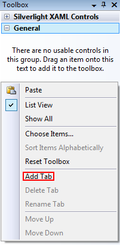
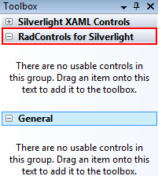
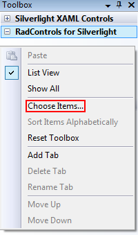
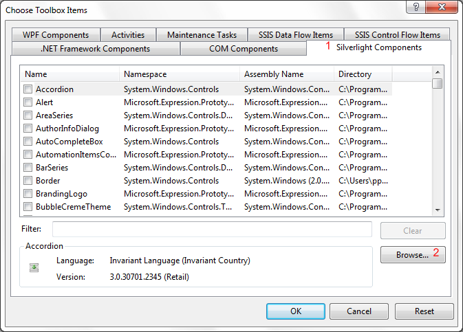
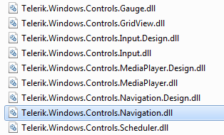
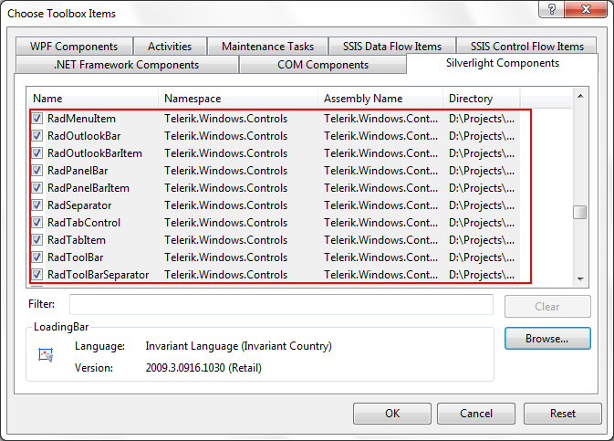
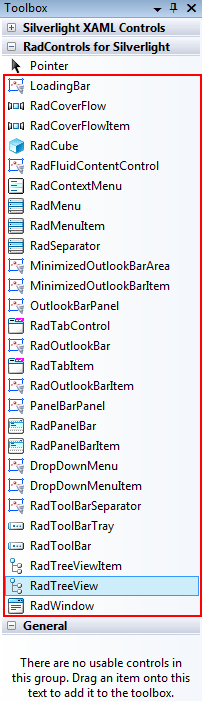

# Adding UI for Silverlight to the Visual Studio 2008 Toolbox

The following tutorial will show you how to add the Telerik RadControls for Silverlight to the Visual Studio 2008 toolbox.

## Adding RadControls for Silverlight to the Visual Studio 2008 Toolbox

To manually add Telerik __RadControls__ for Silverlight to the Toolbox, follow the steps below:

* Open your application in Visual Studio 2008.

* Expand the Toolbox (View->Toolbox or use the shortcut Ctrl+Alt+X). 

* Right mouse button click in the toolbox area and choose "Add Tab" from the context menu.

         
      

* Add a new tab with name "RadControls for Silverlight".

         
      

* Select the "RadControls for Silverlight" tab in the toolbox. Right mouse button click and select "Choose Items...".

         
      

* In the "Choose Toolbox Items" dialog, go to the "Silverlight Components" tab and press the "Browse..." button.

         
      

* Navigate to the folder where the RadControls DLL files are located. Select the DLL you want to import and press OK or hit Enter.

         
      

>If you wonder which control in which assembly belongs to, read the main topic about [Controls Dependencies]().

* Press OK to include the controls in your toolbox, or filter the controls you want to add.

         
      

* Again expand your toolbox. You will see the newly added controls in the "RadControls for Silverlight" section.

         
      

# See Also

 * [Creating an Application and Adding UI for Silverlight]()

 * [Namespace Declaration]()

 * [Using IntelliSense in Visual Studio]()
