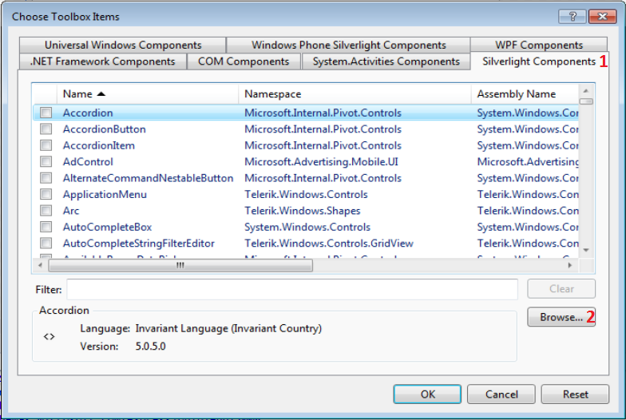
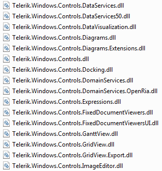
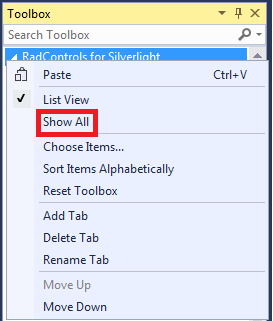

# Adding UI for Silverlight to Visual Studio 2015 Toolbox

The following tutorial will show you how to add UI for Silverlight controls to Visual Studio 2015 toolbox.

## Adding UI for Silverlight to Visual Studio 2015 Toolbox

To manually add Telerik UI for Silverlight to the Toolbox, follow the steps below:

1. Open your application in Visual Studio 2015.

1. Expand the Toolbox (View->Toolbox or use the shortcut Ctrl+Alt+X). 

1. Right mouse button click in the toolbox area and choose "Add Tab" from the context menu.

	  

1. Add a new tab with name "UI for Silverlight".

	

1. Select the "UI for Silverlight" tab in the toolbox. Right mouse button click and select "Choose Items...".

	

1. In the "Choose Toolbox Items" dialog, go to the "Silverlight Components" tab and press the "Browse..." button.

	

1. Navigate to the folder where the binaries are located. Select the DLL you want to import and press OK or hit Enter.

	

1. Press OK to include the controls in your toolbox, or filter the controls you want to add.

	

1. Again expand your toolbox. You will see the newly added controls in the "UI for Silverlight" section.

	

>After pressing the OK button of the "Choose Toolbox Items", it is possible the "UI for Silverlight" tab in the toolbox to be __hidden__. If so, press the right mouse button over the Toolbox area and select the __Show All__ command.
>
>

# See Also
 * [Creating an Application and Adding UI for Silverlight]()
 * [Namespace Declaration]()
 * [Using IntelliSense in Visual Studio]()