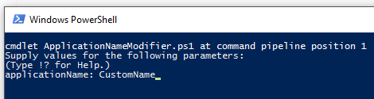

# Protecting Telerik UI Assemblies

Technical guidelines for protecting **Telerik UI for SilverlightWPF by Progress** binaries when redistributed with other applications.
     
There are a couple of approaches that you can take:
* [Use the PowerShell Scripts](#use-the-powershell-scripts)
* [Manually Edit the Source Code](#building-telerik-assemblies-from-source-code)

## Use the PowerShell Scripts

Telerik UI source code provides two power shell scripts that will allow you to easily apply the modifications needed to protect the **Telerik** assemblies without the need to open and edit any files. The scrips are located in the **Build\BuildInstructions\AssemblyProtection** folder of the **Telerik UI** source code. 

The available scripts are: 

* **ApplicationNameModifier.ps1**: Uncomments the **ValidatePassPhrase()** method call and changes the **ApplicationName** in the **Core\Controls\Common\AssemblyProtection.cs** file with the provided one. 

* **ApplicationNameModifier - DPL.ps1**: Uncomments the **ValidatePassPhrase()** method call and changes the ApplicationName in the **Documents\Licensing\AssemblyProtection.cs** file with the provided one.

### Instructions

**1.** Right click on the needed script and click Run with **PowerShell** menu item

**2.** Enter the new **ApplicationName** when prompted: 

**3.** Rebuild the Telerik UI assemblies using one of the approaches explained in the source code build instructions (located in the **Build\BuildInstructions** folder). 

## Building Telerik Assemblies from Source Code 

__Prerequisites__

All control assemblies should be built from source code due to modifications applied to the source files. The source code of UI for SilverlightWPF is distributed separately and is bundled with build instructions. Please, read the source code building instructions beforehand. For brevity this document assumes that the source distribution ZIP file is extracted in **C:\TelerikSilverlightWPFSource**
        
__Instructions__

**1.** Open **C:\TelerikSilverlightWPFSource\Core\Controls\Common\AssemblyProtection.cs** in a text editor (notepad, Visual Studio, etc.)
            
**2.** Uncomment the following line:

#### __Before__

#### [C#] Example 1: Validate method
{{region protecting-telerik-radcontrols-assembly_0}}
	public static void Validate()
	{
		//Uncomment the following line
		//ValidatePassPhrase();
	}
{{endregion}}

#### __After__

#### [C#] Example 2: Validate method
{{region protecting-telerik-radcontrols-assembly_1}}
	public static void Validate()
	{
		//Uncomment the following line
		ValidatePassPhrase();
	}
{{endregion}}

**3.** Change the **ApplicationName** constant to match the name of your application:

#### __Before__

#### [C#] Example 3: Change ApplicationName
{{region protecting-telerik-radcontrols-assembly_2}}
	internal const string ApplicationName = "MyApp";
{{endregion}}

#### __After__

#### [C#] Example 4: Change ApplicationName
{{region protecting-telerik-radcontrols-assembly_3}}
	internal const string ApplicationName = "Sample Application Name v2.0 (tm)";
{{endregion}}

**4.** Save __AssemblyProtection.cs__ and rebuild the suite (described separately in the source code build instructions document).
            
**5.** In your application replace the existing references to the Telerik assemblies with the ones built from the source code.

**6.** If you run the application now you should get an exception with message **"This version of Telerik UI for SilverlightWPF is licensed only for use by Sample Application Name v2.0 (tm)"**. Note that **"Sample Application Name v2.0 (tm)"** will be replaced with the value of the **ApplicationName** constant.
            
**7.** In your application resources **App.xaml** create a string resource with key __"Telerik.Windows.Controls.Key"__ and value equal to the value of the ApplicationName constant from **step 3**:
            
#### __Before__

#### [XAML] Example 5: Add resource
{{region protecting-telerik-radcontrols-assembly_4}}
	<Application 
	    xmlns="http://schemas.microsoft.com/client/2007"
	    xmlns:x="http://schemas.microsoft.com/winfx/2006/xaml" 
	    x:Class="...">
	</Application>
{{endregion}}

#### __After__

#### [XAML] Example 6: Add resource
{{region protecting-telerik-radcontrols-assembly_5}}
	<Application 
	      xmlns="http://schemas.microsoft.com/client/2007"
	      xmlns:x="http://schemas.microsoft.com/winfx/2006/xaml" 
	      xmlns:system="clr-namespace:System;assembly=mscorlib"
	      x:Class="...">
	        <Application.Resources>
	            <system:String x:Key="Telerik.Windows.Controls.Key">Sample Application Name v2.0 (tm)</system:String>
	        </Application.Resources>
	</Application>
{{endregion}}

## Building Telerik Documents Assemblies from Source Code

The instructions in the previous section explain how to build the **Telerik.Windows.Controls** assembly and the assemblies depending on it. The UI for SilverlightWPF suite contains libraries for processing documents which do not depend on **Telerik.Windows.Controls.dll**. 

If you are building the assemblies needed for one of the components depending on **Telerik.Windows.Documents.Core**, such as the [Telerik Document Processing by Progress libraries](https://docs.telerik.com/devtools/document-processing/introduction), you need to execute the following steps as well.
        
>importantThe following instructions are valid for Telerik UI for SilverlightWPF version __Q2 2014__ or later.
          
**1.** Open **C:\TelerikSilverlightWPFSource\Documents\Licensing\AssemblyProtection.cs** in a text editor (notepad, Visual Studio, etc.).

>In versions of the suite prior to R2 2016, the path is **C:\TelerikSilverlightWPFSource\Documents\Core\Core\Licensing\AssemblyProtection.cs**.
            

**2.** Uncomment the following line:
            
#### __Before__

#### [XAML] Example 7: IsValid method
{{region protecting-telerik-radcontrols-assembly_6}}
	public static bool IsValid()
	{
	    // Uncomment the following line
	    // return ValidatePassPhrase();
	    return true;
	}
{{endregion}}

#### __After__

#### [XAML]  Example 8: IsValid method
{{region protecting-telerik-radcontrols-assembly_7}}
	public static bool IsValid()
	{
	    // Uncomment the following line
	    return ValidatePassPhrase();
	}
{{endregion}}

**3.** Execute steps **3-7** from the previous section.

## See Also

* [Installing Telerik UI on your Computer]()