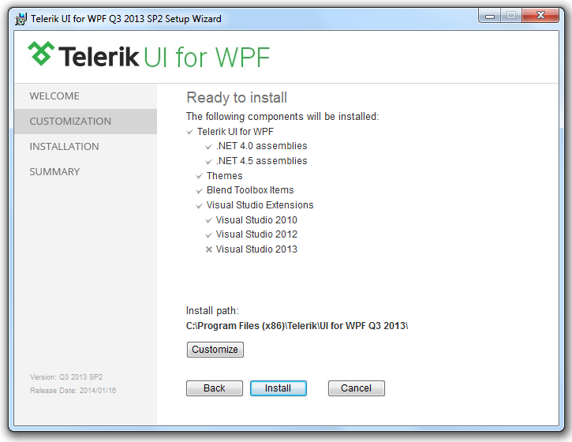
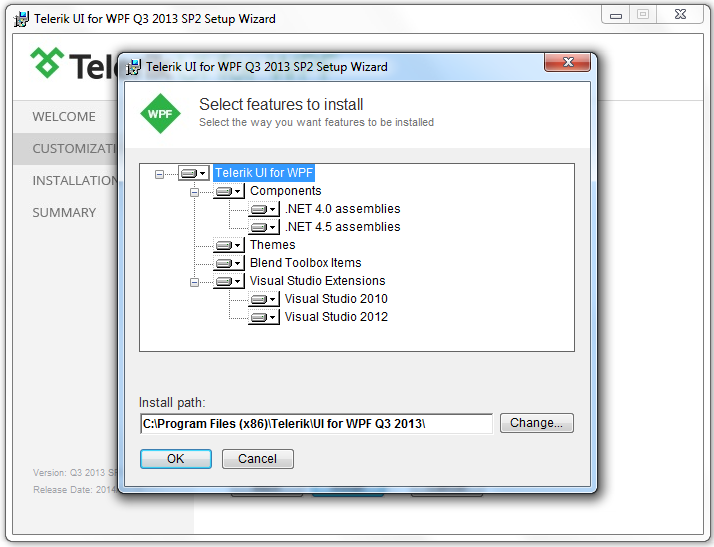
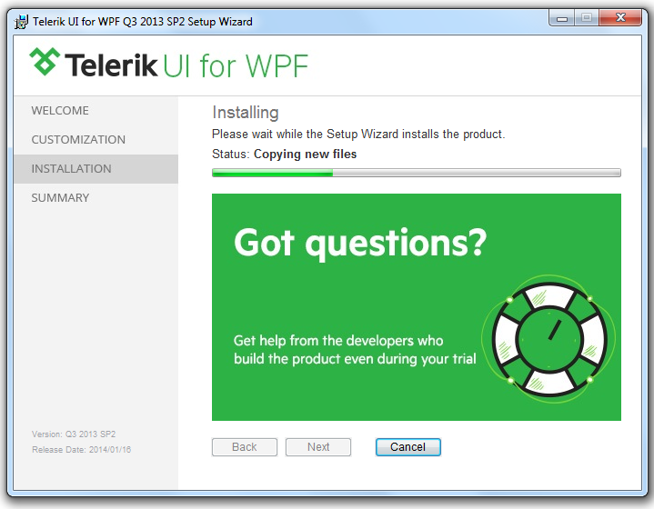

# Installing UI for WPF from MSI File

The following topic describes what steps you should perform in order to install Telerik UI for WPF from a __MSI__ file. 

The [MSI](http://en.wikipedia.org/wiki/Windows_Installer) files are intended for easy and automatic installation of a product. The MSI installs the suite on your computer to a folder named Telerik in your Program Files, automatically creating the necessary virtual folders and projects.

For more information about which installation package you need to install, read [here]().

For more information about the system requirements, read [here]().

>tipThe latest package available for download already has all updates/HOTFIXES applied. There is no need to update it further.

>tipThe MSI installation __will not overwrite__ previous Telerik UI for WPF installations, unless it is of the same version.

Before installing Telerik UI for WPF on your machine, you need to download the latest MSI package.

## Downloading MSI Package

* Go to to the UI for WPF download page following the instructions in [Download Product Files]() topic.

* Download the MSI file.

* Once the download completes, run the MSI file and follow the instructions below.

## Installing WPF Controls Package

* After downloading the UI for WPF and executing the MSI file you should see the welcome window that is shown on the next image.

* Click "Read License Agreement" button - the "Telerik End User License Agreement" dialog will appear. In order to continue you need to read and accept the License Agreement.

* After reading the License Agreement, click "OK" and then "I Agree - Continue".

The next dialog gives you the ability to choose the setup type that best suits your needs. You can either install all Telerik Components or choose which features to install. The second option is recommended for advanced users. 

Choose the "Customize" option. The next dialog gives you the ability explicitly to choose the you want features to be installed.

You have the ability to choose the installation location. The default location is __C:\Program Files\Telerik\__(where C:\ is the drive where your Windows installation folder is located).

>Once choosing the installation location, the wizard will create the necessary virtual folders.

* Click "OK".

* Click "Install" to start the installation process, or click "Cancel" to exit the wizard and to terminate the setup. You may want to go back and to change any of the installation parameters - click "Back" in order to do that.

>The installation process may take several minutes to complete.

* After the successful installation of all features you are ready to start developing powerful and interactive applications using the __Telerik UI for WPF__.

## Exploring the Installation Folder

If you open the installation folder ( __C:\Program Files\Telerik\UI for WPF [version]__ ) you will probably note the following sub directories:

* __Binaries__ - the standard binaries.

* __Binaries.NoXaml__ - binaries without XAML.

* __LicenseAgreements__

* __Themes.Implicit__ - implicit styles friendly XAML.
          

* __VSExtensions__

>importantWith the Q1 2014 release we no longer provide the Themes and pdb files within the installation package. You could download them separately from the UI for WPF download page in your [Telerik account](http://www.telerik.com/account.aspx).

>The WPF Demos application can be downloaded from the UI for WPF download page (in the [Telerik account](http://www.telerik.com/account.aspx)) as a separate ZIP file as well.

## See Also

 * [Installing UI for WPF from ZIP File]()

 * [Using the Hotfix (DLLs Only)]()

 * [Trial License Limitations]()
