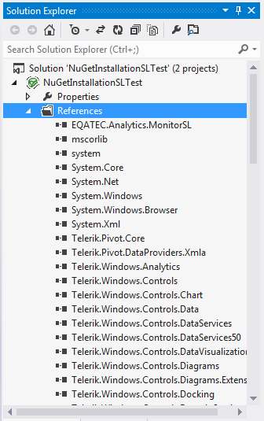

# Installing UI for Silverlight from a NuGet package

The following topic describes what steps you should perform in order to install Telerik UI for Silverlight from a [NuGet package](http://www.nuget.org/).
   
We’re providing a common NuGet package containing all the assemblies from the UI for Silverlight suite as well as separate packages for the different assemblies. It is up to you to decide which one is more suitable to your project. 

>importantThe provided NuGet packages contain either __NoXaml binaries__ or __XAML binaries__. Check the [Setting a Theme (Using  Implicit Styles)]() help topic for more details on the NoXaml binaries and Implicit Styles.
 
We will go through the following sections: 

* [Downloading the NuGet packages](#downloading-the-nuget-packages)

* [Installing Silverlight Controls Package](#installing-silverlight-controls-package)

## Downloading the NuGet packages

In order to download the latest NuGet packages, follow the instructions below:

*  Go to to the UI for Silverlight download page following the instructions in [Download Product Files]() topic.
          
* Download the needed NuGet .zip file depending on whether you're using Xaml or NoXaml binaries and extract it into the folder where your Telerik NuGet packages are located.

## Installing Silverlight Controls Package
      
The next steps show how to install the complete NuGet package which includes all the assemblies.The approach is the same for the separate packages. 

Once you open the __“Manage NuGet Packages”__ dialog in Visual Studio (right-click Project References -> Manage NuGet Packages), you can select the Telerik NuGet folder and the available packages there will be shown: 

>If you haven’t set the Telerik NuGet folder until now, you can do it by clicking __Settings__ button on the __“Manage NuGet Packages”__ dialog, then add the folder where you’ve extracted the .nupkg file (for example C://Telerik NuGet) as a new package source inside the __Options__ dialog:
>

Click the “Install” button and the references will be automatically added to your project as shown below:

You can now use the Telerik Silverlight controls in your project. 

>tipAdditionally, you can create a private NuGet Feed and deploy the Telerik NuGet packages there - for more details refer to [this blog post](http://blogs.telerik.com/careypayette/posts/13-03-11/power-your-projects-with-telerik---now-with-the-convenience-of-nuget).

# See Also

 * [Which File Do I Need to Install?]()

 * [Installing UI for Silverlight from MSI File]()

 * [Installing UI for Silverlight from ZIP File]()
