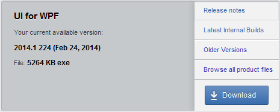

# Using the Hotfix (DLLs Only)

The following topic will show you how to use the __Hotfix DLLs__. The same instructions should be used when installing the __Latest Internal Build__.
				
The __Hotfix__ archive is a bare-bones upgrade option for the Telerik controls - it contains only those files that you need to replace in your project to upgrade to the new version of Telerik UI for WPF. If you are already using Telerik products and just want to update, then you should download the latest HOTFIX and apply it. The __Hotfix__ archive contains the following files:
			
* __Binaries__ folder: Contains the .dll files.

* __Binaries.NoXaml__ folder: Binaries without XAML.

* __LicenseAgreements__ folder
				
* __Themes.Implicit__: Implicit styles friendly XAML.			

>If you are installing the Telerik products for the first time, we recommend you to download the installation package ([MSI file]()).			

## Updating Telerik UI for WPF to a New Version

In order to apply the Hotfix you need to perform the following instructions:

* Log into your [Telerik account](http://www.telerik.com/account.aspx).
		
* Click __Products & Subscriptions__ and then select UI for WPF from the dropdown (or Trial downloads if you are a trial user).

>If you've purchased Telerik DevCraft Complete/Ultimate bundle, you will see it in the Products & Subscriptions dropdown.
>

* Click "Download Installer and other resources" button.

>Again, if you've purchased Telerik DevCraft Complete/Ultimate bundle, you will be redirected to a page with all the products in the suite.
>Scroll to "UI for WPF" product. Click "Browse all product files" to go to the details download page.
>

* After that click the "DLLs only" or the Latest Internal Build link.

>tipYou can also check [here](http://www.telerik.com/account/your-products/internal-builds.aspx) to go directly to the latest internal build download page.
		
* Once the download completes, right click on the zip in Windows Explorer and select "Properties" from the menu. If there is an "__Unblock__" button, press it. Press the OK button. Then unzip the files at a convenient location.
					
* Back up your application.

* Close Visual Studio or any other IDE which may lock the old assembly.

* From the newly downloaded and unzipped files, copy the new DLL (located in the __Binaries__ folder) to your WPF application's folder which contains the Telerik assemblies. Replace the old dll files.
					
* If you are using VS.NET, update the control's reference in your project to point to the new DLL.

* Clean the solution.

* Recompile your project.

* If you have added the control in GAC, remove it by running a gacUtil to remove the old copy and then add the new one.		

* Run the project.

>In case the project does not build:      
>* Please make sure that all the assembies you have referenced are with the same version.
>* Clean the project as sometimes Visual Studio is caching old binaries. Then Rebuild.       
>* If this does not help, delete the bin and obj folders of the project manually and Rebuild.
            
## See Also

 * [Trial License Limitations]()

 * [Adding UI for WPF to the Visual Studio 2008 Toolbox]()

 * [Creating an Application and Adding UI for WPF]()

 * [Upgrading Telerik UI Trial to Telerik UI Developer License or Newer Version]()
