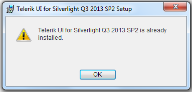

# Upgrading Telerik UI Trial to Telerik UI Developer License or Newer Version

The purpose of this topic is to explain you how to upgrade Telerik UI Trial to Telerik UI Developer License or a newer version.

## Automatic Upgrade to newer version of UI for Silverlight

Utilize the VS Extensions wizards for this purpose:

* [Latest Version Acquirer Tool]()

* [Upgrading to a new UI for Silverlight distribution]()

## Upgrade to Newer Version or Other License of UI for Silverlight

In order to upgrade your controls to a newer version of the suite, you need to perform the following instructions:

* 
						Download the installation method you prefer:
						

* [MSI file for automatic installation.]()

* [ZIP file for manual (advanced) installation.]()

* [DLL files only (a.k.a. HOTFIX).]()

>If you have installed the trial version of UI for Silverlight and try to install the developer version of the same release, you will receive the following message:
					So, you should remove the trial version first.

* 
						If the upgrade is major (i.e. from Q2 2011 to Q3 2011), check the [Release History](http://www.telerik.com/products/silverlight/whats-new.aspx).
					

* Back up your application.

* Update all the Telerik references in your project in Visual Studio to point to the new DLLs.

* Clean the solution.

* Recompile your project.

* Run the project.

>tipIn case the project does not build:
          

* 
              Please make sure that all the assembies you have referenced are with the same version.
            

* 
              If this does not help, delete the bin and obj folders of the project manually and Rebuild.
            

# See Also

 * [Controls Dependencies]()
