# Installing Telerik UI for WPF

The Telerik UI for WPF suite is distributed with multiple installation methods that can be used according the the developer's needs. 

>important The recommended methods are using the [Telerik CLI]() and the [NuGet packages](#tab-1-nuget-installation)

<TabStrip>
<TabStripTab title="NuGet Installation">

Telerik UI for WPF is distributed via nuget packages, allowing easier installation and maintenance. 

To install the product:

1. Open any terminal and install the [Telerik CLI]().

	```
	dotnet tool install -g Telerik.CLI
	```
	
1. Call the `telerik setup wpf` command in the terminal.

	```
	telerik setup wpf
	```

1. Use the __NuGet Package Manager__ to install the needed Telerik packages in your project. For example, `Telerik.UI.for.Wpf.AllControls.Xaml`. 

	```
	<PackageReference Include="Telerik.UI.for.Wpf.AllControls.Xaml" Version="*" />
	```

</TabStripTab>
<TabStripTab title="MSI Installation">

The `.msi` installer installs the suite on your computer to a folder named __Progress__ in your Program Files, automatically creating the necessary virtual folders and projects.

To install the product:

1. Download the `Telerik_UI_for_WPF_[version]_[license].msi` file from the [Telerik UI for WPF download page](https://www.telerik.com/account/product-download?product=RCWPF).

1. Run the installer and follow the instructions.

	The MSI installation __will not overwrite__ previous Telerik UI for WPF installations, unless it is of the same version.

	In the installation directory (default: `C:\Program Files (x86)\Progress\Telerik UI for WPF [version]`) you will see the following folders:

	* `\Binaries`
	* `\Binaries.NoXaml`
	* `\LicenseAgreements`
	* `\Themes.Implicit`
	* `\VSExtensions`

1. Use the [Visual Studio's Reference Manager](https://learn.microsoft.com/en-us/visualstudio/ide/how-to-add-or-remove-references-by-using-the-reference-manager?view=visualstudio) to browse and reference the Telerik dlls in your WPF project. 

	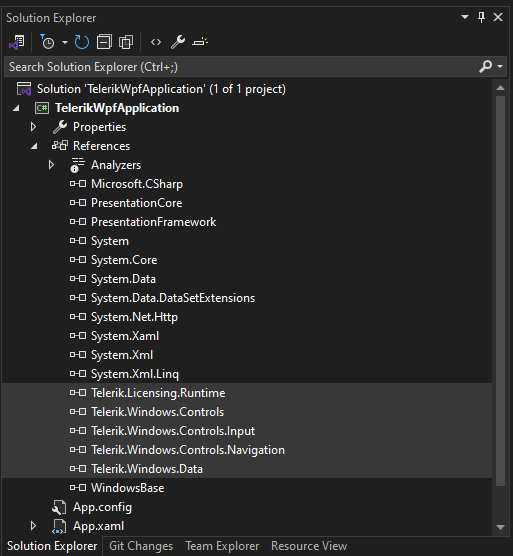
	
1. [Install a license key](#adding-a-license-to-projects-using-telerik-assembly-references-no-nuget-packages).

	```C#
	[assembly: global::Telerik.Licensing.EvidenceAttribute("your-WPF-script-key-here")]
	```
</TabStripTab>
<TabStripTab title="ZIP Installation">

Telerik provides a `.zip` file containing the files distributed with Telerik UI for WPF.

To install the product:

1. Download the `Telerik_UI_for_WPF_[version]_[license]_Dlls.zip` file from the [Telerik UI for WPF download page](https://www.telerik.com/account/product-download?product=RCWPF).

1. Extract the contents of the `.zip` file in a location of your choice.

	The archive contains the following folders:

	* `\Binaries`
	* `\Binaries.NoXaml`
	* `\LicenseAgreements`
	* `\Themes.Implicit`
	* `\VSExtensions`

1. Use the [Visual Studio's Reference Manager](https://learn.microsoft.com/en-us/visualstudio/ide/how-to-add-or-remove-references-by-using-the-reference-manager?view=visualstudio) to browse and reference the Telerik dlls in your WPF project. 

	
	
1. [Install a license key](#adding-a-license-to-projects-using-telerik-assembly-references-no-nuget-packages).

	```C#
	[assembly: global::Telerik.Licensing.EvidenceAttribute("your-WPF-script-key-here")]
	```
	
</TabStripTab>
<TabStripTab title="VSX Installation">

The UI for WPF product can be installed also via the Telerik UI for WPF Extension for Visual Studio (VSX). The extension installs also a project template in Visual Studio that allows easier creation of Telerik WPF projects.

1. To get the extension, you can either install product via the [.msi installer](#tab-2-msi-installation) or use the [Extensions](https://learn.microsoft.com/en-us/visualstudio/ide/finding-and-using-visual-studio-extensions?view=visualstudio) menu in Visual Studio to download the extension from the marketplace (*"Progress Telerik UI for WPF Extension"*).

	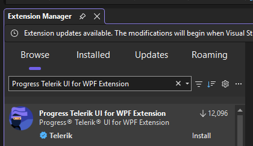

1. In Visual Studio use the Telerik WPF Application project template to create a WPF project.

	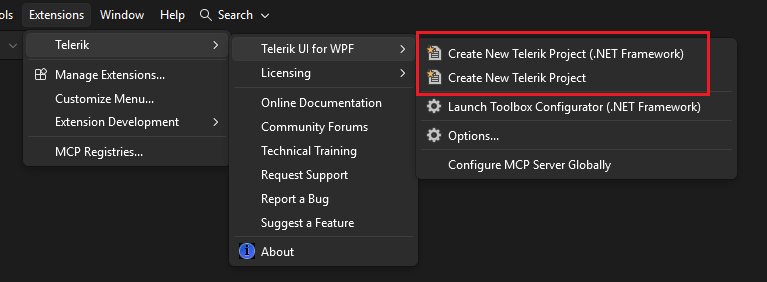

2. Follow the Create New Project Wizard to setup the project.
	
	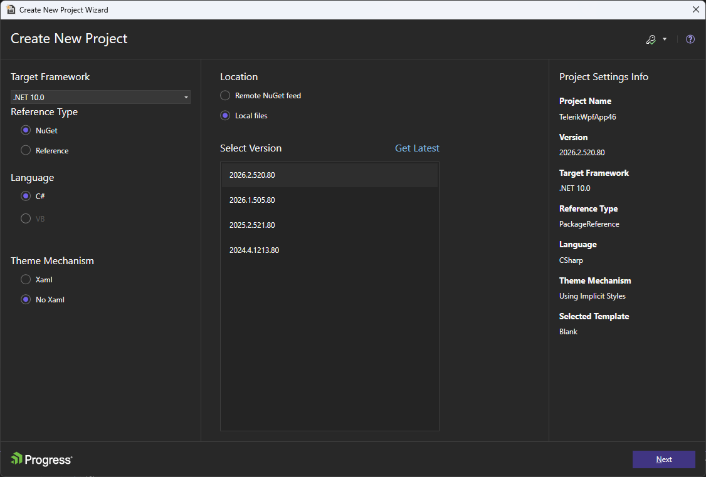

4. In case you haven't installed a [license key]() already, you can download one using the License Validation screen.
	
	__License validation screen (license not found)__  
	
	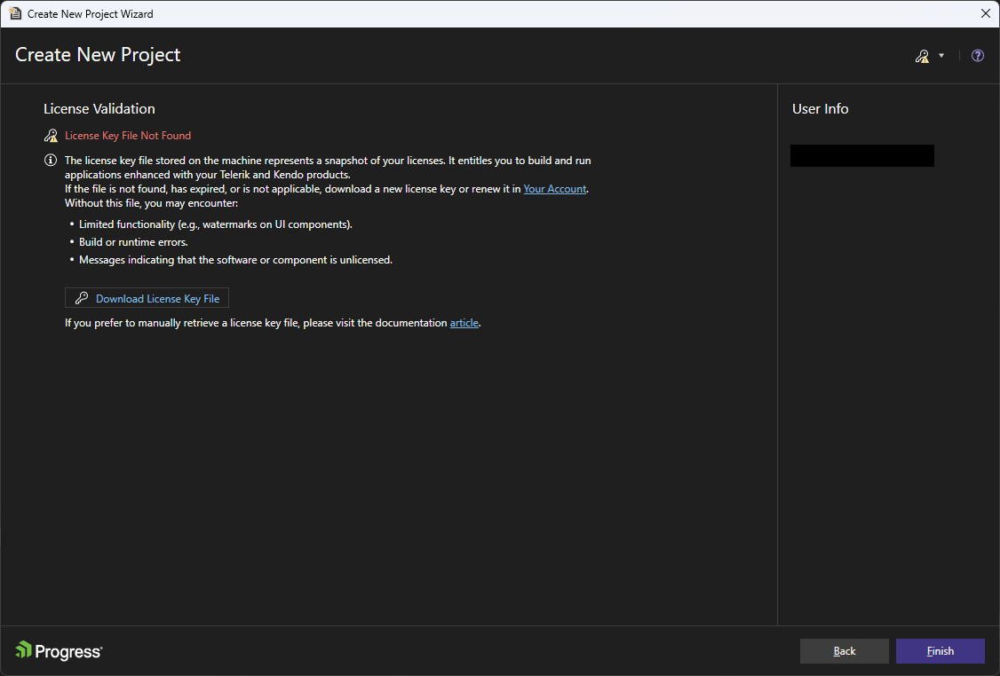
	
	__License validation screen (successfully downloaded a license)__
	
	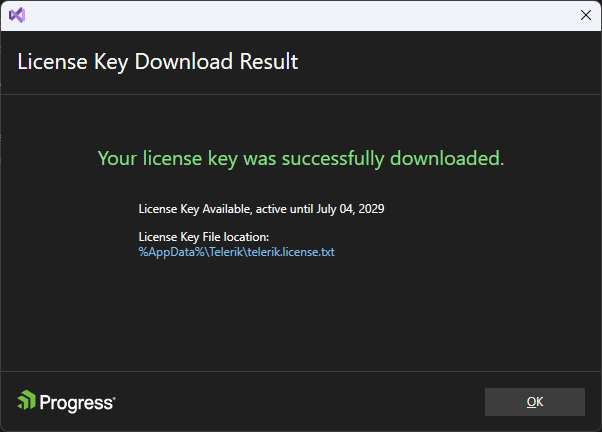

	If you have a license key already installed the License Validation screen will be skipped.

You can further configure the project using the Project Configuration Wizard. You can do that by going to the __Extensions > Telerik > Telerik UI for WPF > Configure Project__ menu in Visual Studio. When you open the wizard you can select the controls you are going to use from the list (or search them in the search box). Once you have selected them, click Finish. This will add the required dlls and references to your project.

__Adding references to the charting controls__  
	
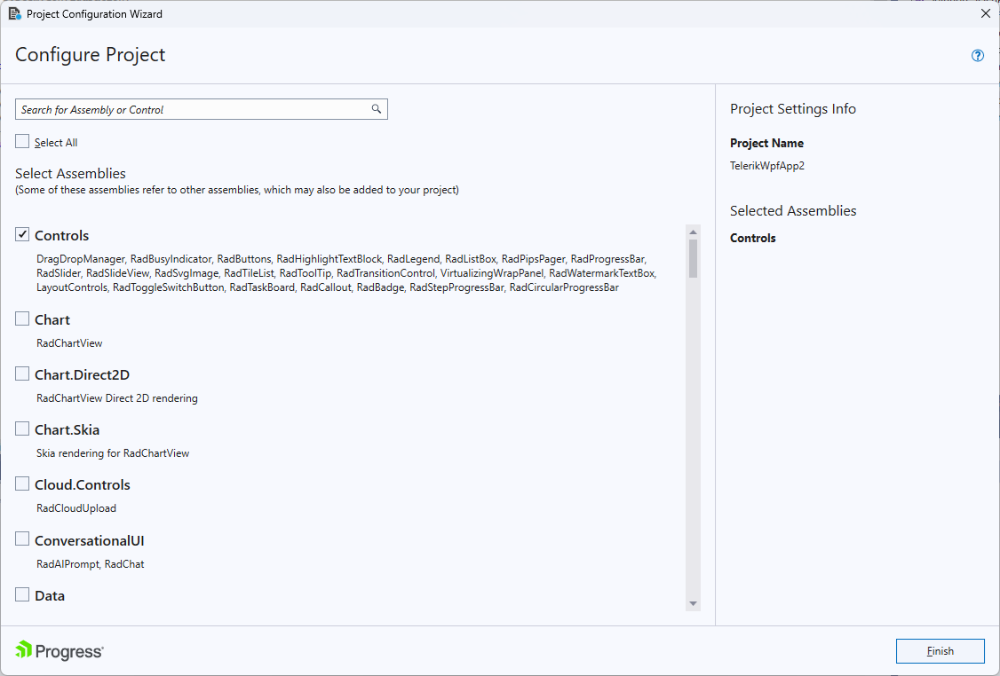	

This step is optional and you will only need it if you use controls that are not defined in `Telerik.Windows.Controls.dll`.

</TabStripTab>
<TabStripTab title="Progress Control Panel">

The Telerik UI for WPF controls can also be installed via the **Progress Control Panel**.


To install the product:

1. Download the [Progress Control Panel](https://www.telerik.com/download-trial-file/v2/control-panel)

1. Run the downloaded `.exe` file.

1. On the login screen use your Telerik account credentials.

	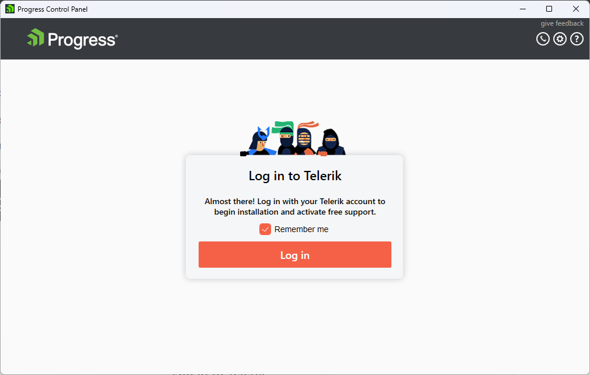
	
1. Select the Telerik UI for WPF product in the products list on click __Proceed__.

	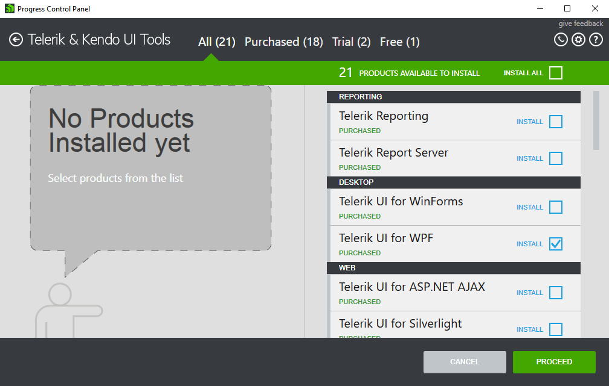

1. Follow the screens to configure the installation.

	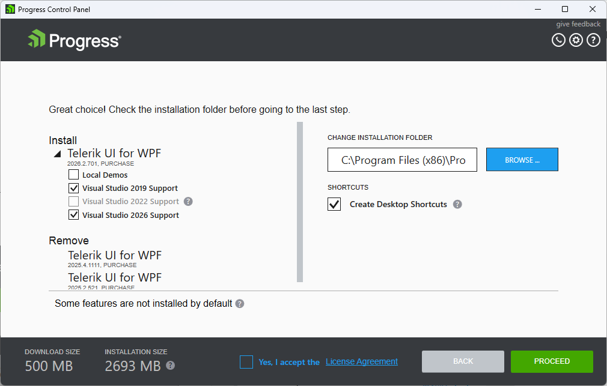

	The Progress Control Panel will download the necessary files for installation and then install them to the location you selected.
	
	The installation directory contains following folders:

	* `\Binaries`
	* `\Binaries.NoXaml`
	* `\LicenseAgreements`
	* `\Themes.Implicit`
	* `\VSExtensions`

</TabStripTab>
</TabStrip>

## Add Telerik Controls in the Project

For this example we will use [RadGridView]().

1. Open the WPF project with the Telerik references in Visual Studio.

1. To use RadGridView install the `Telerik.Windows.Controls.GridView.for.Wpf.Xaml` nuget package, or reference the following assemblies:			

	* `Telerik.Windows.Controls`
	* `Telerik.Windows.Controls.GridView`
	* `Telerik.Windows.Controls.Input`
	* `Telerik.Windows.Data`

1. Define a basic model for the items in the data grid.

	```C#
	public class Profile
	{
		public int ID { get; set; }
		public string Name { get; set; }
		public DateTime Date { get; set; }
		public bool IsChecked { get; set; }
	}
	```
	
1. Populate a collection with the model.

	```C#
	public MainWindow()
    {
		this.InitializeComponent();
        var source = new ObservableCollection<Profile>();
        DateTime date = DateTime.Now;
        for (int i = 0; i < 10; i++)
        {
        source.Add(new Profile() { ID = i, Name = "Item" + i, Date = date, IsChecked = i % 2 == 0 });
        date = date.AddDays(7);
        }
        gridView.ItemsSource = source;
    }
	```
	
1. Add `RadGridView` in the XAML.

	```XAML
	<Grid xmlns:telerik="http://schemas.telerik.com/2008/xaml/presentation">
		<telerik:RadGridView x:Name="gridView" GroupRenderMode="Flag" AutoGenerateColumns="False">
			<telerik:RadGridView.Columns>
				<telerik:GridViewDataColumn DataMemberBinding="{Binding ID}"/>
				<telerik:GridViewDataColumn DataMemberBinding="{Binding Name}" />
				<telerik:GridViewDataColumn DataMemberBinding="{Binding Date}" />
				<telerik:GridViewDataColumn DataMemberBinding="{Binding IsChecked}" />
			</telerik:RadGridView.Columns>
		</telerik:RadGridView>
	</Grid>
	```

1. Run the project and you should see something like this:

	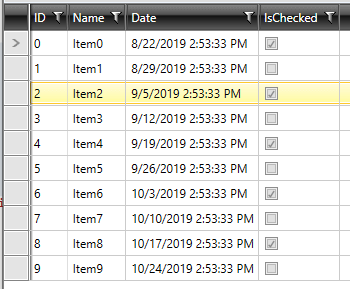
