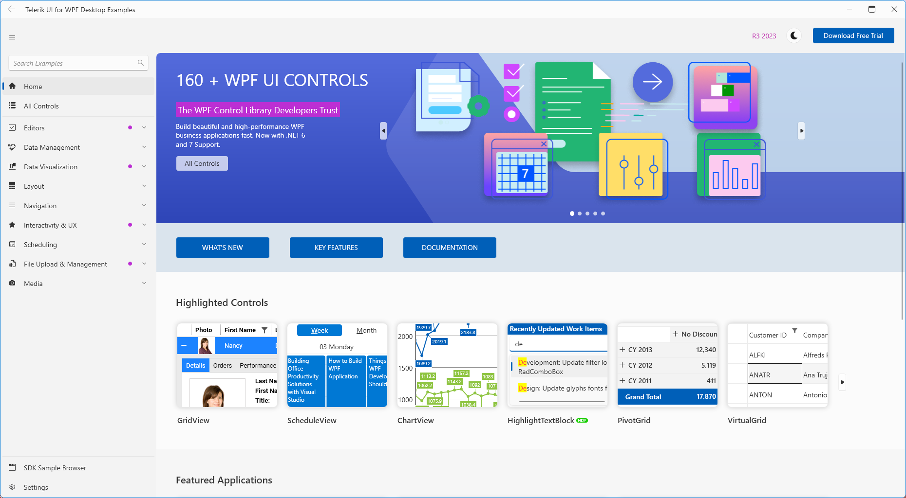
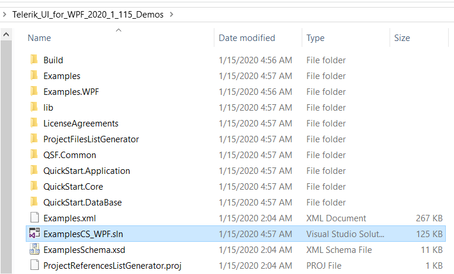

# Installing WPF Demos Application

Telerik WPF Demos application provides a rich list of examples showcasing all the important features of Telerik UI for WPF.

## Installation

The demos can be downloaded from the [Telerik UI for WPF demos site](https://demos.telerik.com/wpf/) as a ClickOnce application.

The application requires the following component in order to be installed and run locally:

* [Microsoft .NET Desktop Runtime 10.0.0 (x64)](https://dotnet.microsoft.com/en-us/download/dotnet/10.0)

>important If you have a previous installation of WPF Demos, make sure to uninstall it before installing a newer version.

## Getting the Source Code

Visual Studio solution containing the source code of the examples is available in the in your Telerik account. 

Follow the next steps in order to download it:

1. Log into your telerik.com account.

1. Go to the [Telerik UI for WPF download page](https://www.telerik.com/account/downloads/product-download?product=RCWPF).

1. Find the `Telerik_UI_for_WPF_[version]_Demos_Source.zip` file and click on it in order to download the .zip.	

1. Unzip the file and run the `ExamplesCS_WPF.sln` file.

	

The source code .zip does not contain the assemblies so that it is smaller in size. Building and running the demos solution locally requires to have a local installation (via the .msi installer) of the Telerik UI for WPF suite with the same version as the downloaded demos. This will create an __environment variable__ called `TelerikWPFDir` which points to the Binaries folder in the installation directory (example: *C:\Program Files (x86)\Progress\Telerik UI for WPF 2024 Q1*). The environment variable is used by the HintPaths in the source code to resolve the Telerik assemblies.

## See Also  
* [Could Not Load File or Assembly Error in WPF Demos Application]()
