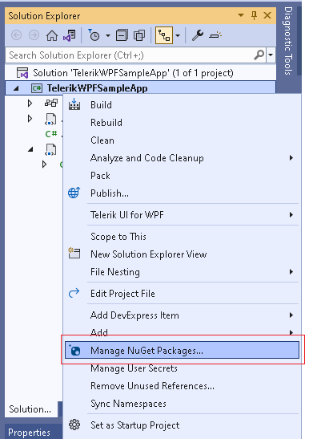

# Installing Telerik UI for WPF NuGet Packages

Use Telerik UI for WPF NuGet packages to install, update, and manage Telerik assemblies in your project. This article explains how to configure the Telerik NuGet feed, authenticate correctly, and install the packages that your project needs.

>important When Visual Studio prompts for Telerik NuGet credentials, enter `api-key` as the user name and your Telerik NuGet API key as the password. This is the recommended authentication method for the Telerik NuGet server.

## Before You Start

Before you configure the feed, confirm the following prerequisites:

* You can create and run a standard WPF application in Visual Studio.
* Your Telerik account has an active trial or commercial license for Telerik UI for WPF.
* If you want to use the Telerik NuGet server, you have a Telerik NuGet API key from the [Telerik account API key management page](https://www.telerik.com/account/downloads/api-keys).

The Telerik packages can be accessed through two primary sources:

* The online Telerik NuGet server.
* A local package source containing downloaded `.nupkg` files.

This article focuses on the Telerik NuGet server. For broader feed setup guidance, see [how to configure the Telerik NuGet package source]().

>note Starting with **Q3 2026**, Telerik UI for WPF NuGet packages are also available on [NuGet.org](https://www.nuget.org/). If you install packages from NuGet.org, you do not need to authenticate against the Telerik NuGet server.

## Step 1: Add the Telerik NuGet Package Source

The easiest way to setup the Telerik package source is to use the [Telerik CLI]() tool.

1. Open any command line terminal.

1. If you don't have Telerik CLI installed, run the `dotnet tool install` command.

	```
	dotnet tool install -g Telerik.CLI
	```

1. Run the `nuget config` command.

	```
	telerik nuget config
	```
	
If you prefer to avoid the Telerik CLI tool, you can manually setup the package source and enter your credentials as shown in the article about [manually configuring the Telerik NuGet package source](#telerik-nuget-server-manual-setup).

## Step 2: Install NuGet Packages

The following steps show how to search for and install Telerik packages from the configured source.

1. Select your solution or project and click on the "Manage NuGet Packages" menu.

	
	
1. Set the Telerik server as the current package source.

1. Search for the Telerik package that contains the control you want to use.

1. Select the required version and install the package.

	

Some packages depend on other Telerik assemblies, so NuGet installs those dependencies automatically when needed. For example, if your project uses `RadTabControl`, install `Telerik.Windows.Controls.Navigation` or `Telerik.Windows.Controls.Navigation.Xaml`, depending on whether the project uses NoXaml or Xaml packages.

>tip Read more about the package list in [the Telerik UI for WPF NuGet package catalog]() and the package type differences in [the Xaml vs. NoXaml package comparison]().

## If You Created an Account but Still Cannot Log In

If you created a Telerik account and Visual Studio still cannot access the feed, check the following:

* Make sure that you are using `api-key` as the user name instead of your Telerik account email.
* Make sure that you are using a Telerik NuGet API key as the password instead of your Telerik account password.
* Verify that the Telerik account has an active trial or commercial license for Telerik UI for WPF.
* Generate a new API key from the [Telerik account API key management page](https://www.telerik.com/account/downloads/api-keys) and try again.
* Confirm that the package source URL is exactly `https://nuget.telerik.com/v3/index.json`.

If authentication still fails, download the `.nupkg` files and install them through a local package source.

## Verify the Installation

After you install the package:

1. Confirm that the Telerik assemblies appear under **Dependencies** or **References**.
2. Add a Telerik control in XAML.
3. Build and run the project.

If the project builds and the Telerik control renders correctly, the NuGet installation is complete.

## See Also

* [Configure the Telerik NuGet Package Source]()
* [Review the Available Telerik UI for WPF NuGet Packages]()
* [Compare Xaml and NoXaml Package Options]()