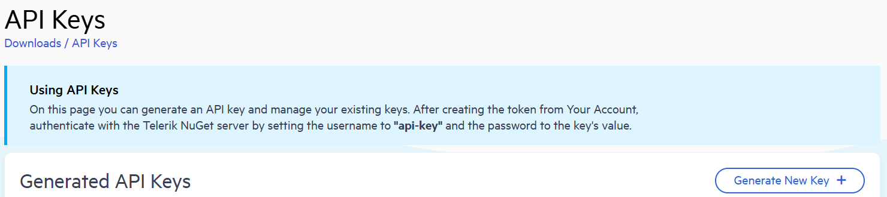
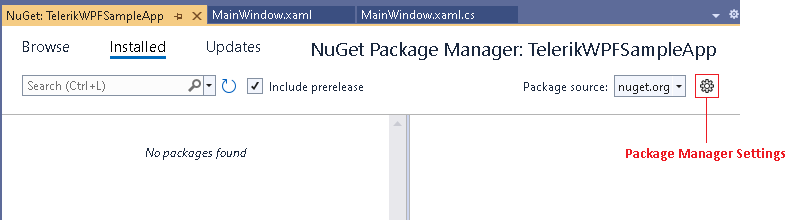
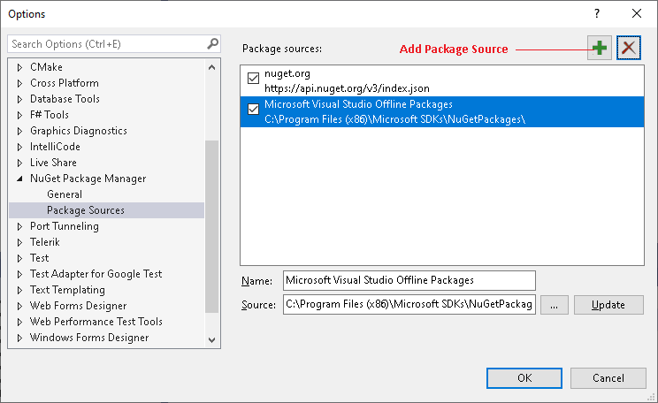
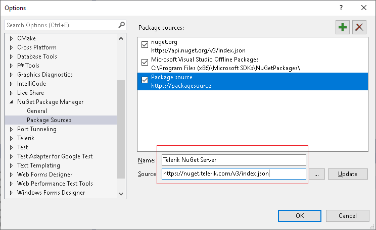
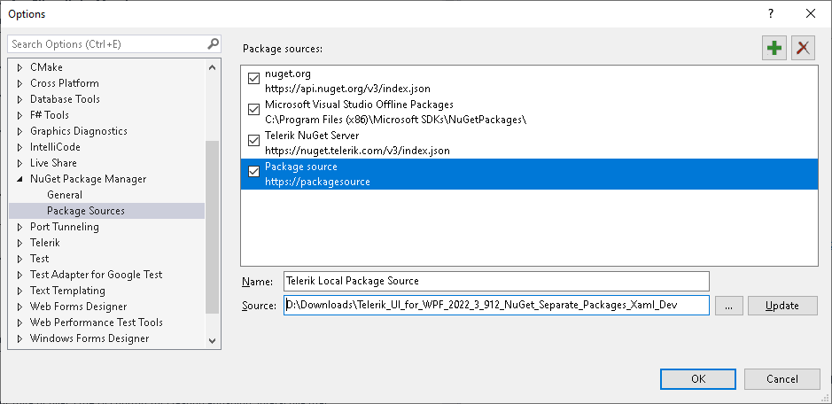
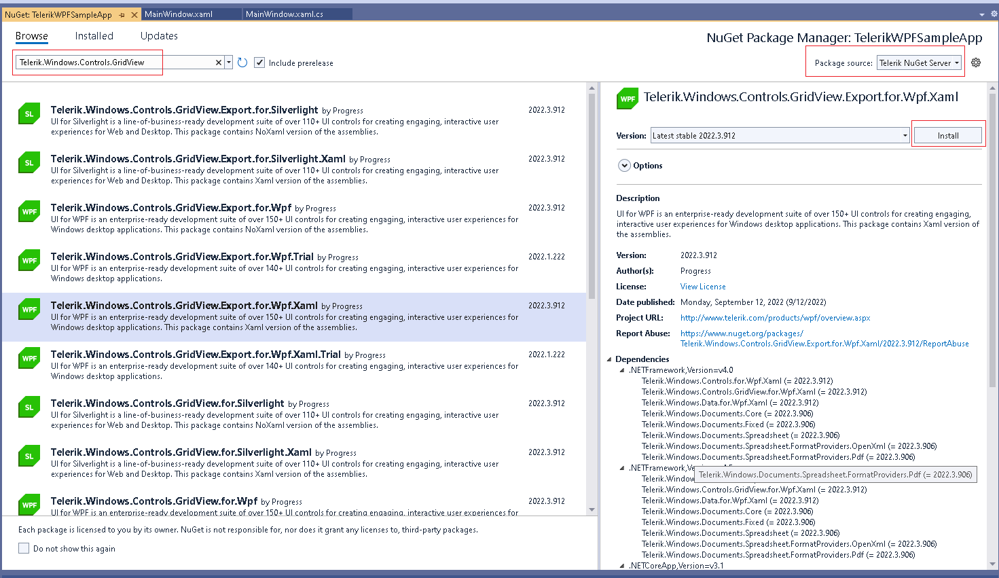

# Setting NuGet Package Source

You can install Telerik UI for WPF NuGet packages from three different sources:

* [Download Telerik UI for WPF packages from NuGet.org (Recommended)](#download-from-nugetorg) (**Recommended for Q3 2026 and later**) — The packages are available on the default NuGet source. No configuration or authentication needed.
* [Download Telerik UI for WPF packages from the Telerik NuGet server](#download-from-the-telerik-nuget-server) — An online private Telerik NuGet feed available for all releases.
* [Download Telerik UI for WPF packages from a local NuGet feed](#manually-download-nuget-packages-from-a-local-nuget-feed) — Download `.nupkg` files from the [Telerik product download page](https://www.telerik.com/account/product-download?product=RCWPF) and configure a local package source.

You are free to choose the installation method that best fits your preferences and project requirements.

## How to Choose the NuGet Installation Source

All three installation methods are fully supported. The following guidance can help you decide:

* Use **NuGet.org** for current Telerik UI for WPF releases (**Q3 2026 and later**). NuGet.org is the default package source in Visual Studio and the .NET CLI, so it requires the least configuration.

* Use the **Telerik NuGet server** when you need package versions released before Q3 2026, or when your organization already standardizes on the Telerik private feed. All new release versions are also available on the Telerik NuGet server.

* Use a **local NuGet feed** when you need offline installation, reproducible restores inside a controlled network, or a mirrored package source for build agents.

## Automated Setup with Telerik CLI

The easiest way to setup the Telerik package source is to use the [Telerik CLI setup tool]().

1. Open any command line terminal.

1. If you don't have Telerik CLI installed, run the `dotnet tool install` command.

   ```
   dotnet tool install -g Telerik.CLI
   ```

1. Run the `nuget config` command:

   ```
   telerik nuget config
   ```

>tip Telerik CLI uses NuGet.org to download Telerik UI for Wpf packages.

## Download from NuGet.org

Starting with **Q3 2026**, Telerik UI for Wpf NuGet packages are also available on <a href="https://www.nuget.org/" target="_blank">NuGet.org</a>. You can find and install the Telerik packages directly from NuGet.org without configuring the private Telerik NuGet feed.

This is the recommended installation path for new development. Both Visual Studio and the .NET CLI use NuGet.org by default.

## Download from the Telerik NuGet server

The Telerik server is an online package source that can be accessed through Visual Studio's Nuget Package Manager in order to easily install and upgrade Telerik assemblies. The NuGet server resides at: [https://nuget.telerik.com/v3/index.json](https://nuget.telerik.com/v3/index.json). 

As the Telerik NuGet server requires authentication, the first step is to obtain an API key that you will use instead of a password.

1. Go to the [Telerik account API key management page](https://www.telerik.com/account/downloads/api-keys).
1. Click Generate New Key +.

	

1. In the Key Note field, add a note that describes the API key.
1. Click Generate Key.
1. Select Copy and Close. Once you close the window, you can no longer copy the generated key. For security reasons, the API Keys page displays only a portion of the key.
1. Store the generated NuGet API key as you will need it in the next steps. Whenever you need to authenticate your system with the Telerik NuGet server, use `api-key` as the username and your generated API key as the password.

> API keys expire after two years. Telerik will send you an email when a key is about to expire, but we recommend that you set your own calendar reminder with information about where you used that key: file paths, project links, AzDO and GitHub Action variable names, and so on.

The following steps show how to setup the package source in Visual Studio. 

1. Navigate to the Package Manager Settings menu in Visual Studio.
	
	

1. Add a new source in the Package Sources section.

	
	
1. In the Source field fill the address of the Telerik NuGet Server and click OK. The address is: [https://nuget.telerik.com/v3/index.json](https://nuget.telerik.com/v3/index.json)

	
	
1. The Telerik Server is added and ready to use. 

Using the Telerik package source gives access to versions starting from __2016.3.1024__. If you need to use a previous version of the suite you will need to create a [local package source](#using-a-local-package-source).

### Telerik NuGet Server Authentication

When you select the Telerik feed for the first time, Visual Studio prompts you for credentials.

Use the following values:

* **User name**: `api-key`
* **Password**: Your Telerik NuGet API key

Generate the key from the [Telerik account API key management page](https://www.telerik.com/account/downloads/api-keys).

>warning If [single sign-on for Telerik accounts](https://www.telerik.com/blogs/sso-telerik-kendo-ui-simpler-more-secure-access-account) (SSO) is enabled for your Telerik account, do not enter your Telerik account email and password in this prompt. Even if you use SSO to sign in to telerik.com, Visual Studio requires `api-key` as the user name and a Telerik NuGet API key as the password for Telerik NuGet feed access. The account must also have an active trial or commercial license.

### Reset Stored Credentials

If you previously stored credentials for the Telerik NuGet server, you need to reset them to be able to authenticate with your new API key. Here are the steps you need to follow:

1. Remove the saved credentials in the [Windows Credential Manager](https://support.microsoft.com/en-us/windows/credential-manager-in-windows-1b5c916a-6a16-889f-8581-fc16e8165ac0). These credentials will appear as `nuget.telerik.com` or `VSCredentials_nuget.telerik.com` entries.
1. Remove the Telerik NuGet package source from Visual Studio.
1. If you have added the Telerik package source by using the .NET CLI, try to remove it by running the following commands:
   
   * [dotnet nuget list source](https://learn.microsoft.com/en-us/dotnet/core/tools/dotnet-nuget-list-source)
   * [dotnet nuget remove source](https://learn.microsoft.com/en-us/dotnet/core/tools/dotnet-nuget-remove-source)

1. Check if you have any credentials stored in `%AppData%\NuGet\Nuget.Config`. If so, remove them.
1. Try to reset the Visual Studio user data by [forcing NuGet to request authentication again](https://stackoverflow.com/questions/43550797/how-to-force-nuget-to-ask-for-authentication-when-connecting-to-a-private-feed).
1. Restart Visual Studio.
1. Add the Telerik NuGet package source again through Visual Studio or .NET CLI.

## Manually Download NuGet Packages from a local NuGet feed

The Telerik packages are available as `.nupkg` files that can be downloaded from your telerik.com account. The following steps describe what to download and how to setup the package source:

1. Go to the [Telerik UI for WPF download page](https://www.telerik.com/account/product-download?product=RCWPF).
1. Download the .zip file with the NuGet packages and extract it into the folder where your package source will be hosted.

	You will find 4 .zip files with nuget packages on the download page. These contain two different package types (full and separate), each containing two different types of Telerik dlls ([Xaml and NoXaml build types]()).
	
	* `Telerik_UI_for_WPF_{version}_Dev_NuGet_{Xaml/NoXaml}.zip` are available for the supported .NET versions and combine all UI for WPF assemblies in one NuGet.
	
	* `Telerik_UI_for_WPF_{version}_Dev_NuGet_Separate_Packages_{Xaml/NoXaml}.zip` contains the separate NuGet packages of all UI for WPF assemblies. These are useful if you don't want to include all Telerik assemblies in your project, but only the ones you are referencing.	
	
1. Navigate to the "Package Manager Settings" menu.
	
	

1. Add a new source in the "Package Sources" section.

	
	
1. In the "Source" field use the path to the folder where you extracted the .zip file with the .nupkg files (step 2). Then click OK.

	

1. The Telerik server is added and ready to use. 

## Selecting the Package Source in Visual Studio

Once you created the package source as described in the previous sections of this article, you will need to select it in the Visual Studio's NuGet Package Manager.

1. Open your project in Visual Studio and select it.
1. Click on the "Manage NuGet Packages" menu.
1. Select the source from the "Package source" drop down.
	
	

1. Search and install a package.

Selecting the Telerik source as the __Package source__ in Visual Studio will prompt you to enter your Telerik NuGet feed credentials.

## Additional Resources

* The following blog shows how to [create a private NuGet feed for Telerik packages](http://blogs.telerik.com/careypayette/posts/13-03-11/power-your-projects-with-telerik---now-with-the-convenience-of-nuget).

* The following video demonstrates how to add the Telerik NuGet Feed to your NuGet Package Sources:

	<iframe width="800" height="400" src="https://www.youtube.com/embed/c3m_BLMXNDk" frameborder="0" allow="accelerometer; autoplay; encrypted-media; gyroscope; picture-in-picture; fullscreen"></iframe>

## See Also  
* [Review the Available Telerik UI for WPF NuGet Packages]()
