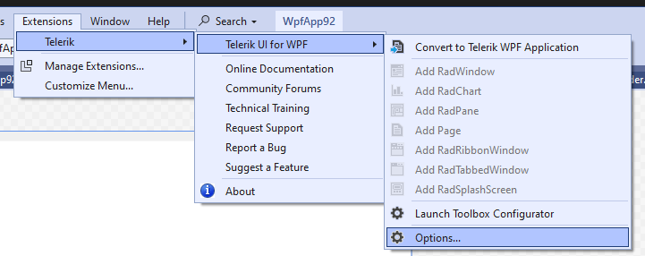
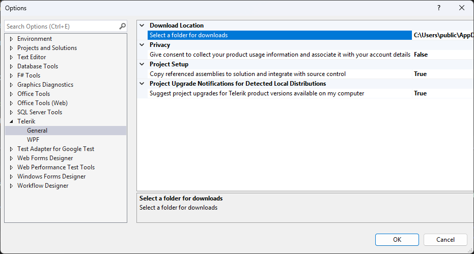
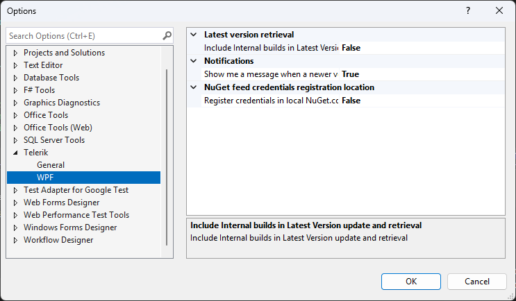
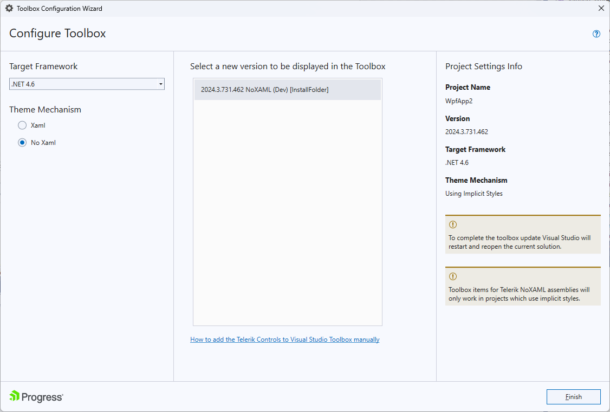

# Telerik Visual Studio Extension Options

__Progress Telerik UI for WPF Extension__ options dialog provides settings, so you can configure the extension to best suit your needs.

It can be accessed through the `Extensions --> Telerik --> Telerik UI for WPF --> Options` menu in Visual Studio.

The __Options__ dialog contains two sets of options that affect Telerik UI for WPF - __General__ and __WPF__.

## General Settings

The settings under the __General__ category affect all of the installed __Telerik Visual Studio Extensions__.

* `Select a folder for downloads`&mdash;Configures the path where the extensions look for and store distributions.

	> Changing the folder path will not move existing folder contents from your previous path. Please, move your previous folder contents manually in case you still want to use them.

* `Copy referenced assemblies to solution and integrate with source control`&mdash;When enabled, the referenced assemblies will be copied to the solution when using Telerik wizards.

* `Suggest project upgrades for Telerik product version available on my computer`&mdash;When enabled, you will be prompted to upgrade upon opening a project, which is not using the latest version of Telerik UI for WPF installed on your system

## WPF Settings

All settings under the Telerik UI for WPF category affect only the Telerik WPF projects.

* `Include internal builds in Latest Version update and retrieval`&mdash;When enabled, the __[Latest Version Acquirer]()__ tool will retrieve internal builds as well as official releases when checking for a new version.

* `Show me a message when a newer version is available on www.telerik.com`&mdash;When enabled, you will receive notifications if a new version of __Telerik UI for WPF__ is available on the Telerik website.

* `Register credentials in local NuGet.config`&mdash;By default the Telerik feed credentials are registered in the global NuGet.config. When this option is enabled, a NuGet.config file will be created in the solution and the credentials registered there.

## Setting Toolbox Version

Progress Telerik UI for WPF Extension supports Visual Studio Toolbox configuration utility. Its purpose is to choose which version of __Telerik UI for WPF__ to be populated in the Toolbox. The user can select among all versions of Telerik UI for WPF that are installed or downloaded on the machine via the Progress Telerik UI for WPF Extension.

The __Toolbox Configurator__ can be launched from the `Extensions --> Telerik --> Telerik UI for WPF --> Launch ToolBox Configurator` menu. 

This setting is supported only for __.NET Framework__ projects.

After running the Toolbox Configurator it shows the version of the currently installed distribution (if available). The user can make a selection using the dropdown menu which lists all versions discovered on the machine. 

When the Finish button is clicked Visual Studio will be restarted so that the changes can take effect.

>The Toolbox Configurator will overwrite the toolbox registration performed during installation. Additionally, after configuring the toolbox, the 'Add References' dialog will suggest Telerik assemblies from the selected distribution only and you will see the selected controls in the Toolbox | Choose Items context menu.        