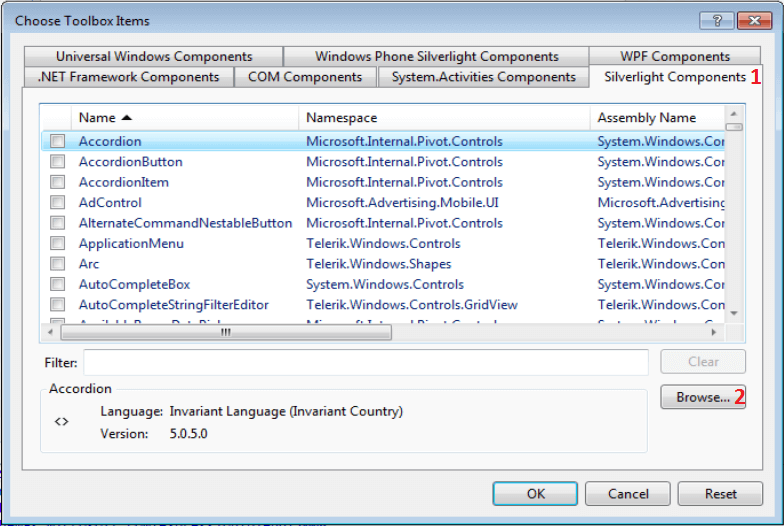
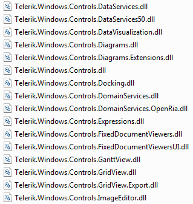
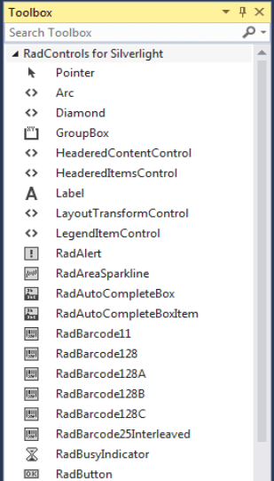
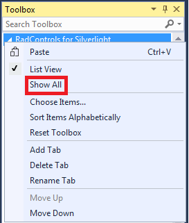

# Adding UI for Silverlight to Visual Studio 2015 Toolbox

The following tutorial will show you how to add UI for Silverlight controls to Visual Studio 2015 toolbox.

## Adding UI for Silverlight to Visual Studio 2015 Toolbox

To manually add Telerik UI for Silverlight to the Visual Studio 2015 Toolbox, follow the steps below:

* Open your application in Visual Studio 2015.

* Expand the Toolbox (View->Toolbox or use the shortcut Ctrl+Alt+X). 

* Right-mouse click in the toolbox area and choose "Add Tab" from the context menu.

	  

* Add a new tab with name "UI for Silverlight".

	

* Select the "UI for Silverlight" tab in the toolbox. Right-mouse click and select "Choose Items...".

	

* In the "Choose Toolbox Items" dialog, go to the "Silverlight Components" tab and click "Browse...".

	

* Navigate to the folder where the binaries are located. Select the DLL you want to import and click OK or press Enter.

	

* Press OK to include the controls in your toolbox, or filter the controls you want to add.

	

* Expand your toolbox. You will see the newly added controls in the "UI for Silverlight" section.

	

>After clicking the OK button of the "Choose Toolbox Items", it is possible that the "UI for Silverlight" tab in the toolbox may be __hidden__. If that happens, move the mouse pointer over the Toolbox area and right-click the mouse and then select the __Show All__ command from the shortcut menu.
>
>

## See Also
 * [Creating an Application and Adding UI for Silverlight]()
 * [Namespace Declaration]()
