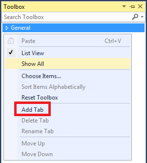
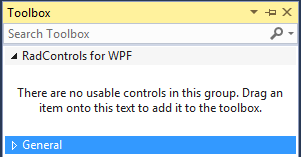
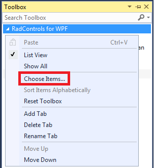
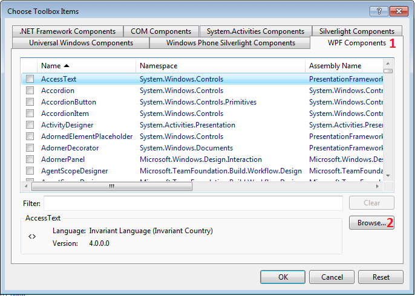
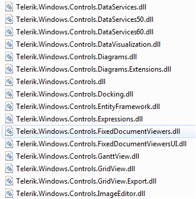
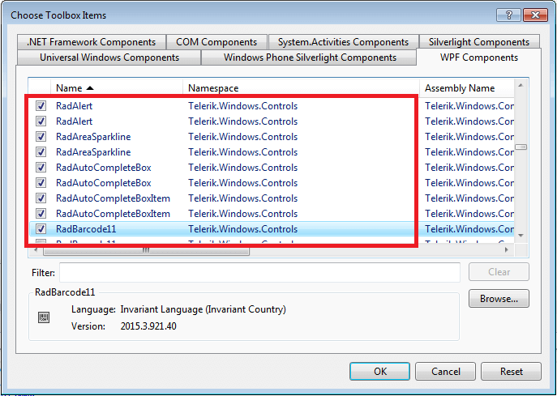
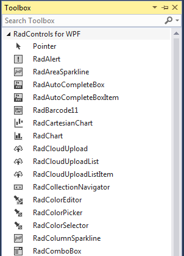
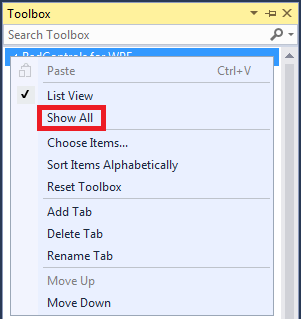

# Adding UI for WPF to Visual Studio Toolbox

The following tutorial will show you how to add UI for WPF controls to the Visual Studio toolbox.

>important This article is relevant for .NET Framework projects. If you use {{ site.minimum_net_core_version }} and later, see the "Design-Time Support" section of the [.NET Overview]() article.

## Adding UI for WPF to Visual Studio Toolbox

To manually add Telerik UI for WPF to the Visual Studio Toolbox, follow the steps below:

* Open your application in Visual Studio.

* Expand the Toolbox (View->Toolbox or use the shortcut Ctrl+Alt+X). 

* Right-mouse button click in the toolbox area and choose "Add Tab" from the context menu.

	

* Add a new tab with name "UI for WPF".

	

* Select the "UI for WPF" tab in the toolbox. Right-mouse click and select "Choose Items...".

	

* In the "Choose Toolbox Items" dialog, go to the "WPF Components" tab and click "Browse...".

	

* Navigate to the folder where the binaries are located. Select the DLL you want to import and click OK or press Enter.

	

	>If you wonder which control belongs to which assembly, take a look at the main topic about [Controls Dependencies]().

* Press OK to include the controls in your toolbox or filter the controls you want to add.

	

* Expand your toolbox. You will see the newly added controls in the "UI for WPF" section.

	

>After clicking the OK button of the "Choose Toolbox Items", it is possible that the "UI for WPF" tab in the toolbox may be __hidden__. If that happens, move the mouse pointer over the Toolbox area and right-click the mouse and then select the __Show All__ command from the shortcut menu.

## See Also  
 * [Namespace Declaration]() 
