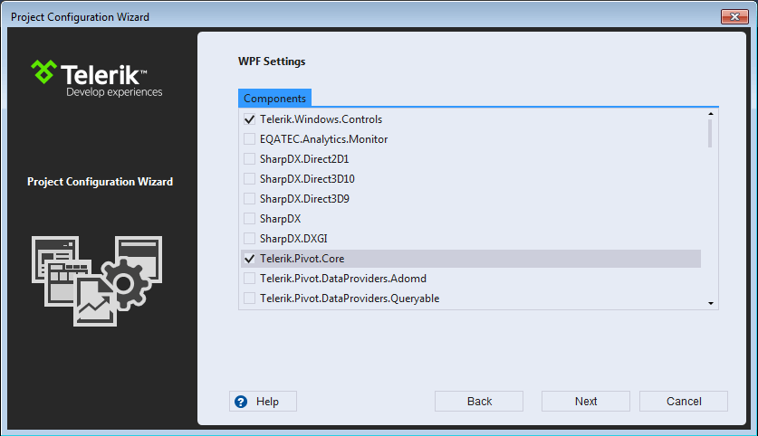

# Automatic Dependency Resolving

## 

To improve the experience of your clients and boost your application’s initial load time it is crucial to use only the subset of Telerik UI for Silverlight assemblies you really need, as described in the [Installation and Deployment Section](). 

Some controls require multiple assemblies and it mistakes are not unlikely to happen. For example, in the urge to optimize load times, you could remove an assembly the project needs, thus breaking the application compilation.

When using the __New Project Wizard__ or __Project Configuration Wizard__, the possibility to make such mistakes is lowered to a minimum, thanks to the dependency analysis in the Visual Studio Extensions.

The VSExtensions assembly list control is controlled by the dependency analyzer, which won’t let you select __Telerik UI for Silverlight__ assemblies without selecting the assemblies they depend on. Both the aspects are covered:

* Selecting a __Telerik UI__ assembly will also select the additional assemblies it depends on as well. 

* Deselecting a __Telerik UI__ assembly will also deselect assemblies depending on it along with it.  

## See Also

 * [Project Creation and Configuration]()

 * [Upgrade Project]()

 * [Download New Version]()
