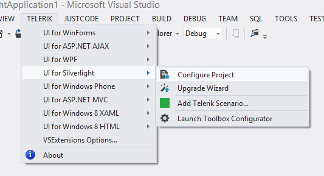

# Overview

__Visual Studio Extensions__ for __Telerik UI for Silverlight__ aim to help developers when creating Silverlight Application with __Telerik UI for Silverlight__.

The extensions handle the following major points in the development with __Telerik UI for Silverlight__:

* __Project creation, conversion and configuration__ – reference management.

* __Project Upgrade__ - upgrading __Telerik UI for Silverlight__ to a new version.

* __Common scenario page creation__ - aid creating pages with basic scenarios in the usage of __Telerik UI for Silverlight.__

* __Toolbox configuration__ – select what version of Telerik UI to be populated in the Toolbox.

__Visual Studio Extensions__ for __Telerik UI for Silverlight__ are distributed with the __Telerik UI for Silverlight__ installer. They can be downloaded and installed as separate product from the [Visual Studio Gallery](http://visualstudiogallery.msdn.microsoft.com/) for Visual Studio 2010 and later. The extensions support Visual Studio 2010 and 2012, handling Silverlight 5 applications. 

The __Visual Studio Extensions__ can be accessed through the __Telerik | Telerik UI for Silverlight__ menu which has different menu items depending on the selected project in Visual Studio. The extensions can be accessed through the context menu of a Silverlight Application as well.

__No selected project in Visual Studio__

__Selected project in Visual Studio is Standard Silverlight Application__

__Selected project in Visual Studio is Telerik Silverlight Application__

When installed, the extensions add several project templates to the New Project dialog of Visual Studio:

>These are available in the language specific nodes of the dialog as well. New Project dialog contains Telerik Silverlight Application under both CSharp\Silverlight and Visual Basic\Silverlight nodes.

