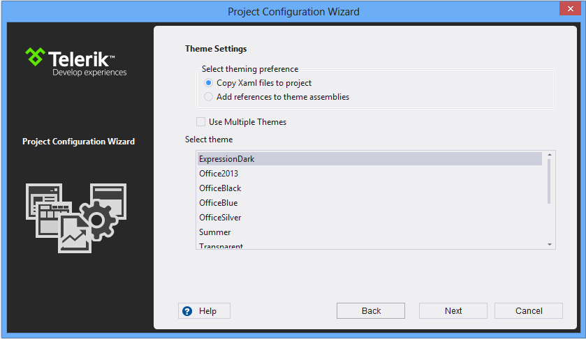

# Project Creation and Configuration

## 

With the new Visual Studio Extensions for Silverlight you can quickly create an application pre-configured to use Telerik UI for Silverlight. 

The quickest way to have such a project is using the __New Project Wizard__ in Visual Studio. There is a new node under the __Telerik__ node – __Silverlight__, where two project templates exist: 

For convenience the same project templates could be found under the __Visual C# -> Silverlight and Visual Basic -> Silverlight__ nodes. 

After you click the __OK__ button, you get the __Project Configuration Wizard__, provided by the Telerik UI for Silverlight Visual Studio Extensions. The wizard detects all the installed distributions of Telerik UI for Silverlight and lists them in a combo box. You can select a distribution which you want to be applied to your project. The wizard helps you manage the references to the Telerik UI for Silverlight that will be added to your application as well. 

You can access the Project Configuration Wizard through the __Telerik__ menu when you need to configure your Telerik Silverlight application or you need to convert an existing Silverlight application to a Telerik Silverlight application. These depend on the active project in the Visual Studio Solution Explorer: 

__Configure Telerik Silverlight Application__

__Convert to Telerik Silverlight Application__

Both menus have their context menu counterparts accessed by right clicking on the project you want to convert or configure. 

The Project Configuration Wizard lets you tune your project's use of Telerik UI for Silverlight.

The Project Configuration Wizard’s first page lets you:
        

* Select a Telerik UI version from the list of versions detected on your system
          

* Navigate to a folder you’ve manually downloaded and extracted a hotfix by clicking the __Browse__ button
          

* Download the latest versions available on our website using the __Download__ button
          

* Choose whether you want to copy the referenced assemblies to your solution folder
          

* Choose whether you want to use implicit styles or not ([more information]())
          

* Specify which assemblies your project would use. When selecting a Telerik UI for Silverlight assembly all dependent controls are selected automatically and vice-versa
          

>The list of available assemblies might be empty in cases where the installed version of Telerik UI for Silverlight does not match the Silverlight version your project targets. For instance, you will not be offered any assemblies if you attempt to create a project targeting Silverlight 4.

Through the Project Configuration Wizard’s second page you can:
        

* Select the way you want themes to be applied in your project
            

* via referencing theme assemblies
              

* via adding theme xaml files to your project (only available when using implicit styles)
              

* Select the theme(s) you wish your to use
          

When you click the Finish button:
        

* The selected assembly references get added to your project
          

* The necessary theme xaml files get included in your project
          

* A default application-wide theme gets set if you select theming based on implicit styles. The first selected theme will be used for a default theme in case you select multiple themes
          

## See Also

 * [Automatic Dependency Resolving]()

 * [Upgrade Project]()

 * [Download New Version]()

 * [Setting a Theme]()
