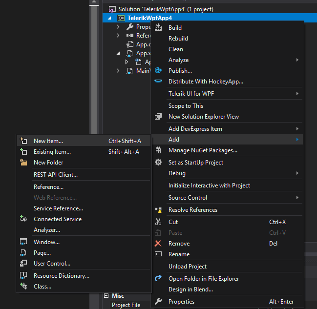
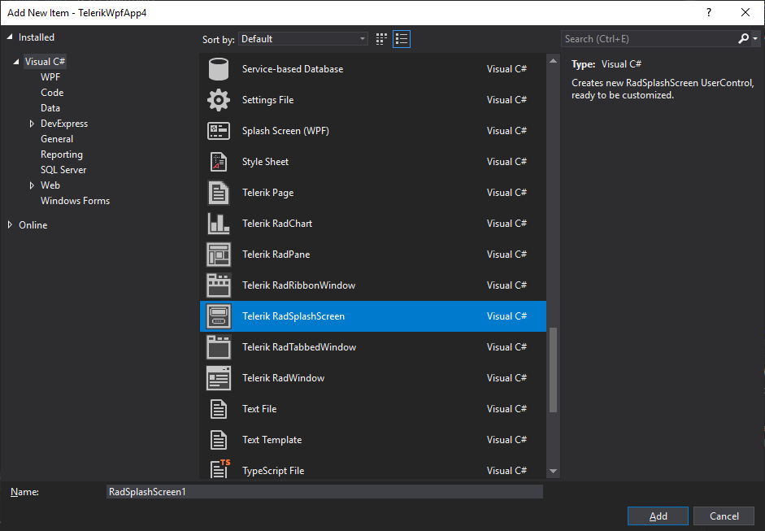

# Telerik Item Templates

Since the __R1 2020__ version of the Telerik UI for {{ site.framework_name }} Visual Studio Extension, Telerik Item Templates are available. They allow you to quickly setup some Telerik controls in your existing projects. Follow these steps in order to add an Item Template.

1. Right-click on your project, and select __Add__ -> __New Item__.

    

1. Scroll down to the Telerik Item Templates and choose the one that is best suitable for you.

    

1. Click __Add__ and the needed Telerik references will be automatically added to your project. 

## Available Item Templates

* __Telerik Page__ : Creates a basic WPF Page, ready to be used with Telerik UI for WPF controls.
* __Telerik RadChart__ : Creates a new UserControl with a [RadChartView]().
* __Telerik RadPane__ : Creates a new [RadPane]() UserControl. RadPane is the main content unit of the RadDocking control.
* __Telerik RadRibbonWindow__ : Creates a new [RadRibbonWindow]() UserControl.
* __Telerik RadSplashScreen__ : Creates a new [RadSplashScreen]() UserControl, ready to be customized.
* __Telerik RadTabbedWindow__ - Creates a new [RadTabbedWindow]() UserControl.
* __Telerik RadWindow__ : Creates a new [RadWindow]() UserControl.