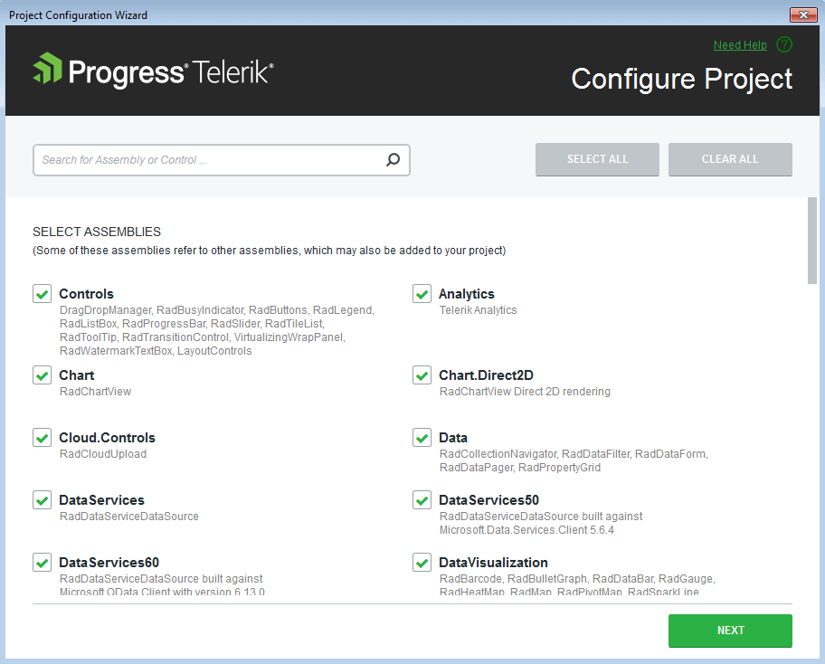
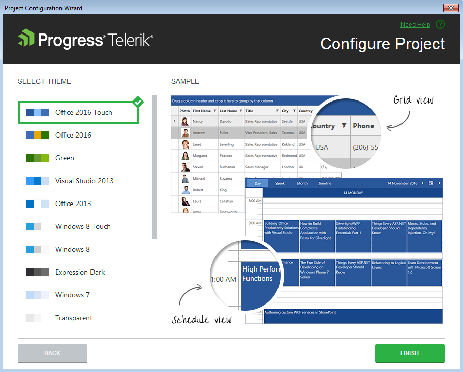

# Configure Project
 
This article shows how to configure a Telerik project created with the Progress Telerik UI for WPF Extension.

You can access the Project Configuration Wizard through the Telerik menu when you need to configure your Telerik WPF application:

> This wizard is currently not available for {{ site.minimum_net_core_version }} and later projects.

The wizard could be also reached through the context menu counterparts accessed by right clicking on the project you want to convert. 

The Project Configuration Wizard’s __first page__ lets you specify which assemblies your project would use. When selecting a Telerik UI for WPF assembly all dependent controls are selected automatically and vice-versa.

       
	
Through the Project Configuration Wizard’s __second page__ you can select which theme will be applied to your project. Check the content of each theme or see the preview of it when select it into the Project Configuration Wizard.

>The Project Configuration Wizard’s second page is only available if you use theming based on implicit styles. ([more information]())           

When you click the Finish button the selected assembly references get added to the project. If you use the [implicit styles]() theming mechanism, the resources of the selected theme are merged in the App.xaml Resources collection.          

## See Also  
 * [Automatic Dependency Resolving]()
 * [Upgrade Project]()
 * [Download New Version]()
 * [Setting a Theme]()
