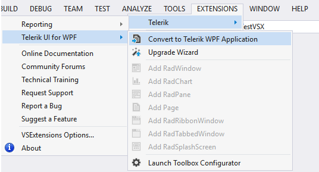
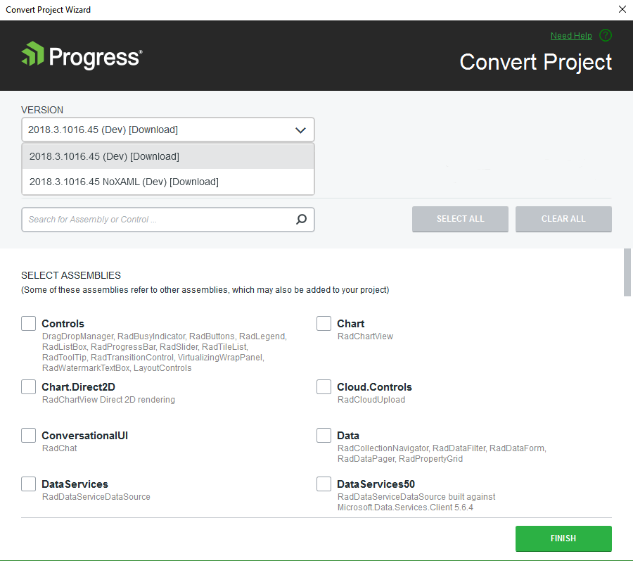
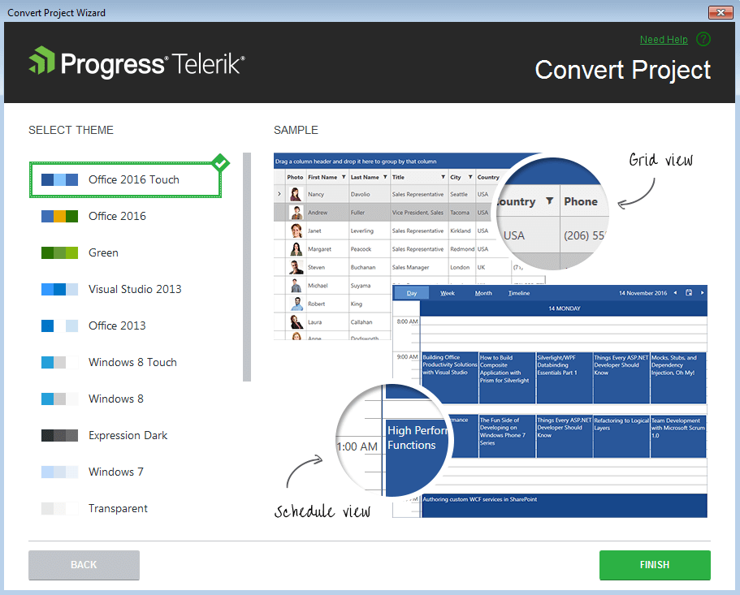

# Convert Project

This article shows how to convert a standard WPF project to a Telerik WPF project.

The project conversion feature is available only for .NET Framework projects.

Progress Telerik UI for WPF Extension's __Convert Project Wizard__ could be accessed through the Visual Studio's __Extensions__ menu when you need to convert an existing WPF application to a Telerik WPF application. 

The wizard could be also reached through the context menu counterparts accessed by right clicking on the project you want to convert. 

The Convert Project Wizard lets you tune your project's use of Telerik UI for WPF.

The wizard’s first page lets you:        

* Select a Telerik UI version from the list of versions detected on your system

* Download the latest versions available on our website using the __GET LATEST__ button. The button will be available only when there is a newer version released on our web site.

* Specify which assemblies your project would use. When selecting a Telerik UI for WPF assembly all dependent controls are selected automatically and vice-versa.

If you prefer the Telerik assemblies to be copied into your solution folder, the **Copy referenced assemblies to solution and source control** option could be selected *only* into the [Visual Studio Extensions Options]().
  
The Convert Project Wizard’s second page is only available if you use theming based on [implicit styles](). 

      

The second page of the Convert Project Wizard’s lets you select which theme will be applied to your project. When you click the Finish button, the selected assembly references get added to your project and the default application-wide theme gets set.

## Convert Project from XAML to NoXAML or Vice Versa

When converting a project from [XAML to NoXAML]() (or vice-versa), you need first to remove all __Telerik__ references from the project. Then you can right-click on the project and launch the Convert Wizard. The final step is to select the assemblies that you need in your project.

## See Also  
 * [Automatic Dependency Resolving]()
 * [Upgrade Project]()
 * [Download New Version]()
 * [Setting a Theme]()