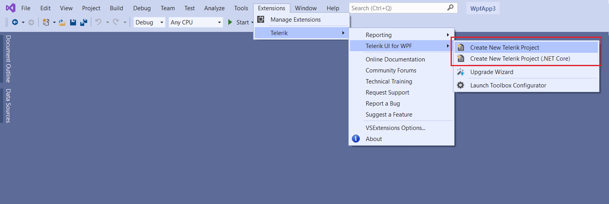
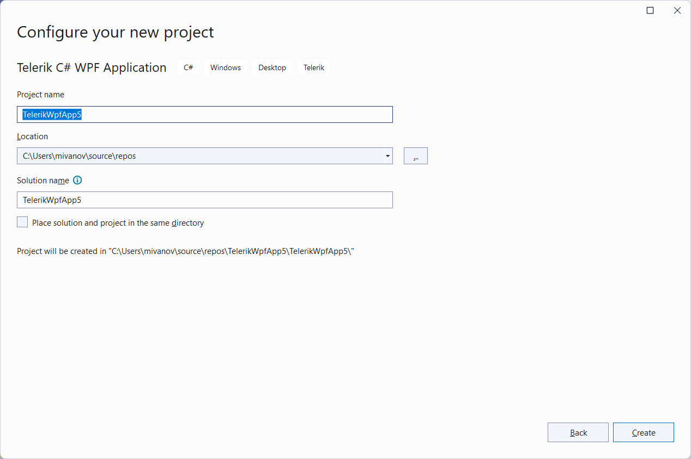
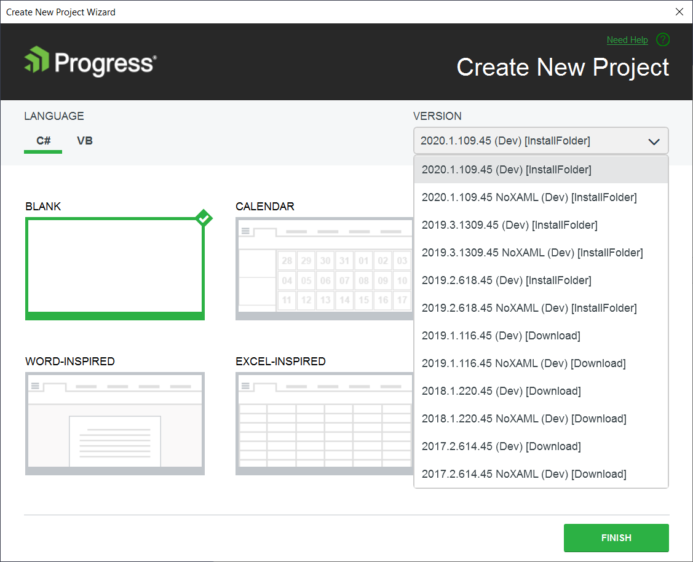
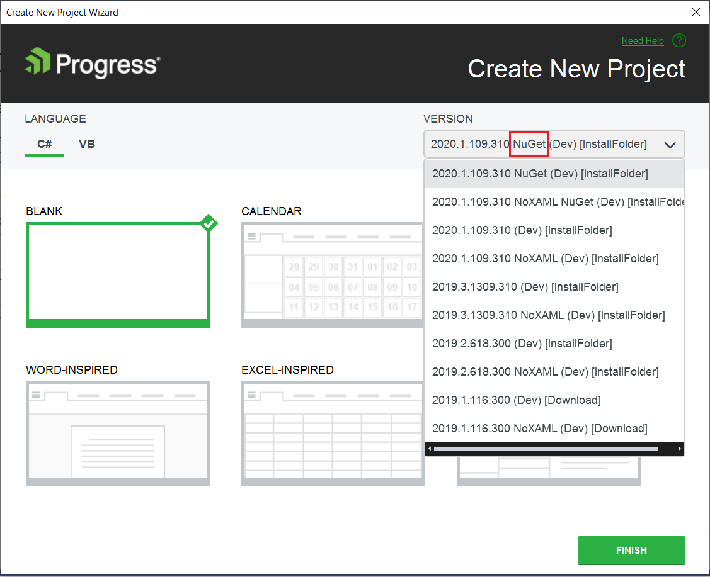
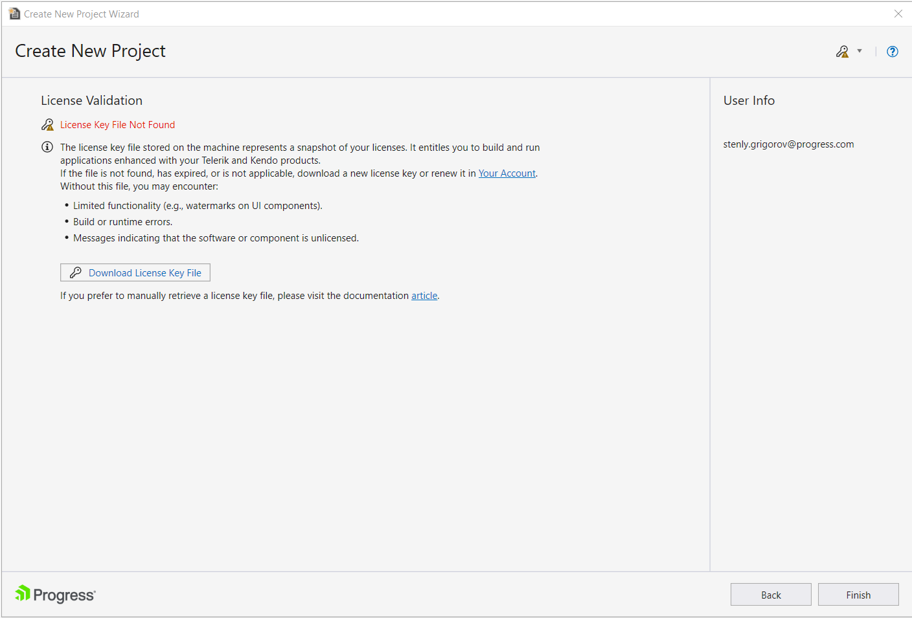
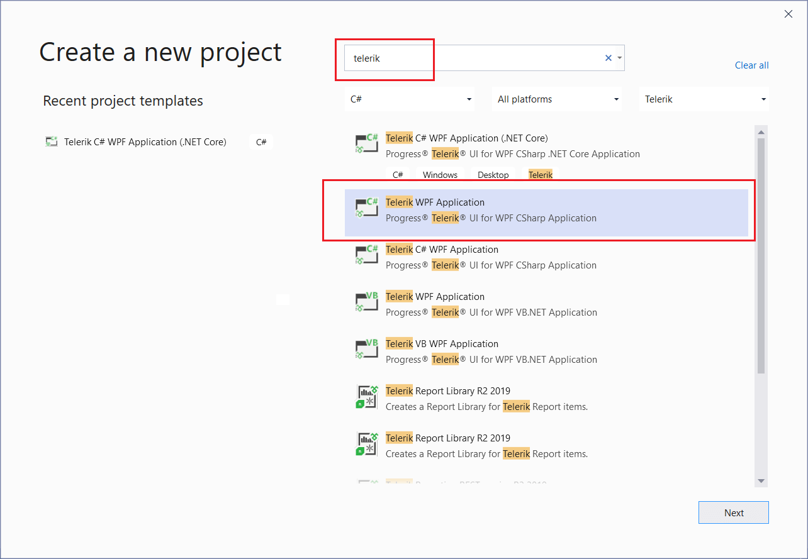

# Create Project

__Progress Telerik UI for WPF Extension__ allows you to quickly create an application pre-configured to use Telerik UI for WPF. 

The fastest way to have such a project is by using the Progress Telerik UI for WPF Extension menu. The following steps show how create a new project with Telerik dlls referenced.

1. Find the Telerik extensions menu in Visual Studio.

	__Telerik Visual Studio Extensions menu location__  
	
	  		
	
2. Click on the __Create New Telerik Project__ option and configure the project's name and location. 
	
	
	
3. Select the project options, like target framework, reference type, theme mechanism, etc., and click Next. This step is available only with the project template for .{{ site.minimum_net_core_version }} and later. 
	
	
	
4. In the __Create New Project Wizard__ select the project template you want to use. The wizard allows you to define a blank project with only the `Telerik.Windows.Controls.dll` referenced, or to use one of the [Office-inspired templates]() (Calendar, Word-Inspired, etc.). 
	
	__.{{ site.minimum_net_core_version }} and later project creation wizard__  
	
	
	
	When creating .NET Framework project, the selection of the Telerik version happens in this step.

	__.NET Framework project creation wizard__  
	
	

5. The wizard validates your Telerik UI for WPF license and lets you download a new [license key file](%slug installing-license-key%) if one such is not found.

	

You can also start the Telerik's __Create New Project Wizard__ (see step 2) from the Visual Studio's New Project Wizard.

__Visual Studio New Project Wizard__  

>tip The __Create New Project Wizard__ allows you to download a Telerik version that is not available on your machine.

> If you prefer the Telerik assemblies to be copied into your solution folder, the **Copy referenced assemblies to solution and source control** option could be selected only into the [Visual Studio Extensions Options]().

## See Also
 * [Automatic Dependency Resolving]()
 * [Upgrade Project]()
 * [Download New Version]()
 * [Setting a Theme]()
