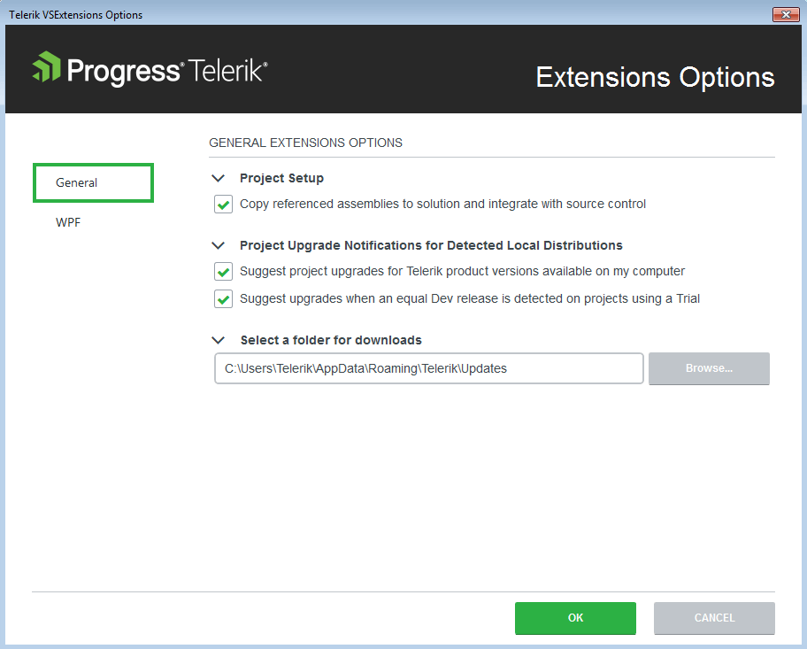
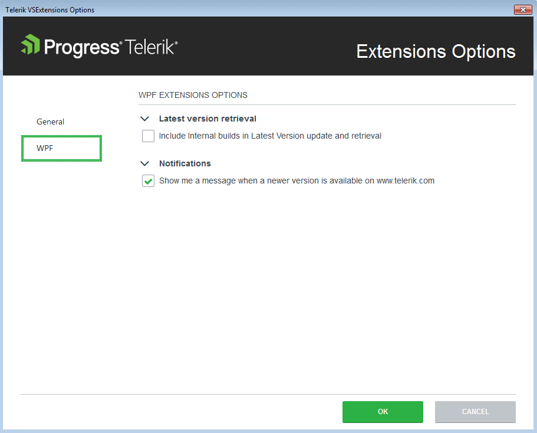

# Options

__Progress Telerik UI for {{ site.framework_name }} Extension__ options dialog provides settings, so you can configure the extension to best suit your needs.

It can be accessed through the __Visual Studio | Telerik | VSExtensions Options…__ menu.

The __Options__ dialog contains two sets of options that affect the __Telerik UI for {{ site.framework_name }}__.

The settings under the __General__ category affect all of the installed __Telerik Visual Studio Extensions__.

## Project Setup

__Add referenced assemblies to solution and source control__ - Sets the default value for the __Add referenced assemblies to solution__ option in the Project Configuration Wizard__Copy referenced assemblies to solution and integrate with source control__ - When enabled, the referenced assemblies will be copied to the solution when using Telerik wizards

## Project Upgrade Notifications for Detected Local Distributions

__Suggest project upgrades for Telerik product version available on my computer__: When enabled, you will be prompted to upgrade upon opening a project, which is not using the latest version of Telerik UI for {{ site.framework_name }} installed on your system

__Suggest upgrades when an equal Dev release is detected on projects using a Trial__: When enabled, you will be prompted to upgrade if a licensed version of Telerik UI for {{ site.framework_name }} is available on your system, but the current project uses a trial version

## Select a Folder for Downloads

Configures the path where the extensions look for and store distributions.

>Changing the folder path will not move existing folder contents from your previous path. Please, move your previous folder contents manually in case you still want to use them.

## {{ site.framework_name }} Options

All settings under the Telerik UI for {{ site.framework_name }} category affect only the Telerik {{ site.framework_name }} projects.

## Latest Version Retrieval

__Include internal builds in Latest Version update and retrieval__: When enabled, the __[Latest Version Acquirer]()__ tool will retrieve internal builds as well as official releases when checking for a new version.

## Notifications

__Show me a message when a newer version is available on [www.telerik.com](http://www.telerik.com)__: When enabled, you will receive notifications if a new version of __Telerik UI for {{ site.framework_name }}__ is available on the Telerik website.