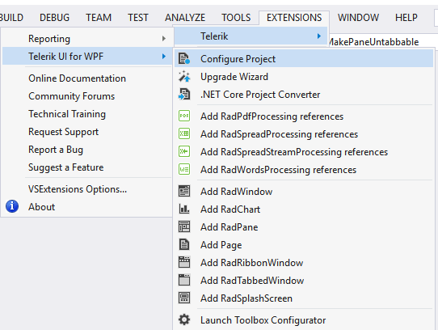
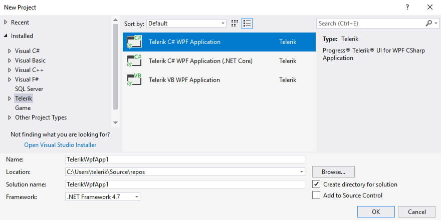

# Overview

__Progress Telerik UI for {{ site.framework_name }} Extension__ aim to help developers when creating an application with Telerik UI for {{ site.framework_name }}.

The extensions handle the following major points in the development with Telerik UI for {{ site.framework_name }}:

* __Project creation, conversion and configuration__: Reference management.

* __Project upgrade__: Upgrading Telerik UI for {{ site.framework_name }} to a new version.

* __Common scenario page creation__: Aid creating pages with basic scenarios in the usage of Telerik UI for {{ site.framework_name }}.

* __Toolbox configuration__: Select what version of Telerik UI for {{ site.framework_name }} to be populated in the Visual Studio Toolbox.

__Progress Telerik UI for {{ site.framework_name }} Extension__ is distributed with the Telerik UI for {{ site.framework_name }} installer. It can be downloaded and installed as separate product from the [Visual Studio Gallery](https://marketplace.visualstudio.com/) for Visual Studio 2019 and later. 

Progress Telerik UI for {{ site.framework_name }} Extension can be accessed through the __Extensions | Telerik | Telerik UI for {{ site.framework_name }}__ menu in Visual Studio. The extensions show different menu items depending on the selected project in Visual Studio. The extensions can be accessed through the context menu of the application as well.

__No selected project in Visual Studio__  

__Selected project in Visual Studio is Standard WPF Application__  

__Selected project in Visual Studio is Telerik Application__  

When installed, the extensions add several project templates to the New Project dialog of Visual Studio.

__Telerik project templates__  

### Visual Studio Support

<table>
	<thead>
		<tr>
			<th width="33.6%">Visual Studio Version</th>
			<th width="66.3%">Notes</th>
		</tr>
	</thead>
	<tbody>
		<tr>
			<td width="33.6%">Visual Studio 2019 and 2022</td>
			<td width="66.3%">The latest version of Telerik VSX is distributed and fully supported in these versions of Visual Studio. With Q2 2024, the Telerik VSX supports .NET Framework 4.6.2 and later projects and .NET 6 and later.</td>
		</tr>		
		<tr>
			<td width="33.6%">Visual Studio 2015 and 2017</td>
			<td width="66.3%">With R1 2023 the Telerik VSX is still distributed with the product, but updates are not longer available for these versions of Visual Studio</td>
		</tr>
		<tr>
			<td width="33.6%">Visual Studio 2012</td>
			<td width="66.3%">With the Q1 2024 release, the Telerik VSX no longer supports this version of Visual Studio.</td>
		</tr>
	</tbody>
</table>