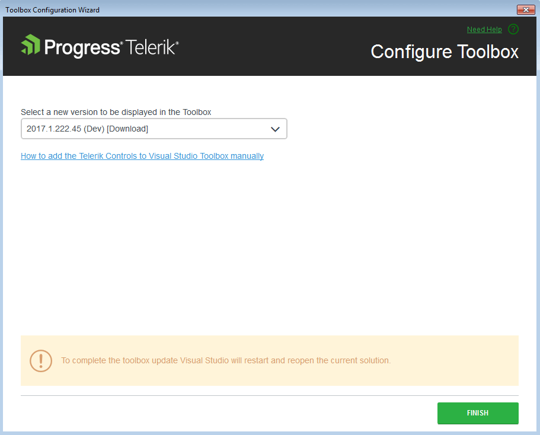

# Set Toolbox Version

Progress Telerik UI for {{ site.framework_name }} Extension supports Visual Studio Toolbox configuration utility. Its purpose is to choose which version of __Telerik UI for {{ site.framework_name }}__ to be populated in the Toolbox. The user can select among all versions of Telerik UI for {{ site.framework_name }} that are installed or downloaded on the machine via the Progress Telerik UI for {{ site.framework_name }} Extension.

The __Toolbox Configurator__ can be launched from the Telerik menu.

After running the Toolbox Configurator it shows the version of the currently installed distribution (if available). The user can make a selection using the dropdown menu which lists all versions discovered on the machine. 

When the Finish button is clicked Visual Studio will be restarted so that the changes can take effect.

>The Toolbox Configurator will overwrite the toolbox registration performed during installation. Additionally, after configuring the toolbox, the 'Add References' dialog will suggest Telerik assemblies from the selected distribution only and you will see the selected controls in the Toolbox | Choose Items context menu.        