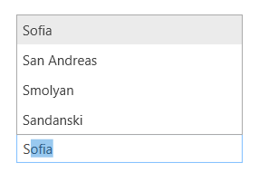

## Environment
<table>
    <tbody>
	    <tr>
	    	<td>Product Version</td>
	    	<td>2018.2.515</td>
	    </tr>
	    <tr>
	    	<td>Product</td>
	    	<td>RadAutoCompleteBox for WPF</td>
	    </tr>
    </tbody>
</table>

## Description

How to align the popup with the search results of RadAutoCompleteBox to the Top of the control.

## Solution

1. Subscribe to the Loaded event of RadAutoCompleteBox.
2. Use the [FindChildByType<T>]() method to get the Popup control.
3. Set the Placement property of the Popup.

#### __[C#]__
{{region kb-autocompletebox-show-popup-on-top-0}}
	private void RadAutoCompleteBox_Loaded(object sender, RoutedEventArgs e)
	{
		var autoCompleteBox = (RadAutoCompleteBox)sender;
		var popup = autoCompleteBox.FindChildByType<Popup>();
		popup.Placement = System.Windows.Controls.Primitives.PlacementMode.Top;
	}
{{endregion}}

