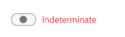

## Environment
<table>
	<tbody>
		<tr>
			<td>Product Version</td>
			<td>2024.1.423</td>
		</tr>
		<tr>
			<td>Product</td>
			<td>RadButtons for WPF</td>
		</tr>
	</tbody>
</table>

## Solution

[Extract the default control template](#extracting-control-templates-manually-from-the-theme-xaml-file) of `RadToggleSwitchButton` and include an additional `ContentPresenter` element. This ContentPresenter will use the values set to the `Content` and `ContentTemplate` properties of RadToggleSwitchButton. You can use these properties to set your content when the control's IsChecked is set to null.

The following example shows the modified control template of the RadToggleSwitchButton control for the Windows 11 theme.

__Modifying the default control template of RadToggleSwitchButton to display content when it is in an undefined state__
```XAML
    <Application.Resources>
        <ResourceDictionary>
            <ResourceDictionary.MergedDictionaries>
                <ResourceDictionary Source="/Telerik.Windows.Themes.Windows11;component/Themes/System.Windows.xaml"/>
                <ResourceDictionary Source="/Telerik.Windows.Themes.Windows11;component/Themes/Telerik.Windows.Controls.xaml"/>
            </ResourceDictionary.MergedDictionaries>
            <Style x:Key="CustomToggleSwitchButtonStyle" TargetType="telerik:RadToggleSwitchButton" BasedOn="{StaticResource RadToggleSwitchButtonStyle}">
                <Setter Property="Template">
                    <Setter.Value>
                        <ControlTemplate TargetType="telerik:RadToggleSwitchButton">
                            <Grid>
                                <Border x:Name="FocusVisual" Style="{StaticResource FocusVisualBorderStyle}" CornerRadius="{TemplateBinding helpers:ThemeHelper.CornerRadius}"/>
                                <Grid Margin="{TemplateBinding helpers:ThemeHelper.FocusVisualMargin}">
                                    <Grid SnapsToDevicePixels="{TemplateBinding SnapsToDevicePixels}" MinHeight="{TemplateBinding MinHeight}" MinWidth="{TemplateBinding MinWidth}">
                                        <Grid.ColumnDefinitions>
                                            <ColumnDefinition Width="Auto"/>
                                            <ColumnDefinition Width="{Binding RelativeSource={RelativeSource TemplatedParent}, Path=TrackWidth}"/>
                                            <ColumnDefinition Width="Auto"/>
                                        </Grid.ColumnDefinitions>
                                        <ContentPresenter x:Name="UncheckedContent"
                                                          Grid.Column="2"
                                                          Margin="{TemplateBinding Padding}"
                                                          TextBlock.Foreground="{TemplateBinding Foreground}"
                                                          Content="{TemplateBinding UncheckedContent}"
                                                          ContentTemplate="{TemplateBinding UncheckedContentTemplate}"
                                                          HorizontalAlignment="{TemplateBinding HorizontalContentAlignment}"
                                                          VerticalAlignment="{TemplateBinding VerticalContentAlignment}"
                                                          ContentStringFormat="{TemplateBinding ContentStringFormat}"
                                                          RecognizesAccessKey="True"/>
                                        <Grid Grid.Column="1" SnapsToDevicePixels="True" Height="{TemplateBinding TrackHeight}">
                                            <Rectangle x:Name="TrackBackground"
                                                       RadiusX="9"
                                                       RadiusY="9"
                                                       Fill="{Binding RelativeSource={RelativeSource TemplatedParent}, Path=(helpers:ThemeHelper.CheckedBackgroundBrush)}"
                                                       Stroke="{Binding RelativeSource={RelativeSource TemplatedParent}, Path=(helpers:ThemeHelper.CheckedBrush)}"
                                                       StrokeThickness="{TemplateBinding BorderThickness}"
                                                       Opacity="0"/>
                                            <Rectangle x:Name="UncheckedTrackBackground"
                                                       RadiusX="9"
                                                       RadiusY="9"
                                                       Fill="{TemplateBinding Background}"
                                                       Stroke="{TemplateBinding BorderBrush}"
                                                       StrokeThickness="{TemplateBinding BorderThickness}"/>
                                            <Ellipse x:Name="PART_Thumb"
                                                     Fill="{telerik:Windows11Resource ResourceKey=AccentControlForegroundBrush}"
                                                     Width="{TemplateBinding ThumbWidth}"
                                                     Height="{TemplateBinding ThumbHeight}"
                                                     HorizontalAlignment="Left"
                                                     RenderTransformOrigin="0.5,0.5"
                                                     Margin="3 0">
                                                <Ellipse.RenderTransform>
                                                    <TranslateTransform X="0" Y="0"/>
                                                </Ellipse.RenderTransform>
                                            </Ellipse>
                                        </Grid>
                                        <ContentPresenter x:Name="CheckedContent"
                                                          Grid.Column="2"
                                                          Margin="{TemplateBinding Padding}"
                                                          TextBlock.Foreground="{TemplateBinding Foreground}"
                                                          Content="{TemplateBinding CheckedContent}"
                                                          ContentTemplate="{TemplateBinding CheckedContentTemplate}"
                                                          VerticalAlignment="{TemplateBinding VerticalContentAlignment}"
                                                          ContentStringFormat="{TemplateBinding ContentStringFormat}"
                                                          HorizontalAlignment="{TemplateBinding HorizontalContentAlignment}"
                                                          RecognizesAccessKey="True"/>
                                        <!--Additional ContentPresenter for the undefined state-->
                                        <ContentPresenter x:Name="UndefinedContent"
                                                          Grid.Column="2"
                                                          Margin="{TemplateBinding Padding}"
                                                          TextBlock.Foreground="{TemplateBinding Foreground}"
                                                          Content="{TemplateBinding Content}"
                                                          ContentTemplate="{TemplateBinding ContentTemplate}"
                                                          VerticalAlignment="{TemplateBinding VerticalContentAlignment}"
                                                          ContentStringFormat="{TemplateBinding ContentStringFormat}"
                                                          HorizontalAlignment="{TemplateBinding HorizontalContentAlignment}"
                                                          RecognizesAccessKey="True"/>
                                    </Grid>
                                </Grid>
                            </Grid>
                            <ControlTemplate.Triggers>
                                <MultiTrigger>
                                    <MultiTrigger.Conditions>
                                        <Condition Property="IsKeyboardFocused" Value="True"/>
                                        <Condition Property="IsEnabled" Value="True"/>
                                        <Condition Property="IsMouseOver" Value="False"/>
                                        <Condition Property="IsPressed" Value="False"/>
                                    </MultiTrigger.Conditions>
                                    <Setter TargetName="FocusVisual" Property="Opacity" Value="1"/>
                                </MultiTrigger>
                                <MultiDataTrigger>
                                    <MultiDataTrigger.Conditions>
                                        <Condition Value="True">
                                            <Condition.Binding>
                                                <MultiBinding Converter="{StaticResource MultiBindingBooleanOrConverter}" Mode="OneWay">
                                                    <Binding
                                                    Path="IsChecked"
                                                    RelativeSource="{RelativeSource Self}"
                                                    Mode="OneWay"
                                                    Converter="{StaticResource LocalCheckedOrIndeterminateBooleanConverter}"
                                                    ConverterParameter="False"/>
                                                    <Binding
                                                    Path="IsChecked"
                                                    RelativeSource="{RelativeSource Self}"
                                                    Mode="OneWay"
                                                    Converter="{StaticResource LocalCheckedOrIndeterminateBooleanConverter}"
                                                    ConverterParameter="{x:Null}"/>
                                                </MultiBinding>
                                            </Condition.Binding>
                                        </Condition>
                                    </MultiDataTrigger.Conditions>
                                    <Setter TargetName="PART_Thumb" Property="Fill" Value="{telerik:Windows11Resource ResourceKey=IconBrush}"/>
                                    <Setter TargetName="PART_Thumb" Property="Opacity" Value="0.6"/>
                                </MultiDataTrigger>
                                <MultiDataTrigger>
                                    <MultiDataTrigger.Conditions>
                                        <Condition Binding="{Binding RelativeSource={RelativeSource Self}, Path=IsChecked}" Value="False"/>
                                        <Condition Value="True">
                                            <Condition.Binding>
                                                <MultiBinding Converter="{StaticResource MultiBindingBooleanOrConverter}" Mode="OneWay">
                                                    <Binding
                                                    Path="IsMouseOver"
                                                    RelativeSource="{RelativeSource Self}"
                                                    Mode="OneWay"
                                                    Converter="{StaticResource LocalMouseOverOrPressedBooleanConverter}"
                                                    ConverterParameter="True"/>
                                                    <Binding Path="IsPressed" RelativeSource="{RelativeSource Self}" Mode="OneWay" Converter="{StaticResource   LocalMouseOverOrPressedBooleanConverter}" ConverterParameter="True"/>
                                                </MultiBinding>
                                            </Condition.Binding>
                                        </Condition>
                                    </MultiDataTrigger.Conditions>
                                    <Setter TargetName="PART_Thumb" Property="Opacity" Value="0.8"/>
                                </MultiDataTrigger>
                                <Trigger Property="IsMouseOver" Value="True">
                                    <Setter TargetName="TrackBackground" Property="Fill" Value="{Binding RelativeSource={RelativeSource TemplatedParent}, Path=(helpers:ThemeHelper.    MouseOverBackgroundBrush)}"/>
                                    <Setter TargetName="TrackBackground" Property="Stroke" Value="{Binding RelativeSource={RelativeSource TemplatedParent}, Path=(helpers:ThemeHelper.  MouseOverBrush)}"/>
                                    <Setter TargetName="UncheckedTrackBackground" Property="Fill" Value="{telerik:Windows11Resource ResourceKey=SecondaryBackgroundBrush}"/>
                                    <Trigger.EnterActions>
                                        <BeginStoryboard Name="ExpandThumbSizeTo14x14" Storyboard="{StaticResource ButtonMouseOverStoryboard}"/>
                                    </Trigger.EnterActions>
                                    <Trigger.ExitActions>
                                        <RemoveStoryboard BeginStoryboardName="ExpandThumbSizeTo14x14"/>
                                    </Trigger.ExitActions>
                                </Trigger>
                                <Trigger Property="IsChecked" Value="True">
                                    <Setter TargetName="TrackBackground" Property="Opacity" Value="1"/>
                                    <Setter TargetName="UncheckedTrackBackground" Property="Opacity" Value="0"/>
                                </Trigger>
                                <Trigger Property="IsChecked" Value="{x:Null}">
                                    <Setter TargetName="TrackBackground" Property="Opacity" Value="0"/>
                                    <Setter TargetName="UncheckedTrackBackground" Property="Opacity" Value="1"/>
                                    <!--Control the visibility of the UndefinedContent element-->
                                    <Setter TargetName="UndefinedContent" Property="Visibility" Value="Visible"/>
                                </Trigger>
                                <Trigger Property="IsPressed" Value="True">
                                    <Setter TargetName="TrackBackground" Property="Fill" Value="{Binding RelativeSource={RelativeSource TemplatedParent}, Path=(helpers:ThemeHelper.    PressedBackgroundBrush)}"/>
                                    <Setter TargetName="TrackBackground" Property="Stroke" Value="{Binding RelativeSource={RelativeSource TemplatedParent}, Path=(helpers:ThemeHelper.PressedBrush)}    "/>
                                    <Setter TargetName="UncheckedTrackBackground" Property="Fill" Value="{telerik:Windows11Resource ResourceKey=SubtleBrush}"/>
                                    <Trigger.EnterActions>
                                        <BeginStoryboard Name="ExpandThumbSizeTo16x14" Storyboard="{StaticResource ButtonPressedStoryboard}"/>
                                    </Trigger.EnterActions>
                                    <Trigger.ExitActions>
                                        <RemoveStoryboard BeginStoryboardName="ExpandThumbSizeTo16x14"/>
                                    </Trigger.ExitActions>
                                </Trigger>
                                <Trigger Property="IsEnabled" Value="False">
                                    <Setter TargetName="CheckedContent" Property="Opacity" Value="{telerik:Windows11Resource ResourceKey=DisabledOpacity}"/>
                                    <Setter TargetName="UncheckedContent" Property="Opacity" Value="{telerik:Windows11Resource ResourceKey=DisabledOpacity}"/>
                                    <Setter TargetName="PART_Thumb" Property="Opacity" Value="0.44"/>
                                    <Setter TargetName="CheckedContent" Property="TextBlock.Foreground" Value="{Binding RelativeSource={RelativeSource TemplatedParent}, Path=(helpers:ThemeHelper. DisabledForegroundBrush)}"/>
                                    <Setter TargetName="UncheckedContent" Property="TextBlock.Foreground" Value="{Binding RelativeSource={RelativeSource TemplatedParent}, Path=    (helpers:ThemeHelper.DisabledForegroundBrush)}"/>
                                    <Setter TargetName="PART_Thumb" Property="Fill" Value="{Binding RelativeSource={RelativeSource TemplatedParent}, Path=(helpers:ThemeHelper. DisabledForegroundBrush)}"/>
                                    <Setter TargetName="UncheckedTrackBackground" Property="Fill" Value="{Binding RelativeSource={RelativeSource TemplatedParent}, Path=(helpers:ThemeHelper.   DisabledBackgroundBrush)}"/>
                                    <Setter TargetName="UncheckedTrackBackground" Property="Stroke" Value="{Binding RelativeSource={RelativeSource TemplatedParent}, Path=(helpers:ThemeHelper. DisabledBrush)}"/>
                                </Trigger>
                                <MultiDataTrigger>
                                    <MultiDataTrigger.Conditions>
                                        <Condition Binding="{Binding RelativeSource={RelativeSource Self}, Path=IsChecked}" Value="True"/>
                                        <Condition Value="True">
                                            <Condition.Binding>
                                                <MultiBinding Converter="{StaticResource MultiBindingBooleanOrConverter}" Mode="OneWay">
                                                    <Binding Path="ContentPosition" RelativeSource="{RelativeSource Self}" Mode="OneWay" Converter="{StaticResource EnumToBooleanConverter}"    ConverterParameter="Left"/>
                                                    <Binding Path="ContentPosition" RelativeSource="{RelativeSource Self}" Mode="OneWay" Converter="{StaticResource EnumToBooleanConverter}"    ConverterParameter="Right"/>
                                                </MultiBinding>
                                            </Condition.Binding>
                                        </Condition>
                                    </MultiDataTrigger.Conditions>
                                    <Setter TargetName="UncheckedContent" Property="Visibility" Value="Hidden"/>
                                </MultiDataTrigger>
                                <MultiDataTrigger>
                                    <MultiDataTrigger.Conditions>
                                        <Condition Binding="{Binding RelativeSource={RelativeSource Self}, Path=IsChecked}" Value="False"/>
                                        <Condition Value="True">
                                            <Condition.Binding>
                                                <MultiBinding Converter="{StaticResource MultiBindingBooleanOrConverter}" Mode="OneWay">
                                                    <Binding Path="ContentPosition" RelativeSource="{RelativeSource Self}" Mode="OneWay" Converter="{StaticResource EnumToBooleanConverter}"    ConverterParameter="Left"/>
                                                    <Binding Path="ContentPosition" RelativeSource="{RelativeSource Self}" Mode="OneWay" Converter="{StaticResource EnumToBooleanConverter}"    ConverterParameter="Right"/>
                                                </MultiBinding>
                                            </Condition.Binding>
                                        </Condition>
                                    </MultiDataTrigger.Conditions>
                                    <Setter TargetName="CheckedContent" Property="Visibility" Value="Hidden"/>
                                </MultiDataTrigger>
                                <MultiDataTrigger>
                                    <MultiDataTrigger.Conditions>
                                        <Condition Binding="{Binding RelativeSource={RelativeSource Self}, Path=IsChecked}" Value="{x:Null}"/>
                                        <Condition Value="True">
                                            <Condition.Binding>
                                                <MultiBinding Converter="{StaticResource MultiBindingBooleanOrConverter}" Mode="OneWay">
                                                    <Binding Path="ContentPosition" RelativeSource="{RelativeSource Self}" Mode="OneWay" Converter="{StaticResource EnumToBooleanConverter}"    ConverterParameter="Left"/>
                                                    <Binding Path="ContentPosition" RelativeSource="{RelativeSource Self}" Mode="OneWay" Converter="{StaticResource EnumToBooleanConverter}"    ConverterParameter="Right"/>
                                                </MultiBinding>
                                            </Condition.Binding>
                                        </Condition>
                                    </MultiDataTrigger.Conditions>
                                    <Setter TargetName="CheckedContent" Property="Visibility" Value="Hidden"/>
                                    <Setter TargetName="UncheckedContent" Property="Visibility" Value="Hidden"/>
                                </MultiDataTrigger>
                                <Trigger Property="ContentPosition" Value="Left">
                                    <Setter TargetName="CheckedContent" Property="Grid.Column" Value="0"/>
                                    <Setter TargetName="UncheckedContent" Property="Grid.Column" Value="0"/>
                                    <Setter Property="HorizontalContentAlignment" Value="Right"/>
                                </Trigger>
                                <Trigger Property="ContentPosition" Value="Both">
                                    <Setter TargetName="UncheckedContent" Property="Grid.Column" Value="0"/>
                                    <Setter TargetName="CheckedContent" Property="Grid.Column" Value="2"/>
                                    <Setter TargetName="CheckedContent" Property="HorizontalAlignment" Value="Right"/>
                                </Trigger>
                            </ControlTemplate.Triggers>
                        </ControlTemplate>
                    </Setter.Value>
                </Setter>
            </Style>
        </ResourceDictionary>
    </Application.Resources>
```

__Setting the Content and ContentTemplate when the IsChecked property is null__
```XAML
    <telerik:RadToggleSwitchButton IsThreeState="True">
        <telerik:RadToggleSwitchButton.Style>
            <Style TargetType="telerik:RadToggleSwitchButton" BasedOn="{StaticResource CustomToggleSwitchButtonStyle}">
                <Setter Property="CheckedContent" Value="Checked"/>
                <Setter Property="UncheckedContent" Value="Unchecked"/>
                <Style.Triggers>
                    <Trigger Property="IsChecked" Value="{x:Null}">
                        <Setter Property="Content" Value="Indeterminate"/>
                        <Setter Property="ContentTemplate">
                            <Setter.Value>
                                <DataTemplate>
                                    <TextBlock Text="{Binding}" Foreground="Red"/>
                                </DataTemplate>
                            </Setter.Value>
                        </Setter>
                    </Trigger>
                </Style.Triggers>
            </Style>
        </telerik:RadToggleSwitchButton.Style>
    </telerik:RadToggleSwitchButton>
```

__RadToggleSwichButton with content when the IsChecked property is null__

