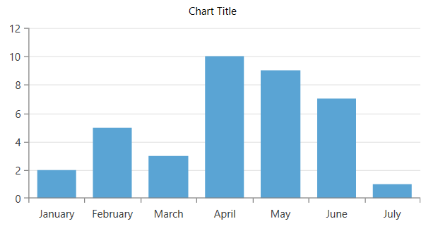

## Environment
<table>
	<tbody>
		<tr>
			<td>Product Version</td>
			<td>2019.2.618</td>
		</tr>
		<tr>
			<td>Product</td>
			<td>RadChartView for WPF</td>
		</tr>
	</tbody>
</table>

## Description

How to add a title to RadCartesianChart.

## Solution

To add a title, add the chart and a TextBlock in a Grid panel with two RowDefinitions.


```XAML
	<Grid>
		<Grid.RowDefinitions>
			<RowDefinition Height="Auto"/>
			<RowDefinition Height="*"/>
		</Grid.RowDefinitions>

		<TextBlock Text="Chart Title" HorizontalAlignment="Center"/>

		<telerik:RadCartesianChart Grid.Row="1">
			<telerik:RadCartesianChart.VerticalAxis>
				<telerik:LinearAxis/>
			</telerik:RadCartesianChart.VerticalAxis>
			<telerik:RadCartesianChart.HorizontalAxis>
				<telerik:CategoricalAxis />
			</telerik:RadCartesianChart.HorizontalAxis>		
			<telerik:RadCartesianChart.Grid>
                <telerik:CartesianChartGrid MajorLinesVisibility="Y" />
            </telerik:RadCartesianChart.Grid>
			<telerik:RadCartesianChart.Series>
				<telerik:BarSeries> 
					<telerik:BarSeries.DataPoints> 
						<telerik:CategoricalDataPoint Category="January" Value="2" /> 
						<telerik:CategoricalDataPoint Category="February" Value="5" /> 
						<telerik:CategoricalDataPoint Category="March" Value="3" /> 
						<telerik:CategoricalDataPoint Category="April" Value="10" /> 
						<telerik:CategoricalDataPoint Category="May" Value="9" /> 
						<telerik:CategoricalDataPoint Category="June" Value="7" /> 
						<telerik:CategoricalDataPoint Category="July" Value="1" /> 
					</telerik:BarSeries.DataPoints> 
				</telerik:BarSeries> 
			</telerik:RadCartesianChart.Series>
		</telerik:RadCartesianChart>
	</Grid>
```



## See Also  
* [Getting Started RadChartView]()

