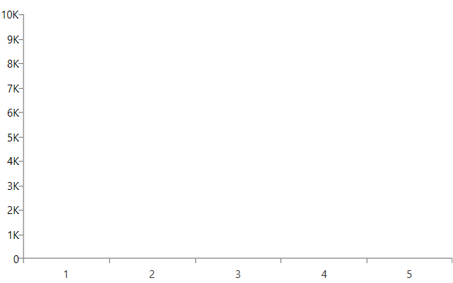

## Environment
<table>
	<tbody>
		<tr>
			<td>Product Version</td>
			<td>2022.2.621</td>
		</tr>
		<tr>
			<td>Product</td>
			<td>ChartView for WPF</td>
		</tr>
	</tbody>
</table>

## Description

How to display shorthand number values in the axis labels. For example, instead of `1000` to display `1K` or instead of `1000000` to show `1M`.

## Solution

To achieve this effect, use the `LabelTemplate` property of the chart axis. This will allow you to implement an `IValueConverter` and use it in the template, to convert from the standard numeric value to the shorthand variation.


```C#
	public class ShorthandNumberConverter : IValueConverter
    {
        private const double OneTrillion = 1000000000000;
        private const double OneBillion = 1000000000;
        private const double OneMillion = 1000000;
        private const double OneThousand = 1000;

        public object Convert(object value, Type targetType, object parameter, CultureInfo culture)
        {
            var originalValue = double.Parse((string)value);
            if (originalValue < OneThousand || originalValue >= OneTrillion)
            {
                return originalValue;
            }
            if (originalValue >= OneBillion)
            {
                return (originalValue / OneBillion).ToString("0.#") + "B";
            }
            else if (originalValue >= OneMillion)
            {
                return (originalValue / OneMillion).ToString("0.#") + "M";
            }
            else if (originalValue >= OneThousand)
            {
                return (originalValue / OneThousand).ToString("0.#") + "K";
            }
            return originalValue;
        }

        public object ConvertBack(object value, Type targetType, object parameter, CultureInfo culture)
        {
            throw new NotImplementedException();
        }
    }
```


```XAML
	<Window.Resources>
		<local:ShorthandNumberConverter x:Key="ShorthandNumberConverter"/>
		<DataTemplate x:Key="CustomAxisLabelTemplate">
			<TextBlock Text="{Binding Converter={StaticResource ShorthandNumberConverter}}" />
		</DataTemplate>
	</Window.Resources>
```


```XAML
	<telerik:RadCartesianChart.VerticalAxis>
		<telerik:LinearAxis LabelTemplate="{StaticResource CustomAxisLabelTemplate}"/>
	</telerik:RadCartesianChart.VerticalAxis>
```


