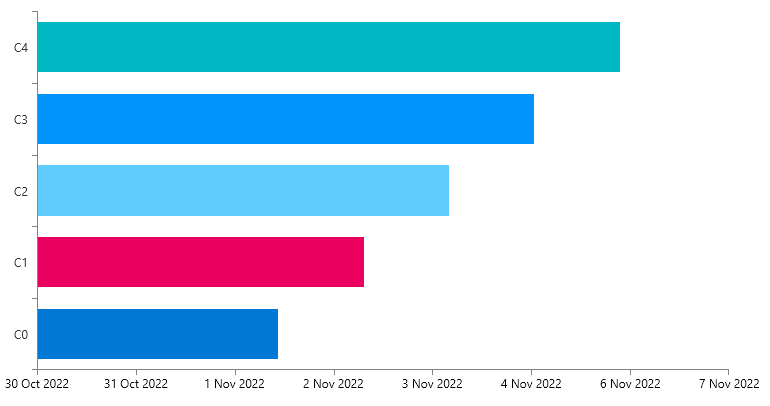

## Environment
<table>
	<tbody>
		<tr>
			<td>Product Version</td>
			<td>2022.2.621</td>
		</tr>
		<tr>
			<td>Product</td>
			<td>ChartView for WPF</td>
		</tr>
	</tbody>
</table>

## Description

How to add a categorical vertical axis and DateTime-like horizontal axis in RadChartView.

## Solution

The RadChartView doesn't support a combination of one categorical axis and one DateTime axis. To get this effect, instead of a DateTime axis (DateTimeCategoricalAxis or DateTimeContinuousAxis), use `LinearAxis`. In that case, instead of plotting `DateTime` objects on the axis, you can use the `Ticks` values of the corresponding date-times. The `LabelTemplate` of the linear axis can be used to format the ticks to a DateTime representation.

The following example shows how to setup the chart and implement the suggested idea.

__The data point model__
```C#
	public class PlotInfo
    {
        public long DateTicks
        {
            get { return this.Date.Ticks; }
        }

        public DateTime Date { get; set; }
        public string Category { get; set; }
    }
```

__An IValueConverter that converts from the ticks value to a DateTime object__
```C#
	public class TicksToDateConverter : IValueConverter
    {
        public object Convert(object value, Type targetType, object parameter, CultureInfo culture)
        {
            decimal ticks = Decimal.Parse(value.ToString(), System.Globalization.NumberStyles.Float);
            return new DateTime((long)ticks);
        }

        public object ConvertBack(object value, Type targetType, object parameter, CultureInfo culture)
        {
            throw new NotImplementedException();
        }
    }
```

__The chart setup__
```XAML
	<telerik:RadCartesianChart Palette="Windows11">
		<telerik:RadCartesianChart.Resources>
			<local:TicksToDateConverter x:Key="TicksToDateConverter" />
		</telerik:RadCartesianChart.Resources>
		
		<telerik:RadCartesianChart.VerticalAxis>
			<telerik:CategoricalAxis />
		</telerik:RadCartesianChart.VerticalAxis>
		<telerik:RadCartesianChart.HorizontalAxis>
			<telerik:LinearAxis>
				<telerik:LinearAxis.LabelTemplate>
					<DataTemplate>
						<TextBlock Text="{Binding Converter={StaticResource TicksToDateConverter}, StringFormat='d MMM yyyy'}" />
					</DataTemplate>
				</telerik:LinearAxis.LabelTemplate>
			</telerik:LinearAxis>
		</telerik:RadCartesianChart.HorizontalAxis>

		<telerik:BarSeries x:Name="barSeries" 
						   ValueBinding="DateTicks" 
						   CategoryBinding="Category"
						   PaletteMode="DataPoint"/>
	</telerik:RadCartesianChart>
```

__The data population__
```C#
	public MainWindow()
	{
		InitializeComponent();
		var source = new ObservableCollection<PlotInfo>();
		for (int i = 0; i < 5; i++)
		{
			source.Add(new PlotInfo() { Date = DateTime.Today.AddDays(i), Category = "C" + i });
		}
		this.barSeries.ItemsSource = source;
	}
```


