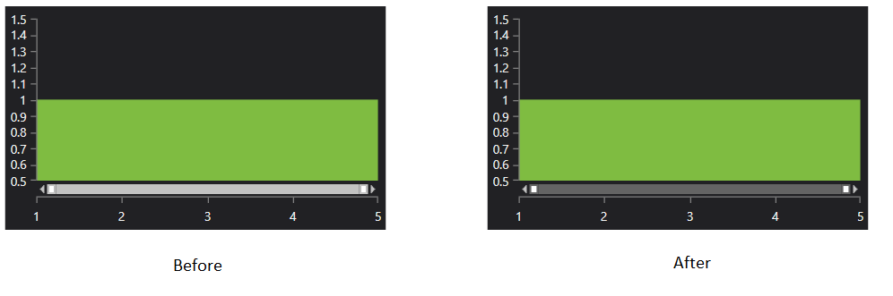

## Environment
<table>
    <tbody>
	    <tr>
	    	<td>Product Version</td>
	    	<td>2019.2.510</td>
	    </tr>
	    <tr>
	    	<td>Product</td>
	    	<td>RadChartView for WPF</td>
	    </tr>
    </tbody>
</table>

## Description

How to change the colors of the RadCartesianChart PanZoomBar (scroll) control.

## Solution

>important The Styles shown in this solution are based on the ExpressionDark [theme](). The same approach can be used accross the different Telerik themes, but the styles may vary between them.

This example shows how to change the colors of the scroll to match the ExpressionDark theme colors.

1. Go to the Telerik UI for WPF installation folder and open the __Telerik.Windows.Controls.ChartView.xaml__ file.
2. Find and extract the Style elements with x:Key properties set to __ThumbStyle__, __AlternateThumbStyle__ and __SelectionMiddleThumbStyle__. The styles target the native Thumb control.
3. Change the __Background__ and __BorderBrush__ property values of the ThumbStyle.
4. Change the __Background__ property of the SelectionMiddleThumbStyle.
5. Define a Style that targets PanZoomBarStyle and set its __ThumbStyle__, __AlternateThumbStyle__ and __SelectionMiddleThumbStyle__ properties to the previously extracted and modified Style objects.

	
	```XAML
		<Window.Resources>
			<Style x:Key="CustomThumbStyle" TargetType="Thumb">
				<Setter Property="Width" Value="8"/>
				<Setter Property="VerticalAlignment" Value="Stretch"/>
				<Setter Property="IsTabStop" Value="True"/>
				<Setter Property="BorderThickness" Value="2"/>
				<Setter Property="BorderBrush" Value="#646464"/>
				<Setter Property="Background" Value="#FFFFFF"/>
				<Setter Property="Template">
					<Setter.Value>
						<ControlTemplate TargetType="Thumb">
							<Grid>
								<Grid.InputBindings>
									<MouseBinding MouseAction="LeftDoubleClick" Command="{x:Static telerikChartView:PanZoomBarCommands.ExpandSelectionToMinimum}"/>
								</Grid.InputBindings>
								<Border x:Name="Border" BorderThickness="{TemplateBinding BorderThickness}" BorderBrush="{TemplateBinding BorderBrush}" Background="{TemplateBinding Background}"/>
							</Grid>
						</ControlTemplate>
					</Setter.Value>
				</Setter>
			</Style>
			<Style x:Key="CustomAlternateThumbStyle" TargetType="Thumb" BasedOn="{StaticResource CustomThumbStyle}">
				<Setter Property="Template">
					<Setter.Value>
						<ControlTemplate TargetType="Thumb">
							<Grid>
								<Grid.InputBindings>
									<MouseBinding MouseAction="LeftDoubleClick" Command="{x:Static telerikChartView:PanZoomBarCommands.ExpandSelectionToMaximum}"/>
								</Grid.InputBindings>
								<Border x:Name="Border" BorderThickness="{TemplateBinding BorderThickness}" BorderBrush="{TemplateBinding BorderBrush}" Background="{TemplateBinding Background}"/>
							</Grid>
						</ControlTemplate>
					</Setter.Value>
				</Setter>
			</Style>
			<Style x:Key="CustomSelectionMiddleThumbStyle" TargetType="Thumb">
				<Setter Property="IsTabStop" Value="True"/>
				<Setter Property="Background" Value="#646464"/>
				<Setter Property="Cursor" Value="Hand"/>
				<Setter Property="VerticalAlignment" Value="Stretch"/>
				<Setter Property="Template">
					<Setter.Value>
						<ControlTemplate TargetType="Thumb">
							<Grid>
								<Grid.InputBindings>
									<MouseBinding MouseAction="LeftDoubleClick" Command="{x:Static telerikChartView:PanZoomBarCommands.ExpandSelection}"/>
								</Grid.InputBindings>
								<Border x:Name="Border" BorderBrush="{TemplateBinding BorderBrush}" BorderThickness="{TemplateBinding BorderThickness}" Background="{TemplateBinding Background}"/>
							</Grid>
						</ControlTemplate>
					</Setter.Value>
				</Setter>
			</Style>

			<Style x:Key="CustomPanZoomBarStyle" TargetType="telerik:PanZoomBar">
				<Setter Property="ThumbStyle" Value="{StaticResource CustomThumbStyle}"/>
				<Setter Property="SelectionMiddleThumbStyle" Value="{StaticResource CustomSelectionMiddleThumbStyle}"/>
				<Setter Property="AlternateThumbStyle" Value="{StaticResource CustomAlternateThumbStyle}"/>
			</Style>
		</Window.Resources>   
	```

6. Set the PanZoomBarStyle of the chart's axis.

	
	```XAML
		 <telerik:RadCartesianChart.HorizontalAxis>
			<telerik:CategoricalAxis PanZoomBarStyle="{StaticResource CustomPanZoomBarStyle}"/>
		</telerik:RadCartesianChart.HorizontalAxis>  
	```

