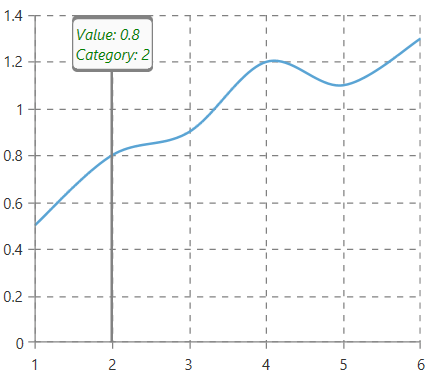

## Environment
<table>
    <tbody>
	    <tr>
	    	<td>Product Version</td>
	    	<td>2019.2.618</td>
	    </tr>
	    <tr>
	    	<td>Product</td>
	    	<td>RadChartView for WPF</td>
	    </tr>
    </tbody>
</table>

## Description

How to modify the display content of ChartTrackBallBehavior's TrackBallInfoControl in RadChartView.

## Solution 

Set the __DataPointInfoTemplate__ property of TrackBallInfoControl. To do this, use the __TrackBallInfoStyle__ property of RadCartesianChart.


```XAML
	<telerik:RadCartesianChart.TrackBallInfoStyle>
		<Style TargetType="telerik:TrackBallInfoControl">
			<Setter Property="DataPointInfoTemplate">
				<Setter.Value>
					<DataTemplate>
						<TextBlock Text="{Binding DisplayContent}" Foreground="Green" FontStyle="Italic"/>
					</DataTemplate>
				</Setter.Value>
			</Setter>
		</Style>
	</telerik:RadCartesianChart.TrackBallInfoStyle>
```

