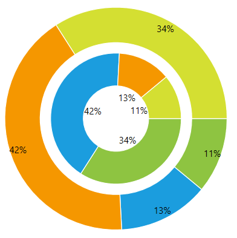

## Environment

<table>
	<tr>
		<td>Product Version</td>
		<td>2019.1.220</td>
	</tr>
	<tr>
		<td>Product</td>
		<td>RadChartView for WPF</td>
	</tr>
</table>

## Description

How to display multiple DoughnutSeries in a single pie chart, without overlapping.

## Solution

Adjust the positions of the series using their [RadiusFactor and InnerRadiusFactor](#setting-the-doughnut-radius) properties.


```XAML
	<telerik:RadPieChart Palette="Windows8">
		<telerik:DoughnutSeries InnerRadiusFactor="0.58">
			<telerik:DoughnutSeries.DataPoints>
				<telerik:PieDataPoint Value="10" />
				<telerik:PieDataPoint Value="12" />
				<telerik:PieDataPoint Value="38" />
				<telerik:PieDataPoint Value="31" />
			</telerik:DoughnutSeries.DataPoints>
		</telerik:DoughnutSeries>
		<telerik:DoughnutSeries RadiusFactor="0.25">
			<telerik:DoughnutSeries.DataPoints>
				<telerik:PieDataPoint Value="31" />
				<telerik:PieDataPoint Value="38" />
				<telerik:PieDataPoint Value="12" />
				<telerik:PieDataPoint Value="10" />
			</telerik:DoughnutSeries.DataPoints>
		</telerik:DoughnutSeries>
	</telerik:RadPieChart>
```


