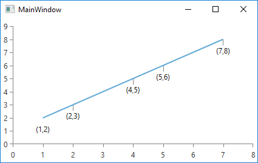

## Environment
<table>
	<tr>
		<td>Product Version</td>
		<td>2017.3.913 or later</td>
	</tr>
	<tr>
		<td>Product</td>
		<td>RadChartView for WPF</td>
	</tr>
</table>

## Description

Choose which label connectors are visible depending on the datapoint. 

## Solution

Define a custom series and override its __GetLabelConnector__ method. The following examples demonstrate how to create a custom [ScatterLineSeries]() and hide the label connector of all points with XValue of 1. 


```C#
	public class CustomScatterLineSeries : ScatterLineSeries
    {
        protected override List<Point> GetLabelConnector(ChartSeriesLabelPositionInfo info)
        {
            //info.DataPoint.DataItem will contain the bound object in a data binding scenario

            var dataPoint = info.DataPoint as ScatterDataPoint;

            if (dataPoint != null && dataPoint.XValue == 1)
            {
                return new List<Point>() { new Point(), new Point() };
            }

            return base.GetLabelConnector(info);
        }
    }
```


```C#
	<Grid>
        <Grid.Resources>
            <telerik:ChartSeriesLabelConnectorsSettings x:Key="LabelConnectorSettings" />
        </Grid.Resources>
		<telerik:RadCartesianChart>
			<telerik:RadCartesianChart.HorizontalAxis>
				<telerik:LinearAxis/>
			</telerik:RadCartesianChart.HorizontalAxis>

			<telerik:RadCartesianChart.VerticalAxis>
				<telerik:LinearAxis/>
			</telerik:RadCartesianChart.VerticalAxis>

            <local:CustomScatterLineSeries ShowLabels="True" LabelConnectorsSettings="{StaticResource LabelConnectorSettings}" >
                <local:CustomScatterLineSeries.DataPoints>
					<telerik:ScatterDataPoint XValue="1" YValue="2"/>
					<telerik:ScatterDataPoint XValue="2" YValue="3"/>
					<telerik:ScatterDataPoint XValue="4" YValue="5"/>
					<telerik:ScatterDataPoint XValue="5" YValue="6"/>
					<telerik:ScatterDataPoint XValue="7" YValue="8"/>
				</local:CustomScatterLineSeries.DataPoints>
			</local:CustomScatterLineSeries>
		</telerik:RadCartesianChart>
	</Grid>
```

#### __Figure 1: Custom ScatterLineSeries with one hidden label connector__


## See Also

* [Label Connectors]()