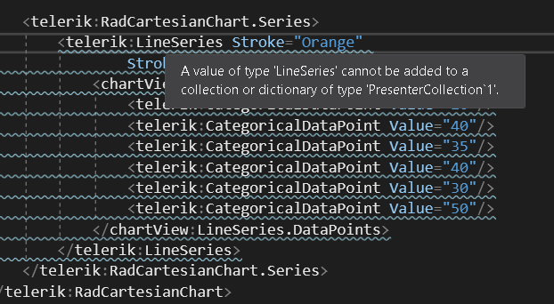

## Environment
<table>
	<tbody>
		<tr>
			<td>Product Version</td>
			<td>2020.3.1020</td>
		</tr>
		<tr>
			<td>Product</td>
			<td>RadChartView for WPF</td>
		</tr>
	</tbody>
</table>

## Description

An error with code XLS0503 and message "A Value of Type LineSeries Cannot be Added to Collection or Dictionary of Type PresenterCollection" shown during the build of a project where a chart series is defined in XAML. 



## Solution

This error appears when referencing both the *Telerik.Windows.Controls.Chart* and *Telerik.Windows.Controls.Charting* assemblies in the same project. The Chart assembly contains the newer RadChartView component. The Charting dll contains the old RadChart which is not recommended. Use RadChartView instead. There are few classes with the same names that are defined in both the Chart and Charting assemblies and are mapped to the "telerik" XAML schema. When you try to use "telerik" to access one of those classes (like LineSeries for example) and error appears.

This issue can be observed also if you reference the Telerik UI for WPF nuget package wich contains all Telerik WPF dlls.

To resolve this remove the *Telerik.Windows.Controls.Charting* assembly from the project references. Or use a XAML namespace that points to the Telerik.Windows.Controls.ChartView namespace.


```XAML  
	<Window xmlns:telerik="http://schemas.telerik.com/2008/xaml/presentation"
		xmlns:chartView="clr-namespace:Telerik.Windows.Controls.ChartView;assembly=Telerik.Windows.Controls.Chart">
```


```XAML
<!-- chartView points to xmlns:chartView="clr-namespace:Telerik.Windows.Controls.ChartView;assembly=Telerik.Windows.Controls.Chart" -->
	<telerik:RadCartesianChart.Series>
		<chartView:LineSeries Stroke="Orange" StrokeThickness="2">
			<chartView:LineSeries.DataPoints>
				<telerik:CategoricalDataPoint Value="20"/>
				<telerik:CategoricalDataPoint Value="40"/>
				<telerik:CategoricalDataPoint Value="35"/>
				<telerik:CategoricalDataPoint Value="40"/>
				<telerik:CategoricalDataPoint Value="30"/>
				<telerik:CategoricalDataPoint Value="50"/>
			</chartView:LineSeries.DataPoints>
		</chartView:LineSeries>
	</telerik:RadCartesianChart.Series>
```
