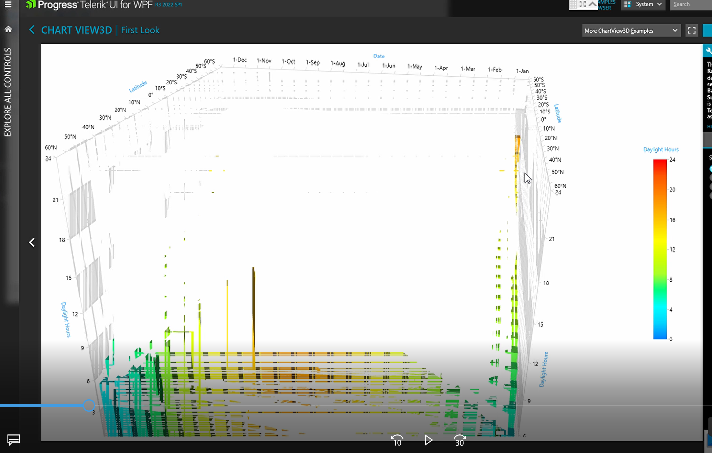

## Environment

<table>
	<tr>
		<td>Product Version</td>
		<td>2022.3.1109</td>
	</tr>
	<tr>
		<td>Product</td>
		<td>RadChartView3D for WPF</td>
	</tr>
</table>

## Description

The 3D ChartView element is rendered fragmented on devices with specific video and processor models and drivers.

## Solution

No stable solution is provided for this issue. The issue may come from the video device or the related driver. The result is that the machine cannot render the information coming from the WPF 3D rendering engine properly. You may notice glitches or a fragmented image.

__Fragmented chart visualization__  



Possible solution is to update the drivers of the video card. Additional to this, try disabling the hardware acceleration in WPF.


```C#
	public partial class MainWindow : Window
	{
		public MainWindow()
		{
			InitializeComponent();
		}

		protected override void OnSourceInitialized(EventArgs e)
		{
			var hwnd = PresentationSource.FromVisual(this) as HwndSource;
			if (hwnd != null)
			{
				hwnd.CompositionTarget.RenderMode = RenderMode.SoftwareOnly;
			}
			base.OnSourceInitialized(e);
		}
	}
```