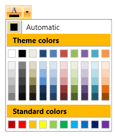

## Environment
<table>
	<tbody>
		<tr>
			<td>Product Version</td>
			<td>2019.2.618</td>
		</tr>
		<tr>
			<td>Product</td>
			<td>RadColorPicker for WPF</td>
		</tr>
	</tbody>
</table>

## Description

How to change the Background Color of RadColorPicker's palette Headers.

## Solution

1. [Extract the ControlTemplate]() of RadColorSelector. This is the control used to display the colors in RadColorPicker.

2. In the template, find the TextBlock elements with x:Name properties set to: __mainPaletteHeader__, __standardPaletteHeader__ and __RecentColorsPaletteHeader__.

3. Set the Background properties of the Border elements that wrap the TextBlocks.

	
	```XAML
		 <!--If you use NoXaml dlls set BasedOn="{StaticResource RadColorSelectorStyle}"-->
		 <Style x:Key="CustomRadColorSelectorStyle" TargetType="telerik:RadColorSelector">           
			<Setter Property="Template">
				<Setter.Value>
					<ControlTemplate TargetType="{x:Type telerik:RadColorSelector}">
						<!-- other parts of the template -->
						
						<!-- Change the Background property of the Border element -->
						<Border BorderBrush="#FF848484" BorderThickness="0,0,0,1" Background="#FFB900" Margin="0,0,0,3" Grid.Row="1">
							<TextBlock x:Name="mainPaletteHeader" Foreground="{TemplateBinding Foreground}" FontWeight="{TemplateBinding FontWeight}" FontStyle="{TemplateBinding FontStyle}" FontSize="{TemplateBinding FontSize}" Margin="10,2,2,2" Text="{TemplateBinding MainPaletteHeaderText}" VerticalAlignment="Center"/>
						</Border>

						<!-- other parts of the template -->
						
						<!-- Change the Background property of the Border element -->
						 <Border x:Name="StandardPaletteBorder" BorderBrush="#FF848484" BorderThickness="0,0,0,1" Background="#FFB900" Margin="0,2,0,3" Grid.Row="4">
							<TextBlock x:Name="standardPaletteHeader" Foreground="{TemplateBinding Foreground}" FontWeight="{TemplateBinding FontWeight}" FontSize="{TemplateBinding FontSize}" Margin="10,2,2,2" Text="{TemplateBinding StandardPaletteHeaderText}" VerticalAlignment="Center"/>
						</Border>
						
						<!-- other parts of the template -->
						
						<!-- Change the Background property of the Border element -->
						<Border x:Name="RecentColorsPaletteBorder" BorderBrush="#FF848484" BorderThickness="0,0,0,1" Background="#FFB900" Margin="0,2,0,3" Grid.Row="6" Visibility="Collapsed">
							<TextBlock x:Name="RecentColorsPaletteHeader" Foreground="{TemplateBinding Foreground}" FontWeight="{TemplateBinding FontWeight}" FontSize="{TemplateBinding FontSize}" Margin="10,2,2,2" Text="{TemplateBinding RecentColorsHeaderText}" VerticalAlignment="Center"/>
						</Border>
											
						<!-- other parts of the template -->
					</ControlTemplate>
				</Setter.Value>
			</Setter>
		</Style>
	```

4. Apply the customized template using the __ColorSelectorStyle__ property of RadColorPicker.

	
	```XAML
		<telerik:RadColorPicker ColorSelectorStyle="{StaticResource CustomRadColorSelectorStyle}" />
	```
	



