## Environment

<table>
    <tbody>
        <tr>
            <td>Product Version</td>
            <td>2024.2.524</td>
        </tr>
        <tr>
            <td>Product</td>
            <td>Telerik UI for WPF</td>
        </tr>
    </tbody>
</table>

## Description

How to get the XML of Word (.docx) documents and compare their contents using Visual Studio.

## Solution

The .docx file format is an archive that can be unzipped. This gives several folders and files with the document contents, styles and other settings. To access the content, you can find and open the __document.xml__ file. Then, you can compare the text in the __document.xml__ files of the corresponding files.

This article describes how to do this using the [Open XML Package Editor for Modern Visual Studios](https://marketplace.visualstudio.com/items?itemName=bsivanov.OpenXMLPackageEditorforVisualStudio) extension tool for easier access to the files of the .docx file, without the need to unzip it. Visual Studio built-in diff tool can be used to compare the extracted XML contents.

1. Install the [Open XML Package Editor for Modern Visual Studios](https://marketplace.visualstudio.com/items?itemName=bsivanov.OpenXMLPackageEditorforVisualStudio) Visual Studio extension. This will allow you to open the __.docx__ files content directly in Visual Studio.

2. [Create a new Blank Solution](https://learn.microsoft.com/en-us/visualstudio/get-started/tutorial-projects-solutions?view=vs-2022#create-a-solution) in Visual Studio. This is required in order to use the Visual Studio's [Compare Selection](https://learn.microsoft.com/en-us/visualstudio/ide/compare-with?view=vs-2022) feature.

3. Include the two __.docx__ files that will be compared in the solution.
	
	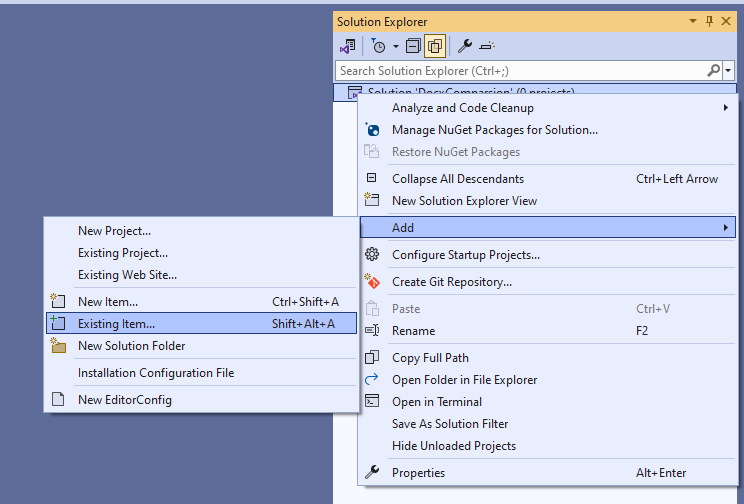  
	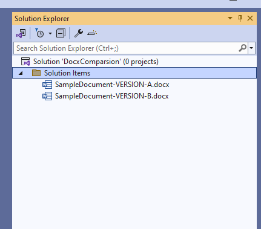
	
4. Create two new empty __.xml__ files in the solution. 

	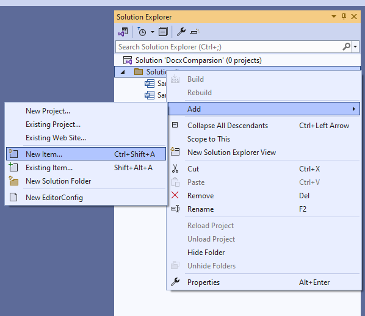
	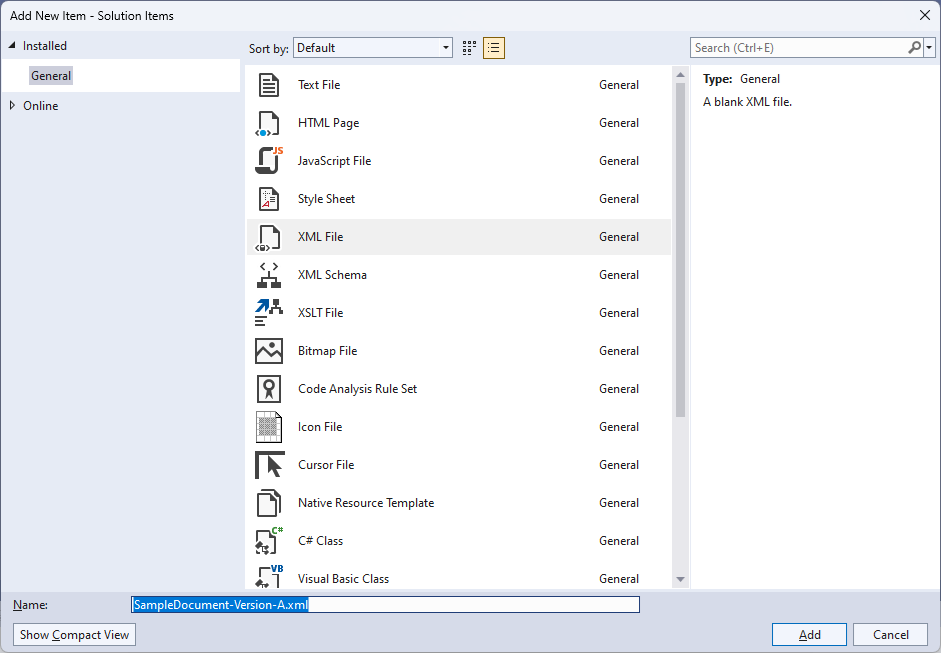
	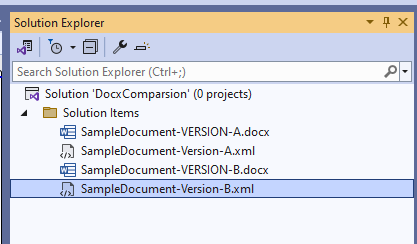

5. Double click the first __.docx__ file in the solution and open the __/word/documents.xml__ file. 
	
	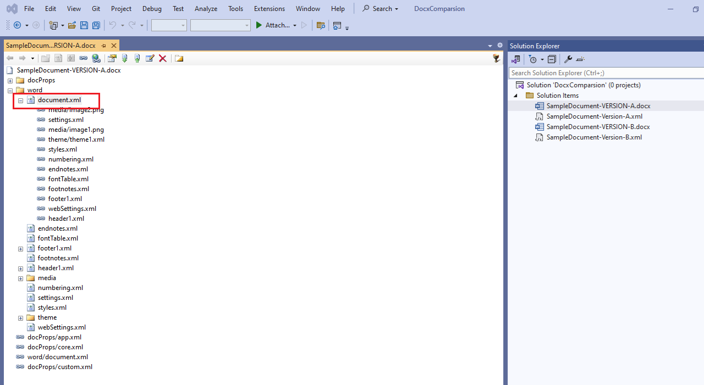
	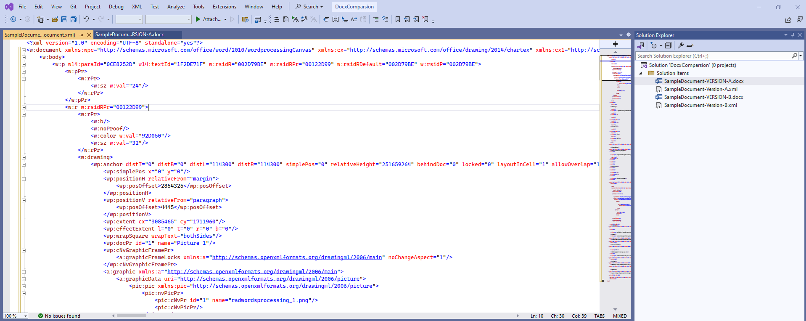
	
	If the file is not formatted you can do that by using the __Edit-->Advanced-->Format Selection__ option. The default shortcut for this action is __Ctrl+K, Ctrl+F__.
	
	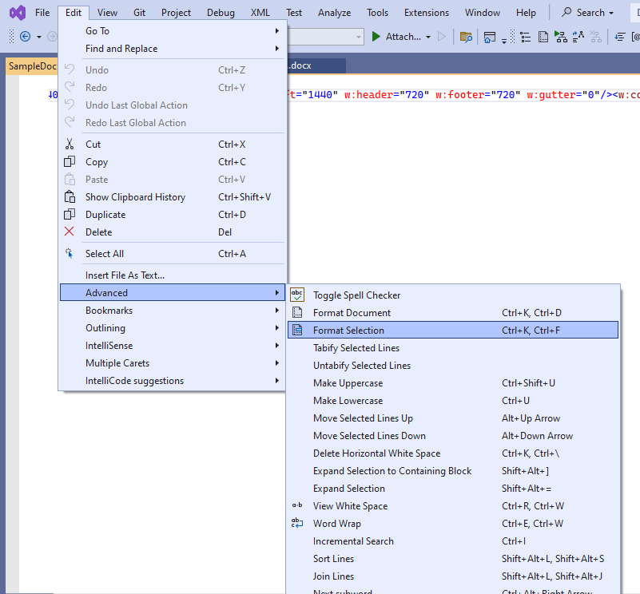
	
6. Copy the content of the __documents.xml__ file to one of the empty __.xml__ files and save it.

	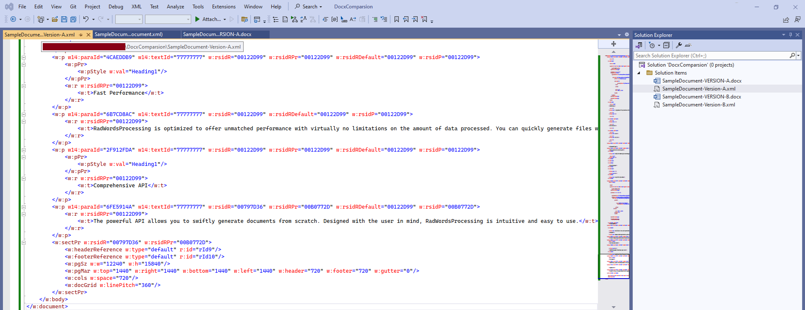

7. Repeat __step 5__ also for the other __.docx__ file and copy its XML contents to the other empty __.xml__ file, and then save it.

8. Select the __.xml__ files in the Solution Explorer and right click on any of the files to display the context menu. From the menu select the [Compare Selection](https://learn.microsoft.com/en-us/visualstudio/ide/compare-with?view=vs-2022) option.

	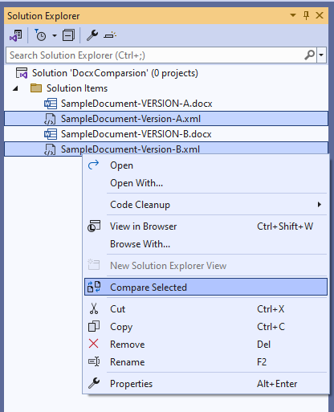

This will open a new diff view showing the comparison between the two __.xml__ files

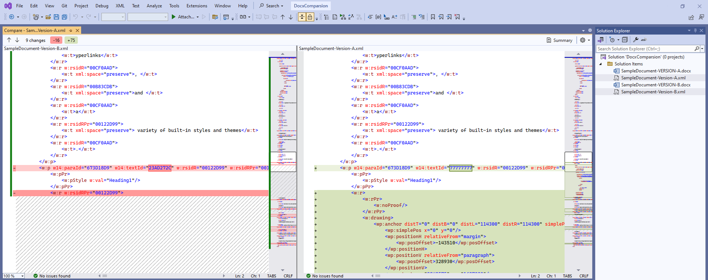

