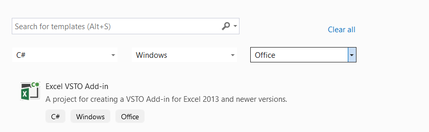
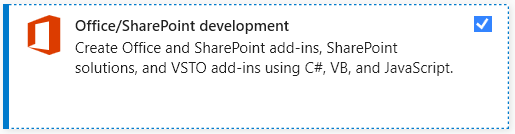
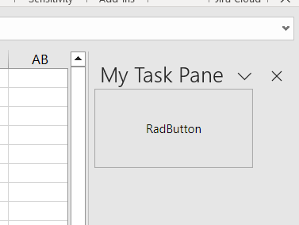
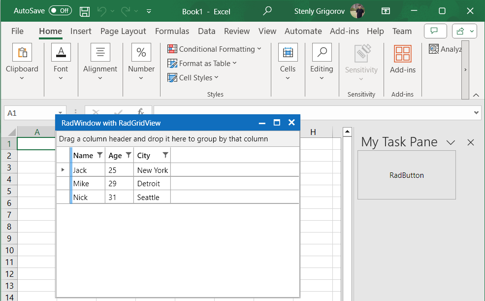

## Environment
<table>
	<tr>
		<td>Product Version</td>
		<td>2023.3.1114</td>
	</tr>
	<tr>
		<td>Product</td>
		<td>UI for WPF</td>
	</tr>
</table>

## Description

How to create an add-in for Microsoft Office with Telerik UI for WPF.

## Solution

The following example shows how to create an Excel VSTO Add-in application and display a RadWindow and RadGridView elements. It is setup with the `NoXaml` version of the assemblies in mind.

1. Open Visual Studio and choose the __Excel VSTO Add-in__ template:



To create a VSTO project, you will need to install the __Office/SharePoint Development__ package from the __Visual Studio Installer__ application.

__Office/SharePoint development package__



2. Create a new UserControl that will hold the Telerik UI for WPF controls.

	__WPF UserControl with Telerik UI for WPF components__
	
	```XAML
		<UserControl x:Class="VSTO.WPFUserControl"
		             xmlns="http://schemas.microsoft.com/winfx/2006/xaml/presentation"
		             xmlns:x="http://schemas.microsoft.com/winfx/2006/xaml"
		             xmlns:mc="http://schemas.openxmlformats.org/markup-compatibility/2006" 
		             xmlns:d="http://schemas.microsoft.com/expression/blend/2008" 
		             mc:Ignorable="d" 
		             xmlns:telerik="http://schemas.telerik.com/2008/xaml/presentation"
		             d:DesignHeight="450" d:DesignWidth="800">
		    <UserControl.Resources>
		        <ResourceDictionary>
		            <ResourceDictionary.MergedDictionaries>
		                <ResourceDictionary Source="/Telerik.Windows.Themes.Office2019;component/Themes/System.Windows.xaml"/>
		                <ResourceDictionary Source="/Telerik.Windows.Themes.Office2019;component/Themes/Telerik.Windows.Controls.xaml"/>
		            </ResourceDictionary.MergedDictionaries>
		        </ResourceDictionary>
		    </UserControl.Resources>
		    <Grid>
		        <telerik:RadButton Content="RadButton" Click="RadButton_Click"/>
		    </Grid>
		</UserControl>
	```

	The above `RadButton` will create a new `RadWindow` instance that will host a `RadGridView` control when its Click event occurs.

	__RadButton Click event handler__
	
	```C#
		private void RadButton_Click(object sender, RoutedEventArgs e)
		{
		    RadWindow radWindow = new RadWindow()
		    {
		        Header = "RadWindow with RadGridView",
		        WindowStartupLocation = WindowStartupLocation.CenterScreen,
		        Owner = this,
		        Width = 400,
		        Height = 300,
		    };	
		    this.SetupResources(radWindow);	
		    RadGridView radGridView = new RadGridView() { ItemsSource = this.peopleViewModel.People };
		    radWindow.Content = radGridView;	
		    radWindow.ShowDialog();
		}
	```

	The `SetupResources` method from the above code snippet merges the resource dictionaries required by the RadGridView and RadWindow controls. The example utilizes the __Office2019__ theme.

	__SetupResources method's implementation__
	
	```C#
		private void SetupResources(RadWindow radWindow)
		{
		    radWindow.Resources.MergedDictionaries.Clear();
	
		    radWindow.Resources.MergedDictionaries.Add(new ResourceDictionary()
		    {
		        Source = new Uri("/Telerik.Windows.Themes.Office2019;component/Themes/System.Windows.xaml", UriKind.RelativeOrAbsolute)
		    });
		    radWindow.Resources.MergedDictionaries.Add(new ResourceDictionary()
		    {
		        Source = new Uri("/Telerik.Windows.Themes.Office2019;component/Themes/Telerik.Windows.Controls.xaml", UriKind.RelativeOrAbsolute)
		    });
		    radWindow.Resources.MergedDictionaries.Add(new ResourceDictionary()
		    {
		        Source = new Uri("/Telerik.Windows.Themes.Office2019;component/Themes/Telerik.Windows.Controls.GridView.xaml", UriKind.RelativeOrAbsolute)
		    });
		    radWindow.Resources.MergedDictionaries.Add(new ResourceDictionary()
		    {
		        Source = new Uri("/Telerik.Windows.Themes.Office2019;component/Themes/Telerik.Windows.Controls.Input.xaml", UriKind.RelativeOrAbsolute)
		    });
		    radWindow.Resources.MergedDictionaries.Add(new ResourceDictionary()
		    {
		        Source = new Uri("/Telerik.Windows.Themes.Office2019;component/Themes/Telerik.Windows.Controls.Navigation.xaml", UriKind.RelativeOrAbsolute)
		    });
		}
	```

3. Create a __WindowsForms UserControl__ that will hold the WPF UserControl in its `Child` property.

	__WindowsForms UserControl__
		
	```C#
		public partial class WinFormsUserControl : UserControl
		{
		    private ElementHost ctrlHost;
	
		    public WinFormsUserControl()
		    {
		        InitializeComponent();
	
		        ctrlHost = new ElementHost();
		        ctrlHost.Child = new WPFUserControl();
		        this.Controls.Add(ctrlHost);
		    }
		}
	```

4. Open the add-in class generated by the __Excel VSTO Add-in__ template and create new `CustomTaskPane` instance in the event handler for the `Startup` event. This CustomTaskPane will hold the WindowsForms UserControl.

	__AddIn class implementation__
	
	```C#
		public partial class MyAddIn
		{
		    private Microsoft.Office.Tools.CustomTaskPane myCustomTaskPane;
		    private WinFormsUserControl userControl;
	
		    private void OnMyAddInStartup(object sender, System.EventArgs e)
		    {
		        userControl = new WinFormsUserControl();
	
		        myCustomTaskPane = this.CustomTaskPanes.Add(userControl, "My Task Pane");
		        myCustomTaskPane.Visible = true;
		    }
	
		    private void OnMyAddInShutdown(object sender, System.EventArgs e)
		    {
		    }
	
		    #region VSTO generated code
	
		    /// <summary>
		    /// Required method for Designer support - do not modify
		    /// the contents of this method with the code editor.
		    /// </summary>
		    private void InternalStartup()
		    {
		        this.Startup += new System.EventHandler(OnMyAddInStartup);
		        this.Shutdown += new System.EventHandler(OnMyAddInShutdown);
		    }
		
		    #endregion
		}
	```

__Excel VSTO Add-in with a WinForms UserControl that hosts the WPFUserControl__



__Excel VSTO Add-in with Telerik UI for WPF components__


