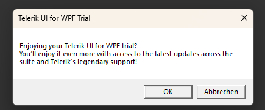

## Environment
<table>
	<tbody>
		<tr>
			<td>Product Version</td>
			<td>2013.2.718</td>
		</tr>
		<tr>
			<td>Product</td>
			<td>UI for WPF</td>
		</tr>
	</tbody>
</table>

## Description

After upgrading to the licensed version of Telerik UI for WPF, the trial message is still displayed.

## Solution

The trial version message is displayed only if the project references the trial version of the Telerik assemblies. To hide the message you will need to replace the assemblies with the licensed version. To do so, you can use one of the installation approaches provided by Telerik. For example, you can install the Telerik dlls with the [.msi installer]() and then replace the assembly references manually, or you can [use nuget packages]().

In some cases, Visual Studio may cache the trial dlls and use them instead of the newly referenced ones. To avoid that, delete the `bin` and `obj` folders of the project, and then __Clean__, and __Rebuild__ it.
