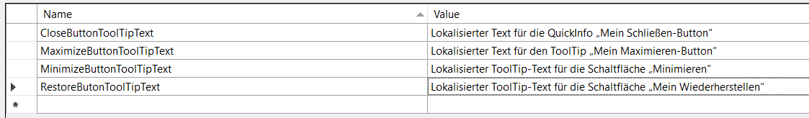
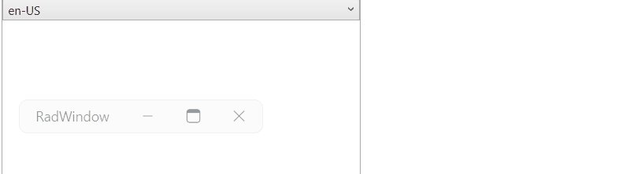

## Environment

<table>
	<tbody>
		<tr>
			<td>Product Version</td>
			<td>2024.2.514</td>
		</tr>
		<tr>
			<td>Product</td>
			<td>Telerik UI for WPF</td>
		</tr>
	</tbody>
</table>

## Description

This article will showcase how to utilize the [LocalizableResourceExtension](#localizableresourceextension) to support [dynamic localization](#dynamic-localization).

The example will use the tooltips of the minimize, maximize, and close buttons of the RadWindow control as they do not support dynamic localization in versions prior 2025.4.1320. In newer versions RadWindow supports dynamic localization.

The used theme will be __Windows 11__. 

## Solution

Create a new __.resx__ file that will contain the localized strings for the tooltips of the minimize, restore, maximize, and close buttons. Then, assign it to the `ResourceManager` property of the `LocalizationManager` class as shown [here](#localization-using-resourcemanager).

__Setting a new .resx file to the ResourceManager property of the LocalizationManager__
```C#
    LocalizationManager.Manager = new LocalizationManager()
    {
        ResourceManager = MyResources.ResourceManager
    };
```

__English translation for the tooltips texts__


__German translation for the tooltips texts__



To apply the `LocalizableResourceExtension` markup extension on the buttons' `ToolTip` instances, extract the default `ControlTemplate` of the `RadWindow` element.

__Default ControlTemplate of the RadWindow control for the Windows 11 theme__
```XAML
    <Style TargetType="telerik:RadWindow" BasedOn="{StaticResource RadWindowStyle}">
        <Setter Property="Template">
            <Setter.Value>
                <ControlTemplate TargetType="telerik:RadWindow">
                    <Grid x:Name="LayoutRoot">
                        <Border x:Name="WindowOuterBorder"
                                Grid.RowSpan="2"
                                BorderBrush="{TemplateBinding BorderBrush}"
                                BorderThickness="{TemplateBinding BorderThickness}"
                                CornerRadius="{TemplateBinding CornerRadius}">
                            <Grid telerik:CornerRadiusHelper.ClipRadius="{Binding ElementName=WindowOuterBorder, Path=CornerRadius}" telerik:CornerRadiusHelper.ClipRadiusOffset="{TemplateBinding telerik:CornerRadiusHelper.  ClipRadiusOffset}">
                                <AdornerDecorator>
                                    <Grid x:Name="BackgroundVisual" Background="{TemplateBinding Background}">
                                        <Grid.RowDefinitions>
                                            <RowDefinition x:Name="WindowHeaderRow" Height="Auto" MinHeight="32"/>
                                            <RowDefinition Height="*"/>
                                        </Grid.RowDefinitions>
                                        <Border x:Name="Header">
                                            <Grid>
                                                <Grid.ColumnDefinitions>
                                                    <ColumnDefinition Width="*"/>
                                                    <ColumnDefinition Width="Auto"/>
                                                </Grid.ColumnDefinitions>
                                                <Grid Grid.Column="0">
                                                    <Grid.ColumnDefinitions>
                                                        <ColumnDefinition Width="Auto"/>
                                                        <ColumnDefinition Width="*"/>
                                                    </Grid.ColumnDefinitions>
                                                    <ContentPresenter x:Name="IconContent"
                                                                      Grid.Column="0"
                                                                      HorizontalAlignment="Left"
                                                                      VerticalAlignment="Center"
                                                                      Content="{TemplateBinding Icon}"
                                                                      ContentTemplate="{TemplateBinding IconTemplate}"
                                                                      Margin="{TemplateBinding IconMargin}"/>
                                                    <ContentControl x:Name="HeaderContent"
                                                                    Grid.Column="1"
                                                                    Foreground="{TemplateBinding Foreground}"
                                                                    Margin="{telerik:Windows11Resource ResourceKey=WindowHeaderMargin}"
                                                                    IsTabStop="False"
                                                                    HorizontalAlignment="Stretch"
                                                                    VerticalAlignment="Center"
                                                                    HorizontalContentAlignment="Stretch"
                                                                    Content="{TemplateBinding Header}"
                                                                    ContentTemplate="{TemplateBinding HeaderTemplate}"
                                                                    SnapsToDevicePixels="True"
                                                                    ContentTemplateSelector="{TemplateBinding HeaderTemplateSelector}"
                                                                    FontSize="{TemplateBinding FontSize}"
                                                                    FontFamily="{TemplateBinding FontFamily}"/>
                                                </Grid>
                                                <Border x:Name="PART_HeaderButtonsBorder" Grid.Column="1">
                                                    <StackPanel x:Name="HeaderButtons" Orientation="Horizontal">
                                                        <telerik:RadButton x:Name="PART_MinimizeButton"
                                                                           Command="{x:Static telerik:WindowCommands.Minimize}"
                                                                           Style="{StaticResource WindowButtonStyle}"
                                                                           Visibility="{Binding IsEnabled, RelativeSource={RelativeSource Self}, Converter={StaticResource BooleanToVisibilityConverter}}">
                                                            <ToolTipService.ToolTip>
                                                                <ToolTip telerik:LocalizationManager.ResourceKey="Minimize"/>
                                                            </ToolTipService.ToolTip>
                                                            <telerik:RadGlyph Foreground="{Binding Foreground, RelativeSource={RelativeSource AncestorType={x:Type telerik:RadButton}}}" Glyph="{StaticResource GlyphMinimize}" FontSize="{telerik:Windows11Resource ResourceKey=GlyphCompactFontSize}"/>
                                                        </telerik:RadButton>
                                                        <telerik:RadButton x:Name="PART_RestoreButton"
                                                                           Command="{x:Static telerik:WindowCommands.Restore}"
                                                                           Style="{StaticResource WindowButtonStyle}"
                                                                           Visibility="{Binding IsEnabled, RelativeSource={RelativeSource Self}, Converter={StaticResource BooleanToVisibilityConverter}}">
                                                            <ToolTipService.ToolTip>
                                                                <ToolTip telerik:LocalizationManager.ResourceKey="Restore"/>
                                                            </ToolTipService.ToolTip>
                                                            <telerik:RadGlyph Foreground="{Binding Foreground, RelativeSource={RelativeSource AncestorType={x:Type telerik:RadButton}}}" Glyph="{StaticResource GlyphWindowCollapse}"   FontSize="{telerik:Windows11Resource ResourceKey=GlyphCompactFontSize}"/>
                                                        </telerik:RadButton>
                                                        <telerik:RadButton x:Name="PART_MaximizeButton"
                                                                           Command="{x:Static telerik:WindowCommands.Maximize}"
                                                                           Style="{StaticResource WindowButtonStyle}"
                                                                           Visibility="{Binding IsEnabled, RelativeSource={RelativeSource Self}, Converter={StaticResource BooleanToVisibilityConverter}}">
                                                            <ToolTipService.ToolTip>
                                                                <ToolTip telerik:LocalizationManager.ResourceKey="Maximize"/>
                                                            </ToolTipService.ToolTip>
                                                            <telerik:RadGlyph Foreground="{Binding Foreground, RelativeSource={RelativeSource AncestorType={x:Type telerik:RadButton}}}" Glyph="{StaticResource GlyphWindow}" FontSize="{telerik:Windows11Resource ResourceKey=GlyphCompactFontSize}"/>
                                                        </telerik:RadButton>
                                                        <telerik:RadButton x:Name="PART_CloseButton"
                                                                           Command="{x:Static telerik:WindowCommands.Close}"
                                                                           Style="{StaticResource WindowCloseButtonStyle}"
                                                                           Visibility="{Binding IsEnabled, RelativeSource={RelativeSource Self}, Converter={StaticResource BooleanToVisibilityConverter}}">
                                                            <ToolTipService.ToolTip>
                                                                <ToolTip telerik:LocalizationManager.ResourceKey="Close"/>
                                                            </ToolTipService.ToolTip>
                                                            <telerik:RadGlyph Foreground="{Binding Foreground, RelativeSource={RelativeSource AncestorType={x:Type telerik:RadButton}}}" Glyph="{StaticResource GlyphClose}" FontSize=" {telerik:Windows11Resource ResourceKey=GlyphCompactFontSize}"/>
                                                        </telerik:RadButton>
                                                    </StackPanel>
                                                </Border>
                                            </Grid>
                                        </Border>
                                        <ContentPresenter x:Name="ContentElement" Grid.Row="1" Margin="{TemplateBinding Padding}" Content="{TemplateBinding Content}" ContentTemplate="{TemplateBinding ContentTemplate}"/>
                                    </Grid>
                                </AdornerDecorator>
                                <ResizeGrip x:Name="WindowResizeGrip" HorizontalAlignment="Right" VerticalAlignment="Bottom" Visibility="Collapsed" IsTabStop="False"/>
                            </Grid>
                        </Border>
                    </Grid>
                    <ControlTemplate.Triggers>
                        <Trigger Property="WindowState" Value="Maximized">
                            <Setter TargetName="LayoutRoot" Property="Margin" Value="0"/>
                            <Setter TargetName="WindowOuterBorder" Property="BorderThickness" Value="0"/>
                            <Setter TargetName="WindowOuterBorder" Property="CornerRadius" Value="0"/>
                        </Trigger>
                        <Trigger Property="WindowState" Value="Minimized">
                            <Setter Property="MinHeight" Value="28"/>
                            <Setter TargetName="WindowHeaderRow" Property="MinHeight" Value="28"/>
                            <Setter TargetName="Header" Property="CornerRadius" Value="{telerik:Windows11Resource ResourceKey=OverlayCornerRadius}"/>
                            <Setter TargetName="HeaderContent" Property="Margin" Value="5 0"/>
                            <Setter TargetName="LayoutRoot" Property="HorizontalAlignment" Value="Left"/>
                            <Setter TargetName="LayoutRoot" Property="VerticalAlignment" Value="Top"/>
                            <Setter TargetName="LayoutRoot" Property="Margin" Value="0"/>
                        </Trigger>
                        <Trigger Property="helpers:WindowEffectsHelper.BackdropMaterial" Value="Acrylic">
                            <Setter TargetName="WindowOuterBorder" Property="BorderThickness" Value="0"/>
                            <Setter TargetName="WindowOuterBorder" Property="CornerRadius" Value="0"/>
                        </Trigger>
                        <Trigger Property="helpers:WindowEffectsHelper.BackdropMaterial" Value="Mica">
                            <Setter TargetName="WindowOuterBorder" Property="BorderThickness" Value="0"/>
                            <Setter TargetName="WindowOuterBorder" Property="CornerRadius" Value="0"/>
                        </Trigger>
                        <Trigger Property="IsInActiveState" Value="False">
                            <Trigger.EnterActions>
                                <BeginStoryboard>
                                    <Storyboard>
                                        <DoubleAnimation Storyboard.TargetName="Header" Storyboard.TargetProperty="Opacity" To="0.5" FillBehavior="Stop" Duration="0:0:1"/>
                                    </Storyboard>
                                </BeginStoryboard>
                            </Trigger.EnterActions>
                            <Setter Property="Opacity" TargetName="Header" Value="0.5"/>
                        </Trigger>
                        <MultiTrigger>
                            <MultiTrigger.Conditions>
                                <Condition Property="Content" SourceName="IconContent" Value="{x:Null}"/>
                                <Condition Property="ContentTemplate" SourceName="IconContent" Value="{x:Null}"/>
                            </MultiTrigger.Conditions>
                            <Setter TargetName="IconContent" Property="Visibility" Value="Collapsed"/>
                        </MultiTrigger>
                        <MultiTrigger>
                            <MultiTrigger.Conditions>
                                <Condition Property="IsActiveWindow" Value="True"/>
                                <Condition Property="helpers:WindowEffectsHelper.BackdropMaterial" Value="Mica"/>
                            </MultiTrigger.Conditions>
                            <MultiTrigger.EnterActions>
                                <BeginStoryboard>
                                    <Storyboard>
                                        <ColorAnimation Storyboard.TargetName="BackgroundVisual" Storyboard.TargetProperty="(Background).(SolidColorBrush.Color)" To="#01FFFFFF" FillBehavior="Stop" Duration="0:0:1"/>
                                    </Storyboard>
                                </BeginStoryboard>
                            </MultiTrigger.EnterActions>
                            <Setter Property="Background" TargetName="BackgroundVisual" Value="#01FFFFFF"/>
                        </MultiTrigger>
                        <MultiTrigger>
                            <MultiTrigger.Conditions>
                                <Condition Property="IsActiveWindow" Value="True"/>
                                <Condition Property="helpers:WindowEffectsHelper.BackdropMaterial" Value="Acrylic"/>
                            </MultiTrigger.Conditions>
                            <MultiTrigger.EnterActions>
                                <BeginStoryboard>
                                    <Storyboard>
                                        <ColorAnimation Storyboard.TargetName="BackgroundVisual" Storyboard.TargetProperty="(Background).(SolidColorBrush.Color)" To="#01FFFFFF" FillBehavior="Stop" Duration="0:0:1"/>
                                    </Storyboard>
                                </BeginStoryboard>
                            </MultiTrigger.EnterActions>
                            <Setter Property="Background" TargetName="BackgroundVisual" Value="#01FFFFFF"/>
                        </MultiTrigger>
                        <MultiTrigger>
                            <MultiTrigger.Conditions>
                                <Condition Property="ResizeMode" Value="CanResizeWithGrip"/>
                                <Condition Property="WindowState" Value="Normal"/>
                            </MultiTrigger.Conditions>
                            <Setter Property="MinHeight" Value="54"/>
                            <Setter TargetName="WindowResizeGrip" Property="Visibility" Value="Visible"/>
                        </MultiTrigger>
                    </ControlTemplate.Triggers>
                </ControlTemplate>
            </Setter.Value>
        </Setter>
    </Style>
```

Locate the `ToolTipService.ToolTip` attached properties on the `RadButton` instances for the minimize, restore, maximize, and close behavior. Then, you can use the LocalizableResourceExtension markup extension to set the custom localizable string.

__Using the LocalizableResourceExtension markup extension on the tooltips for the buttons of RadWindow__
```XAML
    <!--Rest of the default ControlTemplate implementation of RadWindow-->
    <StackPanel x:Name="HeaderButtons" Orientation="Horizontal">
        <telerik:RadButton x:Name="PART_MinimizeButton"
                           Command="{x:Static telerik:WindowCommands.Minimize}"
                           Style="{StaticResource WindowButtonStyle}"
                           Visibility="{Binding IsEnabled, RelativeSource={RelativeSource Self}, Converter={StaticResource BooleanToVisibilityConverter}}">
            <ToolTipService.ToolTip>
                <!--Setting the LocalizableResourceExtension to the MinimizeButtonToolTipText's value-->
                <ToolTip Content="{telerik:LocalizableResource Key=MinimizeButtonToolTipText}"/>
            </ToolTipService.ToolTip>
            <telerik:RadGlyph Foreground="{Binding Foreground, RelativeSource={RelativeSource AncestorType={x:Type telerik:RadButton}}}" Glyph="{StaticResource GlyphMinimize}" FontSize="{telerik:Windows11Resource    ResourceKey=GlyphCompactFontSize}"/>
        </telerik:RadButton>
        <telerik:RadButton x:Name="PART_RestoreButton"
                           Command="{x:Static telerik:WindowCommands.Restore}"
                           Style="{StaticResource WindowButtonStyle}"
                           Visibility="{Binding IsEnabled, RelativeSource={RelativeSource Self}, Converter={StaticResource BooleanToVisibilityConverter}}">
            <ToolTipService.ToolTip>
                <!--Setting the LocalizableResourceExtension to the RestoreButtonToolTipText's value-->
                <ToolTip Content="{telerik:LocalizableResource Key=RestoreButtonToolTipText}"/>
            </ToolTipService.ToolTip>
            <telerik:RadGlyph Foreground="{Binding Foreground, RelativeSource={RelativeSource AncestorType={x:Type telerik:RadButton}}}" Glyph="{StaticResource GlyphWindowCollapse}" FontSize="{telerik:Windows11Resource  ResourceKey=GlyphCompactFontSize}"/>
        </telerik:RadButton>
        <telerik:RadButton x:Name="PART_MaximizeButton"
                           Command="{x:Static telerik:WindowCommands.Maximize}"
                           Style="{StaticResource WindowButtonStyle}"
                           Visibility="{Binding IsEnabled, RelativeSource={RelativeSource Self}, Converter={StaticResource BooleanToVisibilityConverter}}">
            <ToolTipService.ToolTip>
                <!--Setting the LocalizableResourceExtension to the MaximizeButtonToolTipText's value-->
                <ToolTip Content="{telerik:LocalizableResource Key=MaximizeButtonToolTipText}"/>
            </ToolTipService.ToolTip>
            <telerik:RadGlyph Foreground="{Binding Foreground, RelativeSource={RelativeSource AncestorType={x:Type telerik:RadButton}}}" Glyph="{StaticResource GlyphWindow}" FontSize="{telerik:Windows11Resource  ResourceKey=GlyphCompactFontSize}"/>
        </telerik:RadButton>
        <telerik:RadButton x:Name="PART_CloseButton"
                           Command="{x:Static telerik:WindowCommands.Close}"
                           Style="{StaticResource WindowCloseButtonStyle}"
                           Visibility="{Binding IsEnabled, RelativeSource={RelativeSource Self}, Converter={StaticResource BooleanToVisibilityConverter}}">
            <ToolTipService.ToolTip>
                <!--Setting the LocalizableResourceExtension to the CloseButtonToolTipText's value-->
                <ToolTip Content="{telerik:LocalizableResource Key=CloseButtonToolTipText}"/>
            </ToolTipService.ToolTip>
            <telerik:RadGlyph Foreground="{Binding Foreground, RelativeSource={RelativeSource AncestorType={x:Type telerik:RadButton}}}" Glyph="{StaticResource GlyphClose}" FontSize="{telerik:Windows11Resource   ResourceKey=GlyphCompactFontSize}"/>
        </telerik:RadButton>
    </StackPanel>
    <!--Rest of the default ControlTemplate implementation of RadWindow-->
```

__Enabled dynamic localization on the RadWindow's buttons' tooltips__


