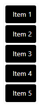
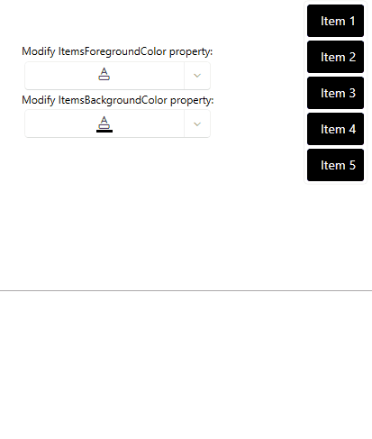

## Description

Keep properties in a separate class from your view model, which should be open for modifications by the user. This setup can be present in the scenario where additional application logic, such as customizable settings for the user, should be kept in a separate class.

## Solution

In such a scenario, the separate class can follow the __singleton pattern__. This will allow you to separate the view model and the additional logic that should not be part of it, while maintaning data-binding and property changes that will be reflected in the UI.

The following example showcases a simple scenario with a view model and a separate class that will contains settings that the user can modify.

__Defining the model and view-model to showcase a simple data-binding scenario__
```C#
    public class Item
    {
        public string ItemName { get; set; }
    }

    public class ItemsViewModel
    {
        public ItemsViewModel()
        {
            this.Items = new ObservableCollection<Item>()
            {
                new Item(){ ItemName = "Item 1" },
                new Item(){ ItemName = "Item 2" },
                new Item(){ ItemName = "Item 3" },
                new Item(){ ItemName = "Item 4" },
                new Item(){ ItemName = "Item 5" },
            };
        }

        public ObservableCollection<Item> Items { get; set; }   
    }
```

The Items collection from the above code snippet will be populating a `RadListBox` control.

__Defining a RadListBox to display the Items__
```XAML
    <Grid>
        <Grid.DataContext>
            <local:ItemsViewModel/>
        </Grid.DataContext>
        <telerik:RadListBox ItemsSource="{Binding Items}" DisplayMemberPath="ItemName"/>
    </Grid>
```

If the user would like to have the ability to customize the foreground and background colors of the items at runtime, this logic will most commonly be defined in the view model. In this scenario an additional class can be created to hold this customization logic, so it is separated from the logic from the view model. This new class can follow the singleton pattern and expose properties that the user can customize, which can be used in data-binding.

__Defining a separate class that follows the singleton pattern to hold user customizable logic__
```C#
    public class UserSettings : ViewModelBase
    {
        private static UserSettings userSettingsInstance;

        private Color itemsForegroundColor;
        private Color itemsBackgroundColor;

        private UserSettings()
        {
            this.ItemsForegroundColor = Colors.White;
            this.ItemsBackgroundColor = Colors.Black;
        }

        public static UserSettings UserSettingsInstance
        {
            get
            {
                if (userSettingsInstance == null)
                {
                    userSettingsInstance = new UserSettings();
                }

                return userSettingsInstance;
            }
        }

        public Color ItemsForegroundColor
        {
            get { return this.itemsForegroundColor; }
            set { this.itemsForegroundColor = value; this.OnPropertyChanged(nameof(this.ItemsForegroundColor)); }
        }

        public Color ItemsBackgroundColor
        {
            get { return this.itemsBackgroundColor; }
            set { this.itemsBackgroundColor = value; this.OnPropertyChanged(nameof(this.ItemsBackgroundColor)); }
        }
    }
```

The `ItemsForegroundColor` and `ItemsBackgroundColor` property can be used in data-binding and will raise the property changed event when their value is updated.

__Binding the ItemsForegroundColor and ItemsBackgroundColor properties__
```XAML
    <Grid.Resources>
        <telerik:ColorToBrushConverter x:Key="ColorToBrushConverter"/>

        <!--If the NoXaml version is used: BasedOn={StaticResource RadListBoxItemStyle}-->
        <Style TargetType="telerik:RadListBoxItem">
            <Setter Property="Foreground" Value="{Binding Source={x:Static local:UserSettings.UserSettingsInstance}, Path=ItemsForegroundColor, Converter={StaticResource ColorToBrushConverter}}"/>
            <Setter Property="Background" Value="{Binding Source={x:Static local:UserSettings.UserSettingsInstance}, Path=ItemsBackgroundColor, Converter={StaticResource ColorToBrushConverter}}"/>
        </Style>
    </Grid.Resources>
```



We can further extend this example to provide the option for the user to customize the properties from the UserSettings class. In this case, we can use the RadColorPicker to modify them.

__Modifying the ItemsForegroundColor and ItemsBackgroundColor__
```XAML
    <TextBlock Text="Modify ItemsForegroundColor property:"/>
    <telerik:RadColorPicker SelectedColor="{Binding Source={x:Static local:UserSettings.UserSettingsInstance}, Path=ItemsForegroundColor, Mode=TwoWay}"/>
    <TextBlock Text="Modify ItemsBackgroundColor property:"/>
    <telerik:RadColorPicker SelectedColor="{Binding Source={x:Static local:UserSettings.UserSettingsInstance}, Path=ItemsBackgroundColor, Mode=TwoWay}"/>
```

__RadColorPicker instances modifying the ItemsForegroundColor and ItemsBackgroundColor properties__


