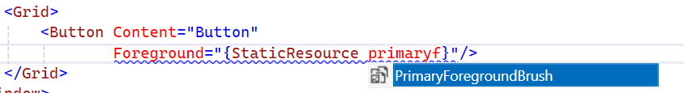

## Description

When using {Theme_Name}Resources in __XAML__, for example, `Windows11Resources`, there will be no intellisense to suggest brushes.

## Solution

You can create a new ResourceDictionary file that will contain `SolidColorBrush` instances pointing to the `{Theme_Name}Palette.Palette`'s properties. Then, merge the created ResourceDictionary.

The following example will use some of the colors of the Windows 11 theme and the properties exposed by the `Windows11Palette` object.

>tip To view the full list of the default colors for the theme you use, check its [Default Theme Colors](#default-theme-colors) section.

__Creating a new ResourceDictionary and defining new SolidColorBrush instances__
```XAML
    <ResourceDictionary xmlns="http://schemas.microsoft.com/winfx/2006/xaml/presentation"
                        xmlns:x="http://schemas.microsoft.com/winfx/2006/xaml"
                        xmlns:telerik="http://schemas.telerik.com/2008/xaml/presentation">
        <SolidColorBrush x:Key="PrimaryForegroundBrush" Color="{Binding Source={x:Static telerik:Windows11Palette.Palette}, Path=PrimaryForegroundColor}" />
        <SolidColorBrush x:Key="SecondaryForegroundBrush" Color="{Binding Source={x:Static telerik:Windows11Palette.Palette}, Path=SecondaryForegroundColor}" />
        <SolidColorBrush x:Key="TertiaryForegroundBrush" Color="{Binding Source={x:Static telerik:Windows11Palette.Palette}, Path=TertiaryForegroundColor}" />
        <SolidColorBrush x:Key="DisabledForegroundBrush" Color="{Binding Source={x:Static telerik:Windows11Palette.Palette}, Path=DisabledForegroundColor}" />
        <SolidColorBrush x:Key="AccentControlForegroundBrush" Color="{Binding Source={x:Static telerik:Windows11Palette.Palette}, Path=AccentControlForegroundColor}" />
        <SolidColorBrush x:Key="IconBrush" Color="{Binding Source={x:Static telerik:Windows11Palette.Palette}, Path=IconColor}" />
        <SolidColorBrush x:Key="IconSecondaryBrush" Color="{Binding Source={x:Static telerik:Windows11Palette.Palette}, Path=IconSecondaryColor}" />
        <SolidColorBrush x:Key="PrimaryBackgroundBrush" Color="{Binding Source={x:Static telerik:Windows11Palette.Palette}, Path=PrimaryBackgroundColor}" />
        <SolidColorBrush x:Key="PrimarySolidBackgroundBrush" Color="{Binding Source={x:Static telerik:Windows11Palette.Palette}, Path=PrimarySolidBackgroundColor}" />
        <SolidColorBrush x:Key="SecondaryBackgroundBrush" Color="{Binding Source={x:Static telerik:Windows11Palette.Palette}, Path=SecondaryBackgroundColor}" />
        <SolidColorBrush x:Key="TertiaryBackgroundBrush" Color="{Binding Source={x:Static telerik:Windows11Palette.Palette}, Path=TertiaryBackgroundColor}" />
        <SolidColorBrush x:Key="TertiarySmokeBackgroundBrush" Color="{Binding Source={x:Static telerik:Windows11Palette.Palette}, Path=TertiarySmokeBackgroundColor}" />
        <SolidColorBrush x:Key="SubtleBrush" Color="{Binding Source={x:Static telerik:Windows11Palette.Palette}, Path=SubtleColor}" />
        <SolidColorBrush x:Key="SubtleSecondaryBrush" Color="{Binding Source={x:Static telerik:Windows11Palette.Palette}, Path=SubtleSecondaryColor}" />
        <SolidColorBrush x:Key="AlternativeBrush" Color="{Binding Source={x:Static telerik:Windows11Palette.Palette}, Path=AlternativeColor}" />
        <SolidColorBrush x:Key="OverlayBrush" Color="{Binding Source={x:Static telerik:Windows11Palette.Palette}, Path=OverlayColor}" />
        <SolidColorBrush x:Key="PrimaryBorderBrush" Color="{Binding Source={x:Static telerik:Windows11Palette.Palette}, Path=PrimaryBorderColor}" />
        <SolidColorBrush x:Key="PrimarySolidBorderBrush" Color="{Binding Source={x:Static telerik:Windows11Palette.Palette}, Path=PrimarySolidBorderColor}" />
        <SolidColorBrush x:Key="SecondaryBorderBrush" Color="{Binding Source={x:Static telerik:Windows11Palette.Palette}, Path=SecondaryBorderColor}" />
        <SolidColorBrush x:Key="TertiaryBorderBrush" Color="{Binding Source={x:Static telerik:Windows11Palette.Palette}, Path=TertiaryBorderColor}" />
        <SolidColorBrush x:Key="ButtonBorderBrush" Color="{Binding Source={x:Static telerik:Windows11Palette.Palette}, Path=ButtonBorderGradientStop1Color}" />
        <SolidColorBrush x:Key="InputBorderBrush" Color="{Binding Source={x:Static telerik:Windows11Palette.Palette}, Path=InputBorderGradientStop1Color}" />
        <SolidColorBrush x:Key="AccentControlBorderBrush" Color="{Binding Source={x:Static telerik:Windows11Palette.Palette}, Path=AccentControlBorderGradientStop1Color}" />
        <SolidColorBrush x:Key="StrokeBrush" Color="{Binding Source={x:Static telerik:Windows11Palette.Palette}, Path=StrokeColor}" />
        <SolidColorBrush x:Key="FocusBrush" Color="{Binding Source={x:Static telerik:Windows11Palette.Palette}, Path=FocusColor}" />
        <SolidColorBrush x:Key="FocusInnerBrush" Color="{Binding Source={x:Static telerik:Windows11Palette.Palette}, Path=FocusInnerColor}" />
        <SolidColorBrush x:Key="MouseOverBackgroundBrush" Color="{Binding Source={x:Static telerik:Windows11Palette.Palette}, Path=MouseOverBackgroundColor}" />
        <SolidColorBrush x:Key="MouseOverBorderBrush" Color="{Binding Source={x:Static telerik:Windows11Palette.Palette}, Path=MouseOverBorderGradientStop1Color}" />
        <SolidColorBrush x:Key="PressedBackgroundBrush" Color="{Binding Source={x:Static telerik:Windows11Palette.Palette}, Path=PressedBackgroundColor}" />
        <SolidColorBrush x:Key="SelectedBrush" Color="{Binding Source={x:Static telerik:Windows11Palette.Palette}, Path=SelectedColor}" />
        <SolidColorBrush x:Key="SelectedMouseOverBrush" Color="{Binding Source={x:Static telerik:Windows11Palette.Palette}, Path=SelectedMouseOverColor}" />
        <SolidColorBrush x:Key="SelectedUnfocusedBrush" Color="{Binding Source={x:Static telerik:Windows11Palette.Palette}, Path=SelectedUnfocusedColor}" />
        <SolidColorBrush x:Key="ReadOnlyBackgroundBrush" Color="{Binding Source={x:Static telerik:Windows11Palette.Palette}, Path=ReadOnlyBackgroundColor}" />
        <SolidColorBrush x:Key="ReadOnlyBorderBrush" Color="{Binding Source={x:Static telerik:Windows11Palette.Palette}, Path=ReadOnlyBorderColor}" />
        <SolidColorBrush x:Key="DisabledBackgroundBrush" Color="{Binding Source={x:Static telerik:Windows11Palette.Palette}, Path=DisabledBackgroundColor}" />
        <SolidColorBrush x:Key="DisabledBorderBrush" Color="{Binding Source={x:Static telerik:Windows11Palette.Palette}, Path=DisabledBorderColor}" />
        <SolidColorBrush x:Key="ValidationBrush" Color="{Binding Source={x:Static telerik:Windows11Palette.Palette}, Path=ValidationColor}" />
    </ResourceDictionary>
```

__Merging the created ResourceDictionary__
```XAML
    <Application.Resources>
        <ResourceDictionary Source="Windows11BrushesResourceDictionary.xaml"/>
    </Application.Resources>
```

__Visual Studio suggesting the colors from the Windows 11 theme__

