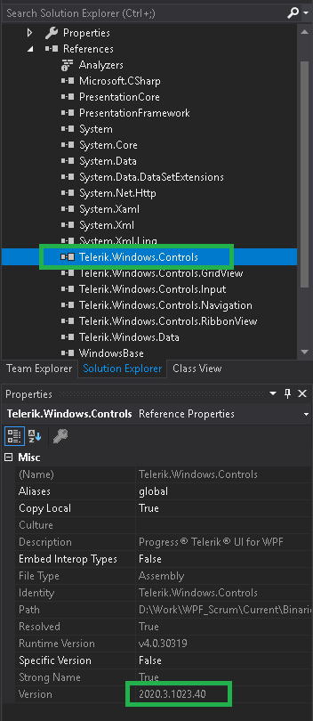

## Environment
<table>
	<tbody>
		<tr>
			<td>Product Version</td>
			<td>2020.3 1020</td>
		</tr>
		<tr>
			<td>Product</td>
			<td>UI for WPF</td>
		</tr>
	</tbody>
</table>

## Description

XamlParseException with message "Could not load file or assembly or one of its dependencies" is thrown at runtime.

## Solution

This issue usually occurs when the Telerik WPF dlls with different versions are referenced in the project. For example, some are `2020.3 1020` and others `2020.1 115`. 

Here are some situations in which this can happen: 
* Different versions referenced by mistake 
* References not properly auto resolved by Visual Studio if you have several Telerik versions installed on the machine.
* Dragging a control from the Visual Studio toolbox to the UI. If the Telerik controls from the toolbox are using a different version than the one referenced in the project, when you drop a control the corresponding toolbox dll will get referenced in the project.

To resolve this, make sure that all Telerik dlls have the same version. To check this, use the Properties pane of the dll references in Visual Studio.

