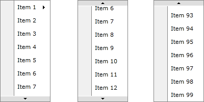
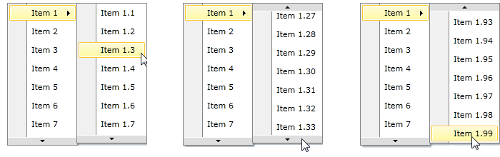
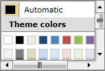

## Environment

<table>
<tbody>
<tr>
<td>Product Version</td>
<td>2026.1.415</td>
</tr>
<tr>
<td>Product</td>
<td>RadContextMenu for WPF</td>
</tr>
</tbody>
</table>

## Description

Limit the number of visible items in a RadContextMenu that displays a long list by adding vertical scrolling.

## Solution

Set the RadContextMenu Height property and the RadMenuItem DropDownHeight property when nested items also need a limited height.

## Use Height and DropDownHeight Properties

__RadContextMenu__ has Height property. If you set it, but the __RadMenuItems__ inside it doesn't fit in this size, you will see two buttons which can be used to scroll through your collection:

__RadContextMenu Scrolling__


But if any of your __RadMenuItems__ has submenu items, they will be placed inside another popup. That's why we've added *DropDownHeight* property for __RadMenuItem__. The value of the property shows the height of RadMenuItem's submenu. The behavior when the items doesn't fit in the set DropDownHeight is the same as described above:

__RadContextMenu Submenu Scrolling__


Here's a simple code that shows how to use Height and DropDownHeight properties:


__Set RadContextMenu Height and RadMenuItem DropDownHeight__
```XAML
<TextBox xmlns:telerik="http://schemas.telerik.com/2008/xaml/presentation"
         ContextMenu="{x:Null}">
    <telerik:RadContextMenu.ContextMenu>
        <telerik:RadContextMenu x:Name="radContextMenu" Height="200">
            <telerik:RadMenuItem Header="Item 1" DropDownHeight="200">
                <telerik:RadMenuItem Header="Item 1.1" />
                <telerik:RadMenuItem Header="Item 1.2" />
                <!--Define all items -->
            </telerik:RadMenuItem>
            <telerik:RadMenuItem Header="Item 2" />
            <!--Define all items -->
        </telerik:RadContextMenu>
    </telerik:RadContextMenu.ContextMenu>
</TextBox>
```

## Scrolling in RadMenuGroupItem

If you are using __RadMenuGroupItem__ you can control scrolling inside it via ScrollViewer's attached properties - VerticalScrollBarVisibility and HorizontalScrollBarVisibility.

__Configure Scrolling in RadMenuGroupItem__
```XAML
<TextBox xmlns:telerik="http://schemas.telerik.com/2008/xaml/presentation"
         ContextMenu="{x:Null}">
    <telerik:RadContextMenu.ContextMenu>
        <telerik:RadContextMenu x:Name="ContextMenu1">
            <telerik:RadMenuGroupItem Height="100" Width="150"
                                      ScrollViewer.HorizontalScrollBarVisibility="Visible"
                                      ScrollViewer.VerticalScrollBarVisibility="Visible">
                <telerik:RadColorSelector />
            </telerik:RadMenuGroupItem>
        </telerik:RadContextMenu>
    </telerik:RadContextMenu.ContextMenu>
</TextBox>
```

__RadMenuGroupItem Scrolling__


## See Also

* [Attaching a Context Menu]()
* [RadContextMenu Overview]()
