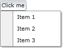

## Environment

<table>
<tbody>
<tr>
<td>Product Version</td>
<td>2026.1.415</td>
</tr>
<tr>
<td>Product</td>
<td>RadContextMenu for WPF</td>
</tr>
</tbody>
</table>

## Description

Create a drop-down menu button that displays additional options when the user clicks a ToggleButton.

## Solution

Attach a RadContextMenu to the ToggleButton and bind the ToggleButton.IsChecked property to the RadContextMenu.IsOpen property.

1. Define the ToggleButton and attach the RadContextMenu.

__Define the ToggleButton and RadContextMenu__
```XAML
<ToggleButton xmlns:telerik="http://schemas.telerik.com/2008/xaml/presentation"
              Content="Click me"
              HorizontalAlignment="Left"
              IsChecked="{Binding IsOpen, ElementName=radContextMenu, Mode=TwoWay}">
    <telerik:RadContextMenu.ContextMenu>
        <telerik:RadContextMenu x:Name="radContextMenu" Placement="Bottom">
            <telerik:RadMenuItem Header="Item 1" />
            <telerik:RadMenuItem Header="Item 2" />
            <telerik:RadMenuItem Header="Item 3" />
        </telerik:RadContextMenu>
    </telerik:RadContextMenu.ContextMenu>
</ToggleButton>
```

The `IsChecked` binding keeps the ToggleButton state synchronized with the RadContextMenu.IsOpen property.

__RadContextMenu Menu Button__


## See Also

* [Getting Started]()
* [Menu Placement]()
* [RadContextMenu Overview]()