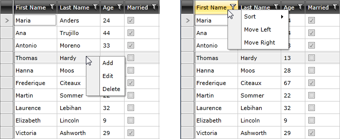

## Environment

<table>
<tbody>
<tr>
<td>Product Version</td>
<td>2026.1.415</td>
</tr>
<tr>
<td>Product</td>
<td>RadContextMenu for WPF</td>
</tr>
</tbody>
</table>

## Description

Display different RadContextMenu items for RadGridView headers, rows, and other clicked areas, then handle the selected menu action.

## Solution

Attach a RadContextMenu to the RadGridView, bind its items through an ItemContainerStyle, switch the ItemsSource in the Opened event, and handle menu actions in the ItemClick event.

This tutorial will demonstrate how to use a **RadContextMenu** to add functionality to the **RadGridView** control. The article is divided into the following sections:

* [Attach RadContextMenu to RadGridView](#attach-radcontextmenu-to-radgridview)
* [Configure the ItemContainerStyle for RadContextMenu](#configure-the-itemcontainerstyle-for-radcontextmenu)
* [Display Different Menu Items Depending on Which RadGridView Part Is Clicked](#display-different-menu-items-depending-on-which-radgridview-part-is-clicked)
* [Handle the Menu Items' Clicks](#handle-the-menu-items-clicks)

>note You can have a look at the **Row Context Menu** and **Header Context Menu** demos in the RadGridView section of the [WPF Controls Examples](https://demos.telerik.com/wpf/).

To start, first define a RadGridView, which will display a list of __Employee__ objects.

__Define the RadGridView__
```XAML
<telerik:RadGridView xmlns:telerik="http://schemas.telerik.com/2008/xaml/presentation" x:Name="radGridView" AutoGenerateColumns="False">
    <telerik:RadGridView.Columns>
        <telerik:GridViewDataColumn DataMemberBinding="{Binding FirstName}" Header="First Name"/>
        <telerik:GridViewDataColumn DataMemberBinding="{Binding LastName}" Header="Last Name"/>
        <telerik:GridViewDataColumn DataMemberBinding="{Binding Age}" Header="Age"/>
        <telerik:GridViewDataColumn DataMemberBinding="{Binding IsMarried}" Header="Married"/>
    </telerik:RadGridView.Columns>
</telerik:RadGridView>
```

## Attach RadContextMenu to RadGridView

In order to add a RadContextMenu to the RadGridView control, you have to just set the __RadContextMenu.ContextMenu__ attached property.

__Attach RadContextMenu to RadGridView__
```XAML
<telerik:RadGridView xmlns:telerik="http://schemas.telerik.com/2008/xaml/presentation"
                    x:Name="radGridView" AutoGenerateColumns="False">
    <telerik:RadContextMenu.ContextMenu>
        <telerik:RadContextMenu x:Name="GridContextMenu" />
    </telerik:RadContextMenu.ContextMenu>
    <telerik:RadGridView.Columns>
        <telerik:GridViewDataColumn DataMemberBinding="{Binding FirstName}" Header="First Name"/>
        <telerik:GridViewDataColumn DataMemberBinding="{Binding LastName}" Header="Last Name"/>
        <telerik:GridViewDataColumn DataMemberBinding="{Binding Age}" Header="Age"/>
        <telerik:GridViewDataColumn DataMemberBinding="{Binding IsMarried}" Header="Married"/>
    </telerik:RadGridView.Columns>
</telerik:RadGridView>
```

## Configure the ItemContainerStyle for RadContextMenu

The __RadContextMenu__ will be populated with dynamic data, so you have to prepare an __ItemContainerStyle__ that will display this data. The business object that represents the data is defined below.

__Define the MenuItem class__
```C#
public class MenuItem : INotifyPropertyChanged
{
    private bool isEnabled = true;
    private string text;
    private ObservableCollection<MenuItem> subItems;
    public event PropertyChangedEventHandler PropertyChanged;
    public bool IsEnabled
    {
        get
        {
            return this.isEnabled;
        }
        set
        {
            if (this.isEnabled != value)
            {
                this.isEnabled = value;
                this.OnNotifyPropertyChanged("IsEnabled");
            }
        }
    }
    public string Text
    {
        get
        {
            return this.text;
        }
        set
        {
            if (this.text != value)
            {
                this.text = value;
                this.OnNotifyPropertyChanged("Text");
            }
        }
    }
    public ObservableCollection<MenuItem> SubItems
    {
        get
        {
            if (this.subItems == null)
            {
                this.subItems = new ObservableCollection<MenuItem>();
            }
            return this.subItems;
        }
        set
        {
            if (this.subItems != value)
            {
                this.subItems = value;
                this.OnNotifyPropertyChanged("SubItems");
            }
        }
    }
    private void OnNotifyPropertyChanged(string propertyName)
    {
        if (this.PropertyChanged != null)
        {
            this.PropertyChanged(this, new PropertyChangedEventArgs(propertyName));
        }
    }
}

public class Employee
{
    public string FirstName { get; set; }
    public string LastName { get; set; }
    public int Age { get; set; }
    public bool IsMarried { get; set; }
}
```
Here is the __ItemContainerStyle__:

__Define the ItemContainerStyle__
```XAML
<Style xmlns:telerik="http://schemas.telerik.com/2008/xaml/presentation"
    x:Key="MenuItemContainerStyle" TargetType="telerik:RadMenuItem">
    <Setter Property="Header" Value="{Binding Text}"/>
    <Setter Property="ItemsSource" Value="{Binding SubItems}"/>
    <Setter Property="IsEnabled" Value="{Binding IsEnabled}"/>
</Style>
```

## Display Different Menu Items Depending on Which RadGridView Part Is Clicked

The __RadContextMenu__ should display different items, depending on which part of it is clicked. Here are the possible scenarios along with the list of items we will show for each one:

* __GridView Header__

	* Sort

		* Ascending

		* Descending

		* None

	* Move Left

	* Move Right

* __GridView Row__

	* Add

	* Edit

	* Delete

* __Anything Else__

	* Add

	* Edit (__Disabled__)

	* Delete (__Disabled__)

As you can see, two data sources have to be provided for the __RadContextMenu__ - one when a header is clicked and a separate one when a row is clicked. For that purpose, create two collection fields in your __UserControl__ as demonstrated below.

__Declare the MenuItem collections__
```C#
private ObservableCollection<MenuItem> headerContextMenuItems;
private ObservableCollection<MenuItem> rowContextMenuItems;
private ObservableCollection<Employee> employees;
```

Now, initialize them by using methods similar to the ones demonstrated below.

__Initialize the MenuItem collections__
```C#
public MainWindow()
{
    this.InitializeComponent();
    this.employees = this.GetEmployees();
    this.radGridView.ItemsSource = this.employees;

    this.InitializeHeaderContextMenuItems();
    this.InitializeRowContextMenuItems();
}

private ObservableCollection<Employee> GetEmployees()
{
    return new ObservableCollection<Employee>
    {
        new Employee { FirstName = "Anne", LastName = "Dodsworth", Age = 35, IsMarried = true },
        new Employee { FirstName = "Nancy", LastName = "Davolio", Age = 29, IsMarried = false }
    };
}

private void InitializeRowContextMenuItems()
{
    ObservableCollection<MenuItem> items = new ObservableCollection<MenuItem>();
    MenuItem addItem = new MenuItem();
    addItem.Text = "Add";
    items.Add(addItem);
    MenuItem editItem = new MenuItem();
    editItem.Text = "Edit";
    items.Add(editItem);
    MenuItem deleteItem = new MenuItem();
    deleteItem.Text = "Delete";
    items.Add(deleteItem);
    this.rowContextMenuItems = items;
}
private void InitializeHeaderContextMenuItems()
{
    ObservableCollection<MenuItem> headerItems = new ObservableCollection<MenuItem>();
    ObservableCollection<MenuItem> sortItems = new ObservableCollection<MenuItem>();
    MenuItem sortAscItem = new MenuItem();
    sortAscItem.Text = "Ascending";
    sortItems.Add(sortAscItem);
    MenuItem sortDescItem = new MenuItem();
    sortDescItem.Text = "Descending";
    sortItems.Add(sortDescItem);
    MenuItem sortNoneItem = new MenuItem();
    sortNoneItem.Text = "None";
    sortItems.Add(sortNoneItem);
    MenuItem sortItem = new MenuItem();
    sortItem.Text = "Sort";
    sortItem.SubItems = sortItems;
    headerItems.Add(sortItem);
    MenuItem moveLeftItem = new MenuItem();
    moveLeftItem.Text = "Move Left";
    headerItems.Add(moveLeftItem);
    MenuItem moveRightItem = new MenuItem();
    moveRightItem.Text = "Move Right";
    headerItems.Add(moveRightItem);
    this.headerContextMenuItems = headerItems;
}
```
Next you will need two properties that will return the clicked row and the clicked header. Define them in your __UserControl__ as follows by using the [GetClickedElement](#get-the-clicked-element) method.

__Define the ClickedHeader and ClickedRow properties__
```C#
private GridViewHeaderCell ClickedHeader
{
    get
    {
        return this.GridContextMenu.GetClickedElement<GridViewHeaderCell>();
    }
}
private GridViewRow ClickedRow
{
    get
    {
        return this.GridContextMenu.GetClickedElement<GridViewRow>();
    }
}
```
The last thing to do is to attach an event handler to the __Opened__ event of the __RadContextMenu__. There you can implement the logic around changing the __ItemsSource__ of the __RadContextMenu__ depending on the clicked element.

__Attach the Opened event handler__
```XAML
<telerik:RadContextMenu xmlns:telerik="http://schemas.telerik.com/2008/xaml/presentation"
                        x:Name="GridContextMenu"
                        ItemContainerStyle="{StaticResource MenuItemContainerStyle}"
                        Opened="GridContextMenu_Opened" />
```

__Define the Opened event handler__
```C#
private void GridContextMenu_Opened(object sender, RoutedEventArgs e)
{
    if (this.ClickedHeader != null)
    {
        this.GridContextMenu.ItemsSource = this.headerContextMenuItems;
    }
    else if (this.ClickedRow != null)
    {
        this.radGridView.SelectedItem = this.ClickedRow.DataContext;
        foreach (var item in this.rowContextMenuItems)
        {
            item.IsEnabled = true;
        }
        this.GridContextMenu.ItemsSource = this.rowContextMenuItems;
    }
    else
    {
        foreach (var item in this.rowContextMenuItems)
        {
            if (!item.Text.Equals("Add"))
            {
                item.IsEnabled = false;
            }
        }
        this.GridContextMenu.ItemsSource = this.rowContextMenuItems;
    }
}
```
The following image shows the result when you click a row or header.

__RadContextMenu for a RadGridView Row and Header__


## Handle the Menu Items' Clicks

The last thing to do in this tutorial is to [handle the menu items' actions](). For this purpose, attach an event handler to the __ItemClick__ event of the __RadContextMenu__. In it, get the clicked item and, depending on its value, execute the appropriate code.

__Attach the ItemClick event handler__
```XAML
<telerik:RadContextMenu xmlns:telerik="http://schemas.telerik.com/2008/xaml/presentation"
                        x:Name="GridContextMenu"
                        ItemContainerStyle="{StaticResource MenuItemContainerStyle}"
                        Opened="GridContextMenu_Opened"
                        ItemClick="GridContextMenu_ItemClick" />
```

__Define the ItemClick event handler__
```C#
private void GridContextMenu_ItemClick(object sender, Telerik.Windows.RadRoutedEventArgs e)
{
    MenuItem item = (e.OriginalSource as RadMenuItem).DataContext as MenuItem;
    switch (item.Text)
    {
        case "Add":
            this.radGridView.BeginInsert();
            break;
        case "Edit":
            this.radGridView.BeginEdit();
            break;
        case "Delete":
            this.employees.Remove((Employee)this.radGridView.SelectedItem);
            break;
        case "Ascending":
            this.radGridView.SortDescriptors.Clear();
            this.radGridView.SortDescriptors.Add(new SortDescriptor()
            {
                Member = this.ClickedHeader.Column.UniqueName,
                SortDirection = ListSortDirection.Ascending
            });
            break;
        case "Descending":
            this.radGridView.SortDescriptors.Clear();
            this.radGridView.SortDescriptors.Add(new SortDescriptor()
            {
                Member = this.ClickedHeader.Column.UniqueName,
                SortDirection = ListSortDirection.Descending
            });
            break;
        case "None":
            this.radGridView.SortDescriptors.Clear();
            break;
        case "Move Left":
            if (this.ClickedHeader.Column.DisplayIndex > 0)
                this.ClickedHeader.Column.DisplayIndex -= 1;
            break;
        case "Move Right":
            if (this.ClickedHeader.Column.DisplayIndex < this.radGridView.Columns.Count - 1)
                this.ClickedHeader.Column.DisplayIndex += 1;
            break;
    }
}
```
## See Also

* [Context Menu Owner]()

* [Handle Item Clicks]()

* [Use Commands with the RadContextMenu]()

* [Select the clicked Item of a RadTreeView]()
