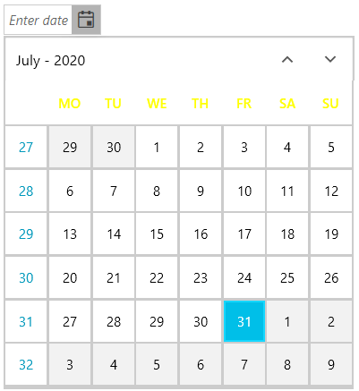

## Environment
<table>
    <tbody>
	    <tr>
	    	<td>Product</td>
	    	<td>RadDateTimePicker for WPF</td>
	    </tr>
    </tbody>
</table>

## Description

How to change the Foreground of the buttons for the day short names in RadCalendar or RadDateTimePicker. 

## Solution

Create a custom DataTemplate that sets the Foreground of a TextBlock element inside its Triggers and assign the template to the __DayTemplate__ of the RadCalendar. If you are using a RadDateTimePicker, you can do that through its __CalendarStyle__ property. 

__Example 1: Conditionally coloring the day short names__
```XAML

    <Grid xmlns:calendar="clr-namespace:Telerik.Windows.Controls.Calendar;assembly=Telerik.Windows.Controls.Input">
        <Grid.Resources>
            <DataTemplate x:Key="DayTemplate">
                <TextBlock x:Name="buttonTextBlock" Text="{Binding}"  />
                <DataTemplate.Triggers>
                    <DataTrigger Binding="{Binding ButtonType, RelativeSource={RelativeSource AncestorType=calendar:CalendarButton}}" Value="WeekName">
                        <Setter TargetName="buttonTextBlock" Property="Foreground" Value="Yellow" />
                    </DataTrigger>
                </DataTemplate.Triggers>
            </DataTemplate>

            <!-- If you are using the NoXaml dlls, you should add the BasedOn attribute: BasedOn="{StaticResource RadCalendarStyle}"-->
            <Style x:Key="CalendarStyle" TargetType="telerik:RadCalendar" >
                <Setter Property="DayTemplate" Value="{StaticResource DayTemplate}" />
            </Style>
        </Grid.Resources>
        
        <telerik:RadDateTimePicker InputMode="DatePicker" CalendarStyle="{StaticResource CalendarStyle}"  VerticalAlignment="Center" HorizontalAlignment="Center" />
    </Grid>
```

#### __Figure 1: Result from Example 1__


## See Also

* [How to Customize the Calendar Buttons]()