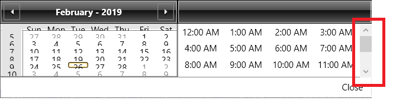

## Environment
<table>
	<tr>
		<td>Product Version</td>
		<td>2019.1.116</td>
	</tr>
	<tr>
		<td>Product</td>
		<td>RadDateTimePicker for WPF</td>
	</tr>
</table>

## Description

How to show a vertical scrollbar in the time section of the drop down.

## Solution

1. [Extract the ControlTemplate]() of RadClock. 
2. Wrap the ItemsPresenter control of the template in a ScrollViewer control.  
3. Create a Style targeting RadClock and define a Setter that sets the Template property to the customized ControlTemplate.
4. Apply the Style via the __ClockStyle property__ of RadDateTimePicker.


```XAML
	<Window.Resources>
		<ControlTemplate TargetType="{x:Type telerik:RadClock}" x:Key="CustomClockTemplate">	  
			<Grid>
				<Grid.RowDefinitions>
					<RowDefinition Height="Auto"/>
					<RowDefinition Height="*"/>
				</Grid.RowDefinitions>
				<Border x:Name="BackgroundVisual" BorderBrush="{TemplateBinding BorderBrush}" BorderThickness="{TemplateBinding BorderThickness}"
						Background="{TemplateBinding Background}" CornerRadius="0" Grid.RowSpan="2">
					<Border BorderBrush="White" BorderThickness="{TemplateBinding BorderThickness}" CornerRadius="0"/>
				</Border>
				<Border x:Name="Header" BorderBrush="Black" BorderThickness="1" CornerRadius="0" MinHeight="32">
					<Border.Background>
						<LinearGradientBrush EndPoint="0.5,1" StartPoint="0.5,0">
							<GradientStop Color="#FF5B5B5B" Offset="1"/>
							<GradientStop Color="#FF868686"/>
							<GradientStop Color="#FF4F4F4F" Offset="0.42"/>
							<GradientStop Color="#FF0E0E0E" Offset="0.43"/>
						</LinearGradientBrush>
					</Border.Background>
					<Border BorderBrush="#FFB5B5B5" BorderThickness="1" CornerRadius="0" Padding="{TemplateBinding Padding}">
						<ContentControl ContentTemplate="{TemplateBinding HeaderTemplate}" Content="{TemplateBinding Header}" 
										Foreground="White" FontWeight="Bold" HorizontalAlignment="{TemplateBinding HorizontalContentAlignment}" IsTabStop="False" Margin="{TemplateBinding Padding}" VerticalAlignment="{TemplateBinding VerticalContentAlignment}"/>
					</Border>
				</Border>
				<!-- THE NEWLY ADDED SCROLLVIEWER -->
				<ScrollViewer Grid.Row="1">
					<ItemsPresenter Margin="1,0,1,1" />
				</ScrollViewer>
			</Grid>
		</ControlTemplate>
	</Window.Resources>
    <Grid>
        <telerik:RadDateTimePicker>
            <telerik:RadDateTimePicker.ClockStyle>
                <Style TargetType="telerik:RadClock">
                    <Setter Property="Template" Value="{StaticResource CustomClockTemplate}" />
                </Style>
            </telerik:RadDateTimePicker.ClockStyle>
        </telerik:RadDateTimePicker>
    </Grid>    
```

> This template is extracted from the OfficeBlack [theme]().


