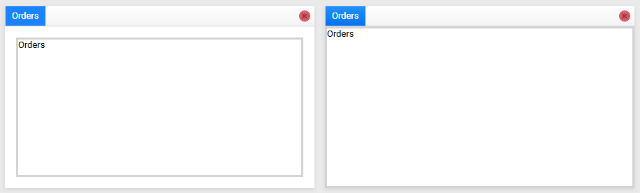

## Environment
<table>
	<tbody>
		<tr>
			<td>Product Version</td>
			<td>2020.3.1020</td>
		</tr>
		<tr>
			<td>Product</td>
			<td>RadDocking for WPF</td>
		</tr>
	</tbody>
</table>

## Description

How to remove the padding around the pane groups of the `RadDocking` control.

## Solution

To get rid of the extra space surrounding the panes in the pane group, which is defined inside a `DocumentHost` container, you would need to set the `Padding` property of the `RadPaneGroup` element, to 0. 


```XAML
	<telerik:RadDocking.DocumentHost>
	    <telerik:RadSplitContainer>
	        <telerik:RadPaneGroup Padding="0">
	            <telerik:RadPane>
	                <ScrollViewer/>
	            </telerik:RadPane>
	        </telerik:RadPaneGroup>
	    </telerik:RadSplitContainer>
	</telerik:RadDocking.DocumentHost>
```

If you need to apply this to all of the `RadPaneGroup` instances, create a new `Style` with a `Setter` for the `Padding` property


```XAML
	<!-- If you're using the NoXaml binaries, you need to base the custom style on the default one for the control, like so:
	<Style TargetType="telerik:RadPaneGroup" BasedOn="{StaticResource RadPaneGroupStyle}"> -->
	<Style TargetType="telerik:RadPaneGroup">
	    <Setter Property="Padding" Value="0" />
	</Style>
```

For the Fluent, Green, Material, Office2016 and Office2016Touch themes, the `RadPaneGroup` element's padding should be updated through a style trigger.


```XAML
	<!-- If you're using the NoXaml binaries, you need to base the custom style on the default one for the control, like so:
	<Style TargetType="telerik:RadPaneGroup" BasedOn="{StaticResource RadPaneGroupStyle}"> -->
	<Style TargetType="telerik:RadPaneGroup">
	    <Style.Triggers>
	        <Trigger Property="IsInDocumentHost" Value="True">
	            <Setter Property="Padding" Value="0" />
	        </Trigger>
	    </Style.Triggers>
	</Style>
```

#### Figure 1: DocumentHost with and without the default padding in the Crystal theme



## See Also

* [Pane Groups]()
* [Styling the RadPaneGroup]()
* [Document Host]()