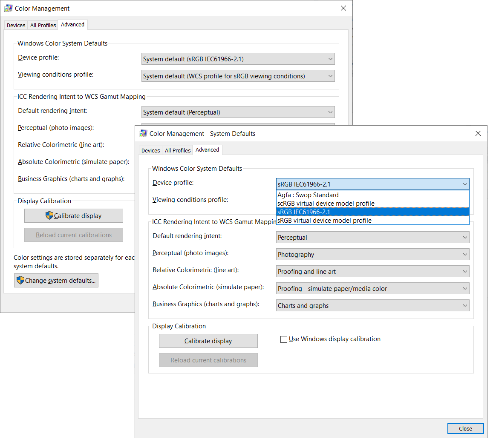

## Environment
<table>
    <tbody>
        <tr>
            <td>Product Version</td>
            <td>2023.1.315</td>
        </tr>
        <tr>
            <td>Product</td>
            <td>RadFileDialogs for WPF</td>
        </tr>
    </tbody>
</table>

## Description

ArithmeticException is thrown on `RadSaveFileDialog`'s `ShowDialog` call, when the __device model profile__ of the OS (from the Color Management menu) is set to __sRGB virtual device model profile__. The profile should be set through the __Change system defaults__ menu. This setting is accessed by opening the Color Management menu in the OS, then select the Advanced tab, then click on __Change system defaults...__ In the newly opened dialog click __Advanced__ again and change the __Device profile__ to __sRGB virtual device model profile__.

This is a bug in the WPF framework that is [reported here](https://github.com/dotnet/wpf/issues/3884).

The important part of the exception stacktrace is the following:

	System.ArithmeticException: Overflow or underflow in the arithmetic operation.
	--- End of inner exception stack trace ---
	at System.Windows.Media.Imaging.ColorConvertedBitmap.FinalizeCreation()
	at System.Windows.Media.Imaging.ColorConvertedBitmap..ctor(BitmapSource source, ColorContext sourceColorContext, ColorContext destinationColorContext, PixelFormat format)
	at System.Windows.Media.Imaging.BitmapSource.CreateCachedBitmap(BitmapFrame frame, BitmapSourceSafeMILHandle wicSource, BitmapCreateOptions createOptions, BitmapCacheOption cacheOption, BitmapPalette palette)
	at System.Windows.Media.Imaging.BitmapFrameDecode.FinalizeCreation()
	at System.Windows.Media.Imaging.BitmapFrameDecode..ctor(Int32 frameNumber, BitmapCreateOptions createOptions, BitmapCacheOption cacheOption, BitmapDecoder decoder)
	at System.Windows.Media.Imaging.BitmapDecoder.SetupFrames(BitmapDecoder decoder, ReadOnlyCollection`1 frames)
	at System.Windows.Media.Imaging.BitmapDecoder.get_Frames()
	at System.Windows.Media.Imaging.BitmapFrame.CreateFromUriOrStream(Uri baseUri, Uri uri, Stream stream, BitmapCreateOptions createOptions, BitmapCacheOption cacheOption, RequestCachePolicy uriCachePolicy)
	at System.Windows.Media.ImageSourceConverter.ConvertFrom(ITypeDescriptorContext context, CultureInfo culture, Object value)
	at System.Windows.Baml2006.TypeConverterMarkupExtension.ProvideValue(IServiceProvider serviceProvider)

## Solution 1

Change the default color profile to the more standard __sRGB IEC61966-2.1__. You can try also the other available profiles. To change the color profile use the following steps:

1. Open the __Color Management__ menu through the Windows OS start menu.
2. Select the __Advanced__ tab.
3. Click on the __Change system defaults...__ button.
4. In the newly opened window (Color Management - System Defaults) select the __Advanced__ tab.
5. In the __Device profile__ drop down, select __sRGB IEC61966-2.1__. 



## Solution 2

The issue is caused by the default `ImageSourceConverter` used with the `TypeConverter` of the WPF's `ImageSource` class. In other words this should manifest everytime you try to set the image path in XAML to property of type `ImageSource`.

The FileDialogs are using this type of image settings only in its `LayoutTypeToIconConverter`. To resolve the issue, you can replace the converter with a custom one. This will require to extract several additional resources related to the FileDialogs in order to replace the converter and its usage. The following steps show how to do this:

1. Create a new IValueConverter that internally uses the LayoutTypeToIconConverter. In the constructor of the converter, initialize the `LayoutTypeToIconConverter` and assign its image source properties.
	
	
	```C#
		public class CustomLayoutTypeToIconConverter : IValueConverter
		{
			private static LayoutTypeToIconConverter originalConverter = new LayoutTypeToIconConverter();

			static CustomLayoutTypeToIconConverter()
			{
				originalConverter.SmallIconImageSource = new BitmapImage(new Uri("/Telerik.Windows.Controls.FileDialogs;component/Images/small-icons.png", UriKind.RelativeOrAbsolute));
				originalConverter.MediumIconImageSource = new BitmapImage(new Uri("/Telerik.Windows.Controls.FileDialogs;component/Images/medium-icons.png", UriKind.RelativeOrAbsolute));
				originalConverter.LargeIconImageSource = new BitmapImage(new Uri("/Telerik.Windows.Controls.FileDialogs;component/Images/large-icons.png", UriKind.RelativeOrAbsolute));
				originalConverter.ExtraLargeIconImageSource = new BitmapImage(new Uri("/Telerik.Windows.Controls.FileDialogs;component/Images/extra-large-icons.png", UriKind.RelativeOrAbsolute));
				originalConverter.ListImageSource = new BitmapImage(new Uri("/Telerik.Windows.Controls.FileDialogs;component/Images/list.png", UriKind.RelativeOrAbsolute));
				originalConverter.TilesImageSource = new BitmapImage(new Uri("/Telerik.Windows.Controls.FileDialogs;component/Images/tiles.png", UriKind.RelativeOrAbsolute));
				originalConverter.DetailsImageSource = new BitmapImage(new Uri("/Telerik.Windows.Controls.FileDialogs;component/Images/details.png", UriKind.RelativeOrAbsolute));
			}

			public object Convert(object value, Type targetType, object parameter, CultureInfo culture)
			{
				return originalConverter.Convert(value, targetType, parameter, culture);
			}

			public object ConvertBack(object value, Type targetType, object parameter, CultureInfo culture)
			{
				throw new NotImplementedException();
			}
		}
	```

2. Find the __Telerik.Windows.Controls.FileDialogs.xaml__ file in the Telerik UI for WPF installation folder and open it.
3. From the .xaml file, copy the following resources (with x:Keys set to) "layoutTypeIconConverter", "LayoutConfiguratorItemTemplate", "LayoutConfiguratorSelectedItemTemplate" and "ExplorerControlTemplate". Then, paste the resources in your project.
4. In the copied resources replace the `LayoutTypeToIconConverter` with the new `CustomLayoutTypeToIconConverter`. 
5. Add an implicit style that sets the `ControlTemplate` of the `ExplorerControl` to all file dialogs.
6. You can wrap the resources in a new ResourceDictionary. The following example shows how the dictionary should look. The example uses the __Windows 11__ theme, but you can use the resources from any other theme.
	
	
	```XAML
		<ResourceDictionary xmlns="http://schemas.microsoft.com/winfx/2006/xaml/presentation"
						xmlns:x="http://schemas.microsoft.com/winfx/2006/xaml" 
						xmlns:telerik="http://schemas.telerik.com/2008/xaml/presentation" 
						xmlns:local="clr-namespace:WPF_test" xmlns:fileDialogsDragDrop="clr-namespace:Telerik.Windows.Controls.FileDialogs.DragDrop;assembly=Telerik.Windows.Controls.FileDialogs" xmlns:historyNavigationPane="clr-namespace:Telerik.Windows.Controls.FileDialogs;assembly=Telerik.Windows.Controls.FileDialogs" xmlns:telerikBreadcrumb="clr-namespace:Telerik.Windows.Controls.Breadcrumb;assembly=Telerik.Windows.Controls.Navigation">
						
			<!-- the merged dictionary is need only if you use the XAML version of the Telerik dlls. In case you are using NoXaml, remove the MergedDictionaries tag -->
			<!-- https://docs.telerik.com/devtools/wpf/styling-and-appearance/xaml-vs-noxaml -->
			<ResourceDictionary.MergedDictionaries>
				<ResourceDictionary Source="/Telerik.Windows.Controls.FileDialogs;component/Themes/GenericWindows11.xaml" />
			</ResourceDictionary.MergedDictionaries>
			
			<local:CustomLayoutTypeToIconConverter x:Key="layoutTypeIconConverter"/>

			<DataTemplate x:Key="CustomLayoutConfiguratorSelectedItemTemplate">
				<Image Source="{Binding LayoutType, Converter={StaticResource layoutTypeIconConverter}, Mode=OneTime}"
					   Width="16"
					   Height="16"
					   Margin="4 0"
					   HorizontalAlignment="Left"
					   VerticalAlignment="Center"/>
			</DataTemplate>
			<DataTemplate x:Key="CustomLayoutConfiguratorItemTemplate">
				<StackPanel Orientation="Horizontal">
					<Image Source="{Binding LayoutType, Converter={StaticResource layoutTypeIconConverter}, Mode=OneTime}" VerticalAlignment="Center" Width="16" Height="16" Margin="4 0"/>            
					<TextBlock telerik:LocalizationManager.ResourceKey="{Binding NameKey}"/>
				</StackPanel>
			</DataTemplate>

			<ControlTemplate x:Key="ExplorerControlTemplate" TargetType="historyNavigationPane:ExplorerControl">
				<Grid x:Name="ExplorerRootGrid" Background="{TemplateBinding Background}">
					<Grid.RowDefinitions>
						<RowDefinition Height="Auto"/>
						<RowDefinition Height="Auto"/>
						<RowDefinition Height="*"/>
					</Grid.RowDefinitions>
					<Grid Grid.Row="0" MinHeight="48">
						<Grid.ColumnDefinitions>
							<ColumnDefinition Width="Auto"/>
							<ColumnDefinition Width="*"/>
							<ColumnDefinition Width="Auto"/>
						</Grid.ColumnDefinitions>
						<historyNavigationPane:HistoryNavigationPaneControl x:Name="PART_HistoryNavigationPane" Grid.Row="0" Grid.Column="0"/>
						<historyNavigationPane:FileDialogsBreadcrumb x:Name="PART_PathNavigationPane"
								Grid.Column="1"
								MinHeight="32"
								CurrentItem="{Binding CurrentParentDirectory, Mode=OneWayToSource, UpdateSourceTrigger=Explicit}"
								HeaderTemplate="{StaticResource BreadCrumbHeaderTemplate}"
								Header="{Binding MainNavigationRoot}"
								ItemsSource="{Binding MainNavigationRoot.ChildDirectories}"
								HeaderMemberPath="Label"
								HierarchicalItemsSource="ChildDirectories"
								HierarchicalMemberPath="Label"
								TextModePath="Name"
								ItemContainerStyle="{StaticResource BreadCrumbBarItemCustomStyle}"/>
						<historyNavigationPane:FileDialogSearchPane x:Name="PART_SearchPane" Grid.Column="2" Margin="10 0"/>
					</Grid>
					<Grid x:Name="ConfigurationPane" Grid.Row="1" Background="{telerik:Windows11Resource ResourceKey=AlternativeBrush}" MinHeight="48">
						<Border BorderBrush="{TemplateBinding BorderBrush}" BorderThickness="0 1 0 0"/>
						<telerik:RadButton
								Content="{telerik:LocalizableResource Key=FileDialogs_NewFolder}"
								HorizontalAlignment="Left"
								VerticalAlignment="Center"
								x:Name="NewFolderButton"
								AutomationProperties.Name="New Folder"
								IsBackgroundVisible="False"
								Margin="2 0"
								Command="historyNavigationPane:FileDialogsCommands.NewFolder"
								Visibility="{Binding IsEnabled, RelativeSource={RelativeSource Mode=Self}, Converter={StaticResource ResourceKey=BooleanToVisibilityConverter}}"/>
						<telerik:RadComboBox x:Name="PART_LayoutConfigurator"
								AutomationProperties.Name="layout configurator"
								HorizontalAlignment="Right"
								SelectedItem="{Binding SelectedLayout}"
								IsTextSearchEnabled="False"
								ItemTemplate="{StaticResource CustomLayoutConfiguratorItemTemplate}"
								SelectionBoxTemplate="{StaticResource CustomLayoutConfiguratorSelectedItemTemplate}"
								ItemsSource="{Binding Layouts}"
								Padding="0"
								MaxDropDownHeight="186"
								Height="NaN"
								Margin="13 0"
								Width="100"
								VerticalAlignment="Center"/>
					</Grid>
					<Border
							Grid.Row="2"
							Background="{telerik:Windows11Resource ResourceKey=PrimaryBackgroundBrush}"
							BorderBrush="{TemplateBinding BorderBrush}"
							BorderThickness="{TemplateBinding BorderThickness}"
							Margin="-1 0">
						<Grid>
							<Grid.ColumnDefinitions>
								<ColumnDefinition MinWidth="100" Width="*"/>
								<ColumnDefinition Width="5"/>
								<ColumnDefinition MinWidth="100" Width="3*"/>
							</Grid.ColumnDefinitions>
							<Grid x:Name="PART_TreeNavigationPane">
								<Grid.RowDefinitions>
									<RowDefinition Height="Auto"/>
									<RowDefinition Height="*"/>
								</Grid.RowDefinitions>
								<telerik:RadTreeView x:Name="PART_CustomPlacesPane"
										AutomationProperties.Name="Custom Places Pane"
										ItemsSource="{Binding CustomPlaces}"
										telerik:AnimationManager.AnimationSelector="{x:Null}"
										IsVirtualizing="True"
										Visibility="{Binding HasItems, RelativeSource={RelativeSource Self}, Converter={StaticResource BooleanToVisibilityConverter}}"
										Margin="0 0 0 44"
										DisplayMemberPath="Label"
										ItemContainerStyle="{StaticResource NavigationTreeViewCustomPlacesItemStyle}"/>
								<historyNavigationPane:FileBrowserTreeView x:Name="PART_MainNavigationPane"
										Grid.Row="1"
										Padding="0"
										AutomationProperties.Name="navigation pane"
										telerik:AnimationManager.AnimationSelector="{x:Null}"
										IsVirtualizing="True"
										IsEditable="True"
										ItemsIndent="10"
										ItemsSource="{Binding MainNavigationRootSource}"
										SelectionMode="Single"
										SelectedItem="{Binding CurrentParentDirectory, Mode=TwoWay}"
										DisplayMemberPath="Label"
										telerik:TextSearch.TextPath="Name"/>
							</Grid>
							<GridSplitter Grid.Column="1" Style="{StaticResource ExplorerControlGridSplitter}"/>
							<historyNavigationPane:FileBrowserTabControl x:Name="PART_MainPane"
									Grid.Column="2"
									BorderThickness="0"
									AutomationProperties.Name="Main Pane"
									SelectedIndex="{Binding ElementName=PART_LayoutConfigurator, Path=SelectedIndex}"
									ItemsSource="{Binding Layouts}"
									ContentTemplateSelector="{StaticResource MainPaneTabControlTemplateSelector}">
								<historyNavigationPane:FileBrowserTabControl.InputBindings>
									<KeyBinding Key="Backspace" Command="historyNavigationPane:HistoryNavigationCommands.Back" CommandTarget="{Binding ElementName=PART_HistoryNavigationPane}"/>
								</historyNavigationPane:FileBrowserTabControl.InputBindings>
							</historyNavigationPane:FileBrowserTabControl>
							<telerik:RadBusyIndicator Grid.Column="2" IsBusy="{Binding IsMainPaneLoadingNetwork}"/>
						</Grid>
					</Border>
				</Grid>
			</ControlTemplate>

			<Style TargetType="historyNavigationPane:ExplorerControl">       
				<Setter Property="Template" Value="{StaticResource ExplorerControlTemplate}"/>
			</Style>
		</ResourceDictionary>
	```

7. Merge the resource dictionary in App.xaml.

	
	```XAML
		<Application.Resources>
			<ResourceDictionary>
				<ResourceDictionary.MergedDictionaries>                
					<!-- other resources here -->				
					<ResourceDictionary Source="/WpfApp1;component/CustomTelerikFileDialogStyles_Windows11.xaml" />
				</ResourceDictionary.MergedDictionaries>
			</ResourceDictionary>
		</Application.Resources>
	```
